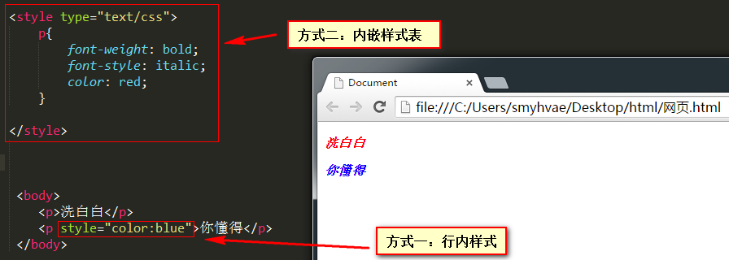
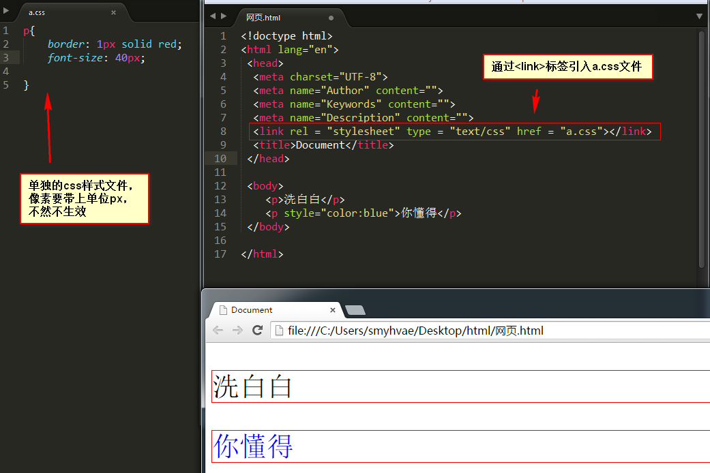
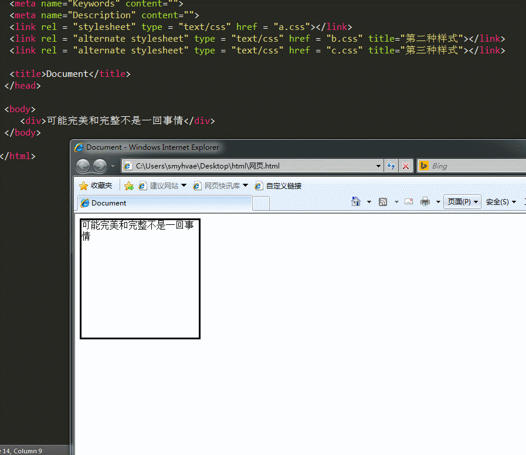

# HTML引入样式表

CSS 和 HTML 的结合方式有 3 种：

- **行内样式**：在某个特定的标签里采用 style**属性**。范围只针对此标签。
- **内嵌样式表**：在页面的 head 里采用`<style>`**标签**。范围针对此页面。
- **引入外部样式表 css 文件**的方式。这种引入方式又分为两种： - 1、采用`<link>`标签。例如：`<link rel = "stylesheet" type = "text/css" href = "a.css"></link>` - 2、采用 import，必须写在`<style>`标签中，并且必须是第一句。例如：`@import url(a.css) ;`

> 两种引入样式方式的区别：外部样式表中不能写标签，但是可以写 import 语句。

下面来详细的讲一讲这三种方式。

### 1、CSS 和 HTML 结合方式一：行内样式

采用 style 属性。范围只针对此标签适用。

该方式比较灵活，但是对于多个相同标签的同一样式定义比较麻烦，适合局部修改。

举例：

```
<p style="color:white;background-color:red">我不会就这样轻易的狗带</p>
```

效果：

[](https://camo.githubusercontent.com/23f6b28191c9f5111257808ed2aead5c1824f2310aa3a1fb9a4d96ad85e61298/687474703a2f2f696d672e736d79687661652e636f6d2f323031352d31302d30332d6373732d30322e706e67)

### 2、CSS 和 HTML 结合方式二：内嵌样式表

在 head 标签中加入`<style>`标签，对多个标签进行统一修改，范围针对此页面。

该方式可以对单个页面的样式进行统一设置，但对于局部不够灵活。

举例：

```
<style type="text/css">
    p {
        font-weight: bold;
        font-style: italic;
        color: red;
    }
</style>

<body>
    <p>洗白白</p>
    <p style="color:blue">你懂得</p>
</body>
```

[](https://camo.githubusercontent.com/84dc2fa7ec76b688703a7c8d382192b806f58480c3bc69e4ef158bd28dd1fb58/687474703a2f2f696d672e736d79687661652e636f6d2f323031352d31302d30332d6373732d30332e706e67)

### 3、CSS 和 HTML 结合方式三：引入外部样式表 css 文件

**引入样式表文件**的方式又分为两种：

- （1）**采用`<link>`标签**。例如：`<link rel = "stylesheet" type = "text/css" href = "a.css"></link>`
- （2）**采用 import**，必须写在`<style>`标签中，并且必须是第一句。例如：`@import url(a.css) ;`

> 两种引入样式方式的区别：外部样式表中不能写标签，但是可以写 import 语句。

**具体操作如下：**

我们先在 html 页面的同级目录下新建一个`a.css`文件，那说明这里面的代码全是 css 代码，此时就没有必要再写`<style>`标签这几个字了。 `a.css`的代码如下：

```
p {
    border: 1px solid red;
    font-size: 40px;
}
```

上方的 css 代码中，注意像素要带上 px 这个单位，不然不生效。 然后我们在 html 文件中通过`<link>`标签引入这个 css 文件就行了。效果如下：

[](https://camo.githubusercontent.com/27aa8a42823281274808670dc39b94b50be7029ff698e6c1d8b6faad8f6cca28/687474703a2f2f696d672e736d79687661652e636f6d2f323031352d31302d30332d6373732d30342e706e67)

这里再讲一个补充的知识：**`<link>`标签的 rel 属性：**。其属性值有以下两种：

- `stylesheet`：定义的样式表
- `alternate stylesheet`：候选的样式表

看字面意思可能比较难理解，我们来举个例子，一下子就明白了。 举例：

现在我们来定义 3 个样式表：

a.css：定义一个实线的黑色边框

```
div {
    width: 200px;
    height: 200px;
    border: 3px solid black;
}
```

ba.css：蓝色的虚线边框

```
div {
    width: 200px;
    height: 200px;
    border: 3px dotted blue;
}
```

c.css：来个背景图片

```
div {
    width: 200px;
    height: 200px;
    border: 3px solid red;
    background-image: url('1.jpg');
}
```

然后我们在 html 文件中引用三个样式表：

```
  <link rel = "stylesheet" type = "text/css" href = "a.css"></link>
  <link rel = "alternate stylesheet" type = "text/css" href = "b.css" title="第二种样式"></link>
  <link rel = "alternate stylesheet" type = "text/css" href = "c.css" title="第三种样式"></link>
```

上面引入的三个样式表中，后面两个样式表作为备选。注意备选的样式表中，title 属性不要忘记写，不然显示不出来效果的。现在来看一下效果：（在 IE 中打开网页）

[](https://camo.githubusercontent.com/5f19bafe531c50f92d1e03be4d5824486fc7f4d5f78071fe2f25af8ca254308a/687474703a2f2f696d672e736d79687661652e636f6d2f323031352d31302d30332d6373732d30352e676966)