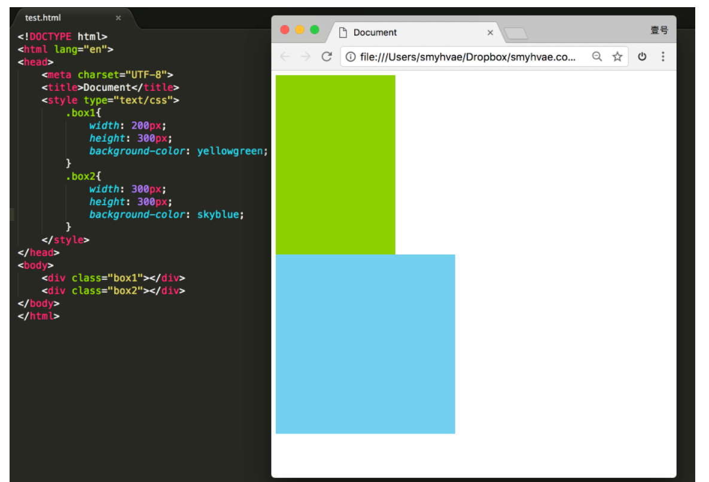
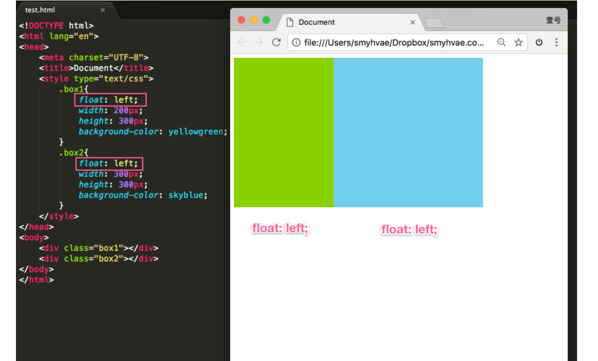
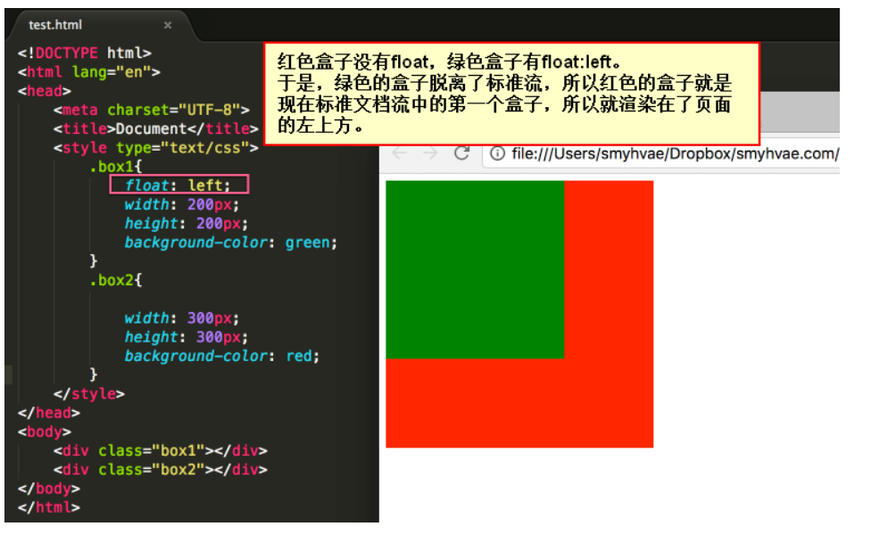
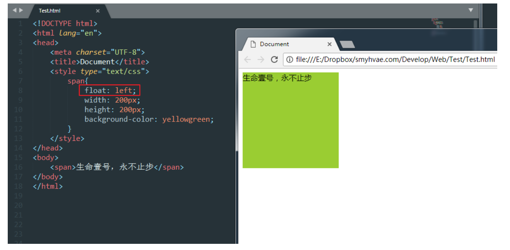
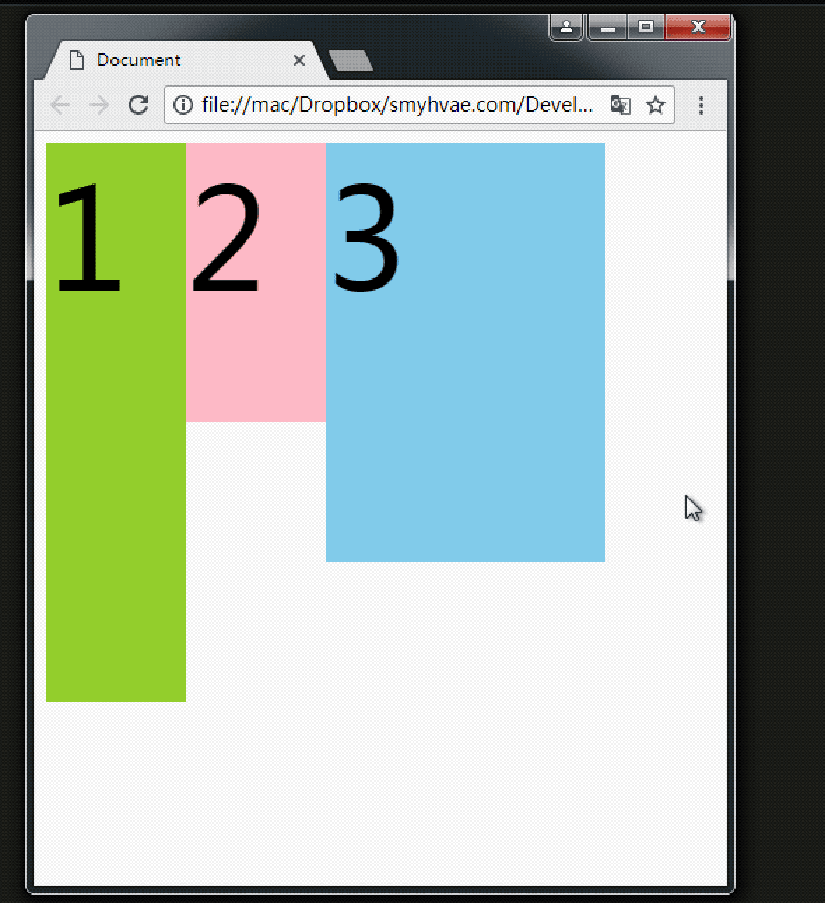

# float 浮动

## 浮动的性质

浮动是css里面布局用的最多的属性。

现在有两个div，分别设置宽高。我们知道，它们的效果如下：

此时，如果给这两个div增加一个浮动属性，比如`float: left;`，效果如下：

这就达到了浮动的效果。此时，两个元素并排了，并且两个元素都能够设置宽度、高度了（这在上一段的标准流中，不能实现）。

浮动想学好，一定要知道三个性质。接下来讲一讲。

## 性质1：浮动的元素  脱离标准流

我们来看几个例子。

证明1：

上图中，在默认情况下，两个div标签是上下进行排列的。现在由于float属性让上图中的第一个`
`标签出现了浮动，于是这个标签在另外一个层面上进行排列。而第二个`
`还在自己的层面上遵从标准流进行排列。

证明2：

上图中，span标签在标准流中，是不能设置宽高的（因为是行内元素）。但是，一旦设置为浮动之后，即使不转成块级元素，也能够设置宽高了。

所以能够证明一件事：**一旦一个元素浮动了，那么，将能够并排了，并且能够设置宽高了。无论它原来是个div还是个span。**所有标签，浮动之后，已经不区分行内、块级了。

## 性质2：浮动的元素互相贴靠

我们来看一个例子就明白了。

我们给三个div均设置了`float: left;`属性之后，然后设置宽高。当改变浏览器窗口大小时，可以看到div的贴靠效果：

