# float 浮动

## 浮动的性质

<span style="color:red">浮动是css里面布局用的最多的属性。</span>

现在有两个div，分别设置宽高。我们知道，它们的效果如下：


此时，如果给这两个div增加一个浮动属性，比如`float: left;`，效果如下：

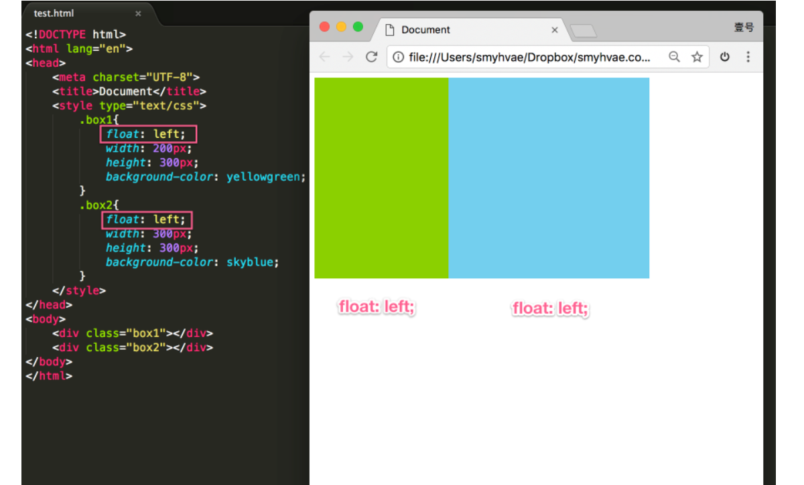

这就达到了浮动的效果。此时，两个元素并排了，并且两个元素都能够设置宽度、高度了（这在上一段的标准流中，不能实现）。

浮动想学好，一定要知道三个性质。接下来讲一讲。

## 性质1：浮动的元素  脱离标准流

我们来看几个例子。

证明1：


上图中，在默认情况下，两个div标签是上下进行排列的。现在由于float属性让上图中的第一个`<div>`标签出现了浮动，于是这个标签在另外一个层面上进行排列。而第二个`<div>`还在自己的层面上遵从标准流进行排列。

证明2：


上图中，span标签在标准流中，是不能设置宽高的（因为是行内元素）。但是，一旦设置为浮动之后，即使不转成块级元素，也能够设置宽高了。

<span style="color:red">所以能够证明一件事：**一旦一个元素浮动了，那么，将能够并排了，并且能够设置宽高了。无论它原来是个div还是个span。**所有标签，浮动之后，已经不区分行内、块级了。</span>

## 性质2：浮动的元素互相贴靠

我们来看一个例子就明白了。

我们给三个div均设置了`float: left;`属性之后，然后设置宽高。当改变浏览器窗口大小时，可以看到div的贴靠效果：


上图显示，3号如果有足够空间，那么就会靠着2号。如果没有足够的空间，那么会靠着1号大哥。 如果没有足够的空间靠着1号大哥，3号自己去贴左墙。

不过3号自己去贴墙的时候，注意：

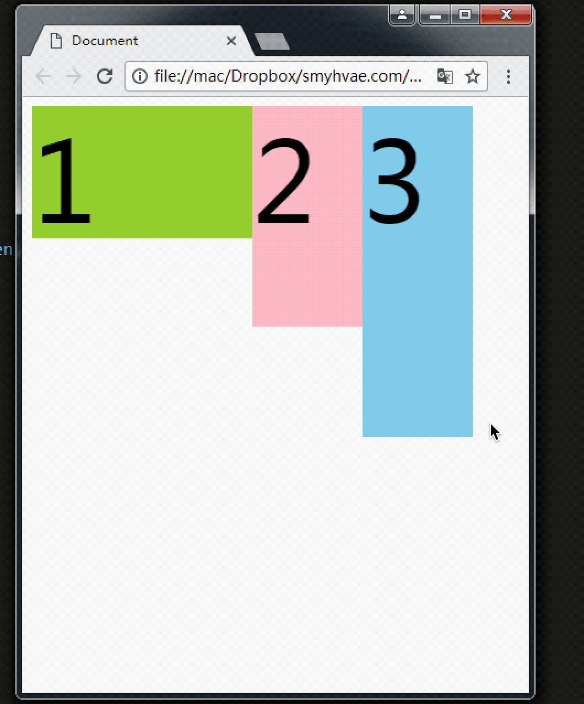

上图显示，3号贴左墙的时候，并不会往1号里面挤。

同样，float还有一个属性值是`right`，这个和属性值`left`是对称的。

## 性质3：浮动的元素有“字围”效果

来看一张图就明白了。我们让div浮动，p不浮动。

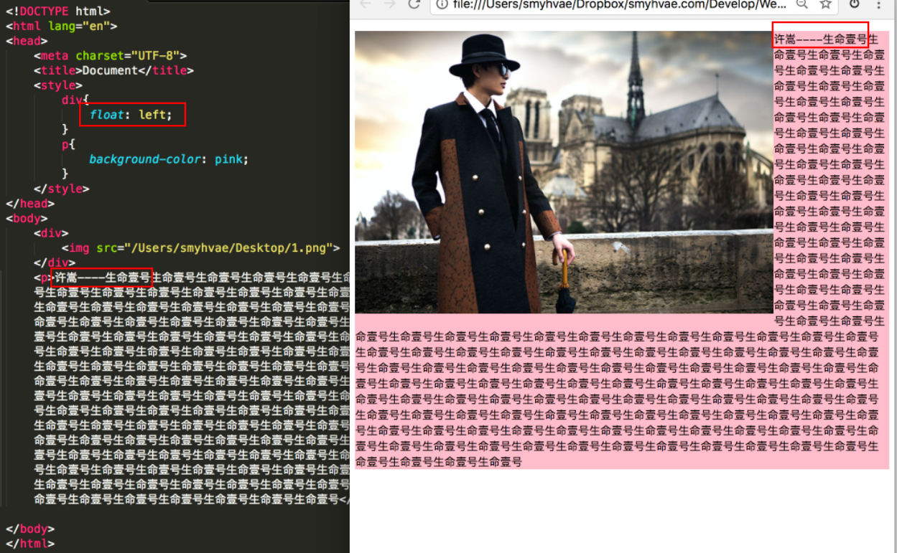

上图中，我们发现：**div挡住了p，但不会挡住p中的文字**，形成“字围”效果。

总结：**标准流中的文字不会被浮动的盒子遮挡住**。（文字就像水一样）

关于浮动我们要强调一点，浮动这个东西，为避免混乱，<span style="color:red">我们在初期一定要遵循一个原则：**永远不是一个东西单独浮动，浮动都是一起浮动，要浮动，大家都浮动。**</span>

## 性质4：收缩

收缩：一个浮动的元素，如果没有设置width，那么将自动收缩为内容的宽度（这点非常像行内元素）。

举例如下：

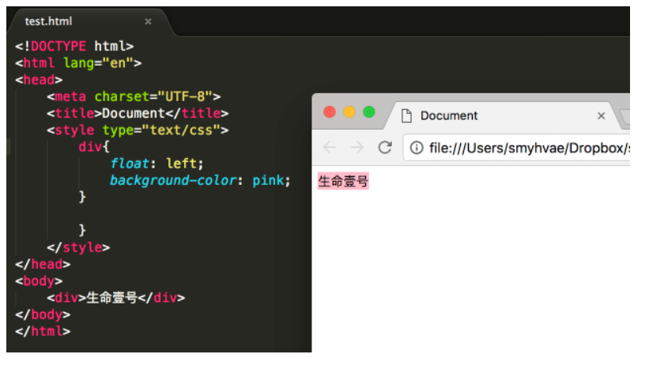

上图中，div本身是块级元素，如果不设置width，它会单独霸占整行；但是，设置div浮动后，它会收缩

## 浮动的补充（做网站时注意）

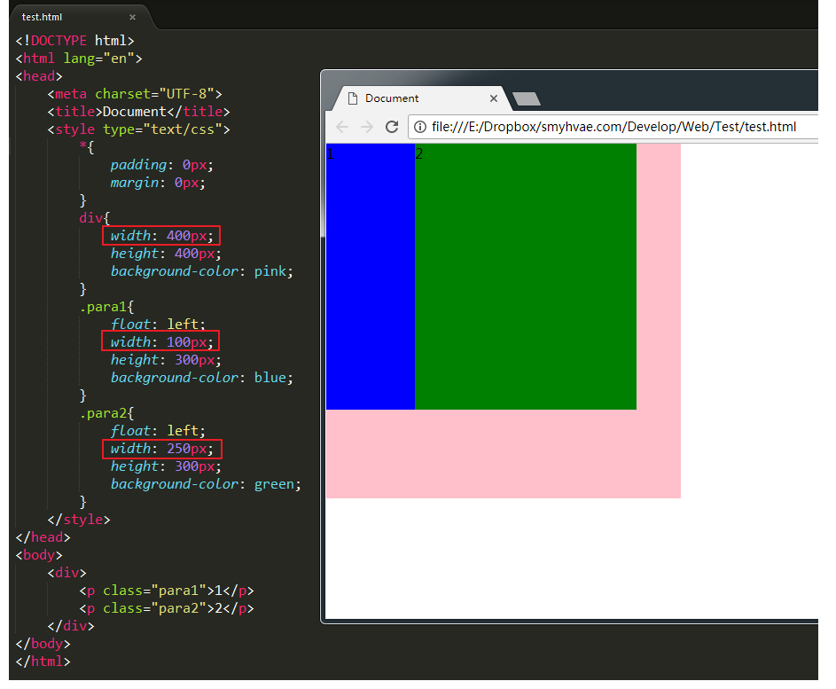

上图所示，将para1和para2设置为浮动，它们是div的儿子。此时para1+para2的宽度小于div的宽度。效果如上图所示。可**如果设置para1+para2的宽度大于div的宽度**，我们会发现，para2掉下来了：

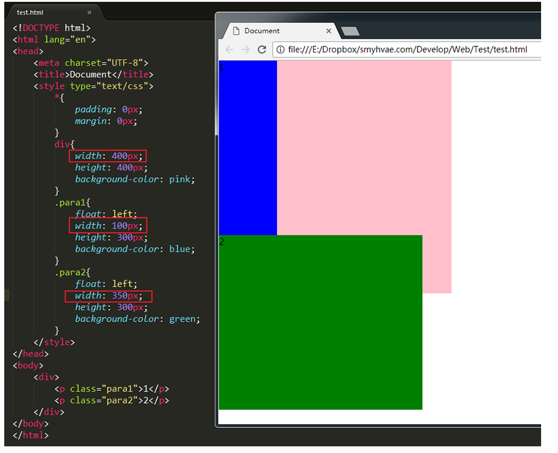

## 布置一个作业

布置一个作业，要求实现下面的效果：


为实现上方效果，代码如下：

```html
<!DOCTYPE html PUBLIC "-//W3C//DTD XHTML 1.0 Transitional//EN" "http://www.w3.org/TR/xhtml1/DTD/xhtml1-transitional.dtd">
<html xmlns="http://www.w3.org/1999/xhtml" xml:lang="en">
<head>
	<meta http-equiv="Content-Type" content="text/html;charset=UTF-8">
	<title>Document</title>
	<style type="text/css">
		*{
			margin: 0;
			padding: 0;
		}
		.header{
			width: 970px;
			height: 103px;
			/*居中。这个语句的意思是：居中：*/
			margin: 0 auto;
		}
		.header .logo{
			float: left;
			width: 277px;
			height: 103px;
			background-color: red;
		}
		.header .language{
			float: right;
			width: 137px;
			height: 49px;
			background-color: green;
			margin-bottom: 8px;
		}
		.header .nav{
			float: right;
			width: 679px;
			height: 46px;
			background-color: green;
		}

		.content{
			width: 970px;
			height: 435px;
			/*居中，这个语句今天没讲，你照抄，就是居中：*/
			margin: 0 auto;
			margin-top: 10px;
		}
		.content .banner{
			float: left;
			width: 310px;
			height: 435px;
			background-color: gold;
			margin-right: 10px;
		}
		.content .rightPart{
			float: left;
			width: 650px;
			height: 435px;
		}
		.content .rightPart .main{
			width: 650px;
			height: 400px;
			margin-bottom: 10px;
		}
		.content .rightPart .links{
			width: 650px;
			height: 25px;
			background-color: blue;
		}
		.content .rightPart .main .news{
			float: left;
			width: 450px;
			height: 400px;
		}
		.content .rightPart .main .hotpic{
			float: left;
			width: 190px;
			height: 400px;
			background-color: purple;
			margin-left: 10px;
		}
		.content .rightPart .main .news .news1{
			width: 450px;
			height: 240px;
			background-color: skyblue;
			margin-bottom: 10px;
		}
		.content .rightPart .main .news .news2{
			width: 450px;
			height: 110px;
			background-color: skyblue;
			margin-bottom: 10px;
		}
		.content .rightPart .main .news .news3{
			width: 450px;
			height: 30px;
			background-color: skyblue;
		}
		.footer{
			width: 970px;
			height: 35px;
			background-color: pink;
			/*没学，就是居中：*/
			margin: 0 auto;
			margin-top: 10px;
		}
	</style>
</head>
<body>
	<!-- 头部 -->
	<div class="header">
		<div class="logo">logo</div>
		<div class="language">语言选择</div>
		<div class="nav">导航条</div>
	</div>

	<!-- 主要内容 -->
	<div class="content">
		<div class="banner">大广告</div>
		<div class="rightPart">
			<div class="main">
				<div class="news">
					<div class="news1"></div>
					<div class="news2"></div>
					<div class="news3"></div>
				</div>
				<div class="hotpic"></div>
			</div>
			<div class="links"></div>
		</div>
	</div>

	<!-- 页尾 -->
	<div class="footer"></div>
</body>
</html>

```

其实，这个页面的布局是下面这个网站：


## 浮动的清除

这里所说的清除浮动，指的是清除浮动与浮动之间的影响。

### 前言

通过上面这个例子，我们发现，此例中的网页就是通过浮动实现并排的。

比如说一个网页有header、content、footer这三部分。就拿content部分来举例，如果设置content的儿子为浮动，但是，这个儿子又是一个全新的标准流，于是儿子的儿子仍然在标准流里。

从学习浮动的第一天起，我们就要明白，浮动有开始，就要有清除。我们先来做个实验。

下面这个例子，有两个块级元素div，div没有任何属性，每个div里有li，效果如下：

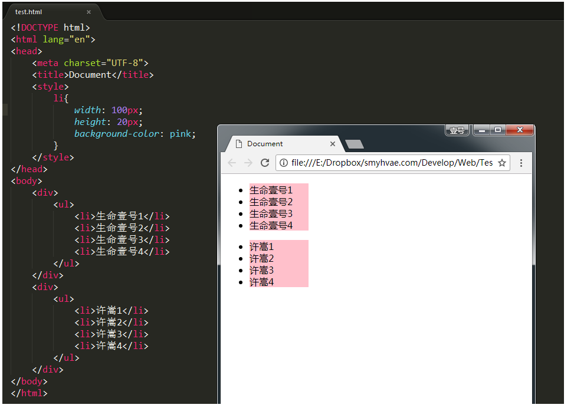

上面这个例子很简单。可如果我们给里面的`<li>`标签加浮动。效果却成了下面这个样子：

代码如下：

```html
<!DOCTYPE html>
<html lang="en">
<head>
	<meta charset="UTF-8">
	<title>Document</title>
	<style type="text/css">
		*{

		}
		li{
			float: left;
			width: 100px;
			height: 20px;
			background-color: pink;


		}
	</style>
</head>
<body>
	<div class="box1">
		<ul>
			<li>生命壹号1</li>
			<li>生命壹号2</li>
			<li>生命壹号3</li>
			<li>生命壹号4</li>
		</ul>
	</div>
	<div class="box2">
		<ul>
			<li>许嵩1</li>
			<li>许嵩2</li>
			<li>许嵩3</li>
			<li>许嵩4</li>
		</ul>
	</div>
</body>
</html>
```

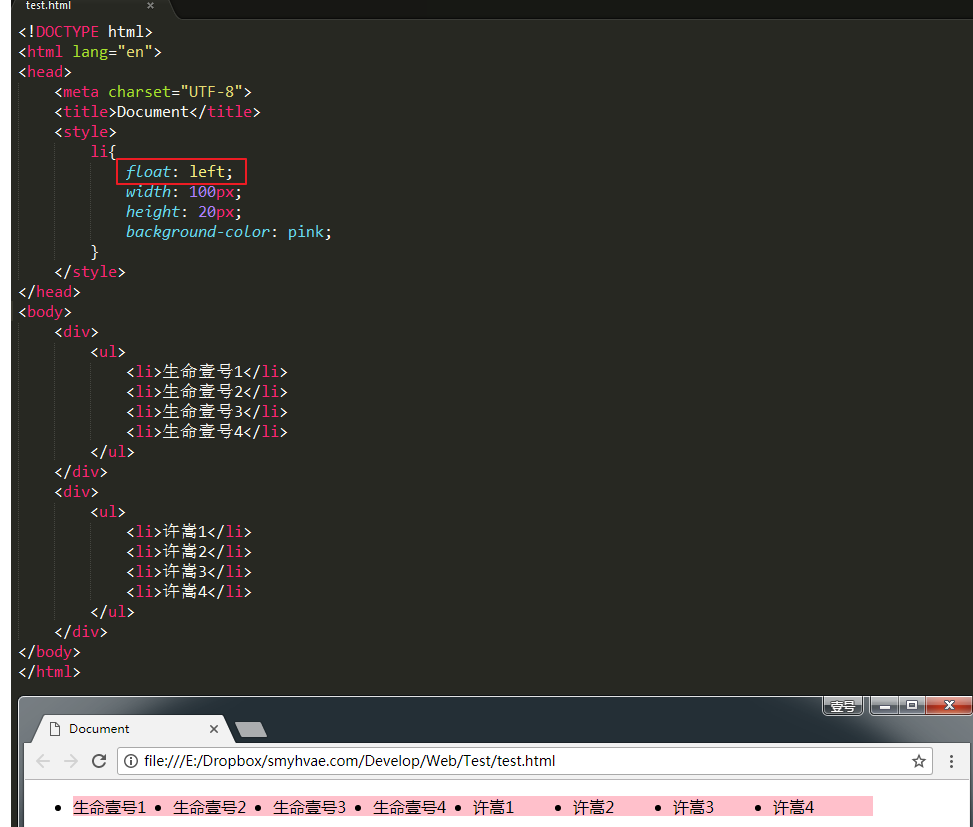

### 方法1：给父元素设置一个高度

给div设置一个正确的合适的高度（至少保证高度大于儿子的高度），就可以看到正确的现象：

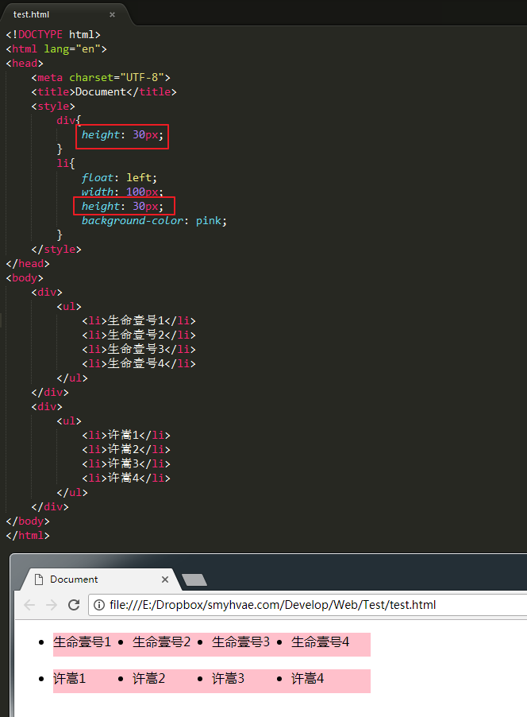

**总结：**

<span style="color:red">**如果一个元素要浮动，那么它的祖先元素一定要有高度。**</span>

<span style="color:red">**有高度的盒子，才能关住浮动**。（记住这句过来人的经验之语）**</span>

只要浮动在一个有高度的盒子中，那么这个浮动就不会影响后面的浮动元素。所以就是清除浮动带来的影响了。

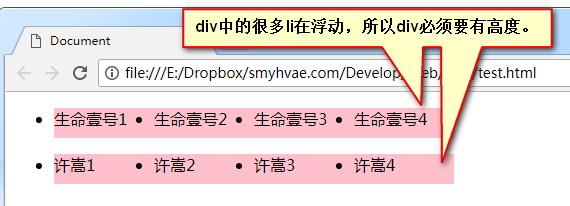

### 方法2：clear:both;

网页制作中，高度height其实很少出现。为什么？因为能被内容撑高！也就是说，刚刚我们讲解的方法1，工作中用得很少。

那么，能不能不写height，也把浮动清除了呢？也让浮动之间，互不影响呢？

这个时候，我们可以使用`clear:both;`这个属性。如下：

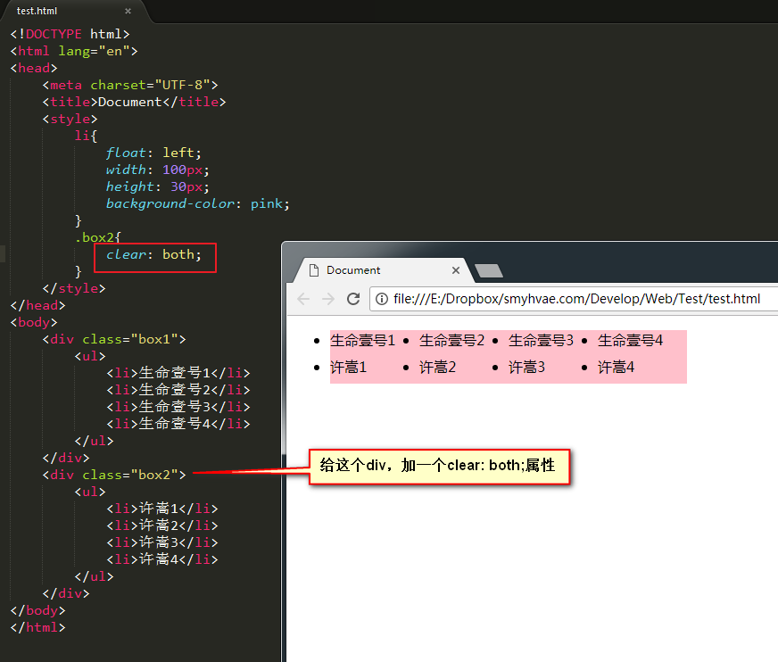

clear就是清除，both指的是左浮动、右浮动都要清除。`clear:both`的意思就是：**不允许左侧和右侧有浮动对象。**

这种方法有一个非常大的、致命的问题，**它所在的标签，margin属性失效了**。读者可以试试看。

margin失效的本质原因是：上图中的box1和box2，高度为零。

### 方法3：隔墙法

上面这个例子中，为了防止第二个div贴靠到第一个div，我们可以在这两个div中间用一个新的div隔开，然后给这个新的div设置`clear: both;`属性；同时，既然这个新的div无法设置margin属性，我们可以给它设置height，以达到margin的效果（曲线救国）。这便是隔墙法。

我们看看例子效果就知道了：

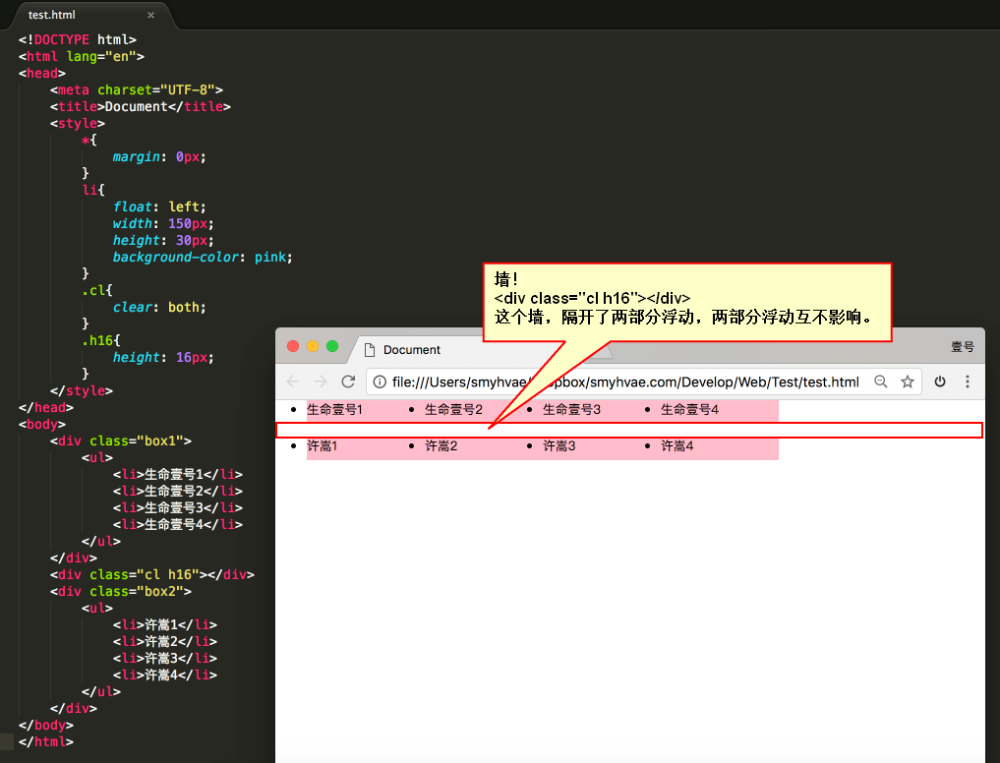

上图这个例子就是隔墙法。

**内墙法：**


上面这个图非常重要，当作内墙法的公式，先记下来。

为了讲内墙法，我们先记住一句重要的话：**一个父亲是不能被浮动的儿子撑出高度的**。举例如下：

（1）我们在一个div里放一个有宽高的p，效果如下：（很简单）

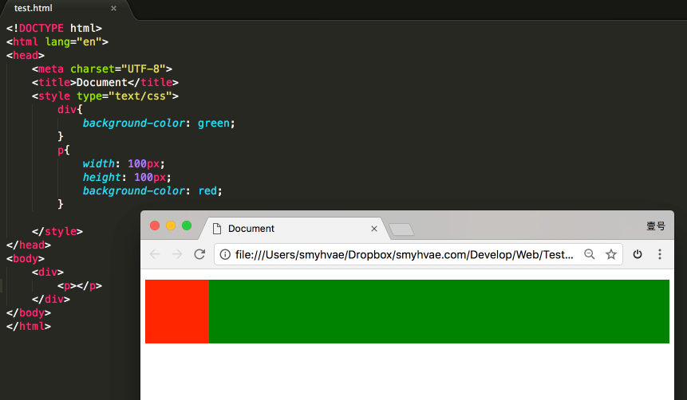

（2）可如果在此基础之上，给p设置浮动，却发现父亲div没有高度了：

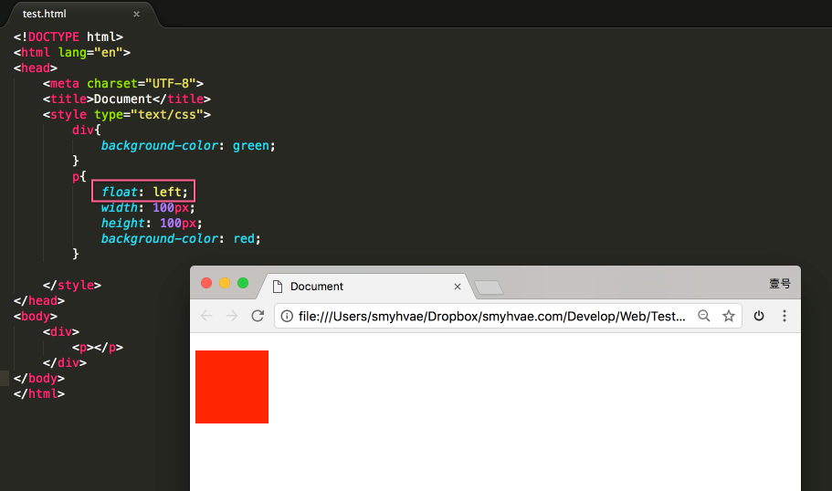

（3）此时，我么可以在div的里面放一个div（作为内墙），就可以让父亲div恢复高度：

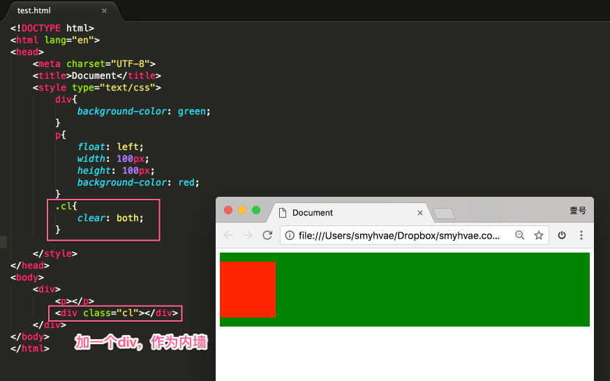

于是，我们采用内墙法解决前言中的问题：

与外墙法相比，内墙法的优势（本质区别）在于：内墙法可以给它所在的家撑出宽度（让box1有高）。即：box1的高度可以自适应内容。

而外墙法，虽然一道墙可以把两个div隔开，但是这两个div没有高，也就是说，无法wrap_content。

### 清除浮动方法4：overflow:hidden;

我们可以使用如下属性：

overflow即“溢出”， hidden即“隐藏”。这个属性的意思是“溢出隐藏”。顾名思义：所有溢出边框的内容，都要隐藏掉。如下：

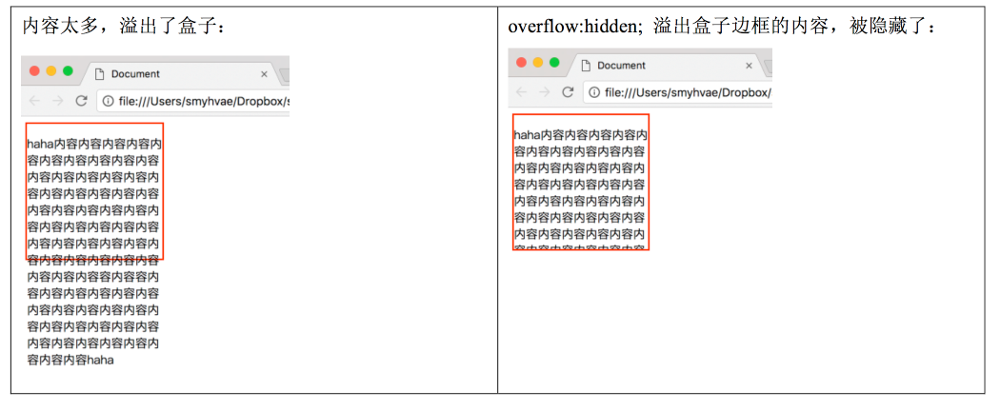

上图显示，`overflow:hidden;`的本意是清除溢出到盒子外面的文字。但是，前端开发工程师发现了，它能做偏方。如下：

一个父亲不能被自己浮动的儿子，撑出高度。但是，只要给父亲加上`overflow:hidden`; 那么，父亲就能被儿子撑出高了。这是一个偏方。

举个例子：

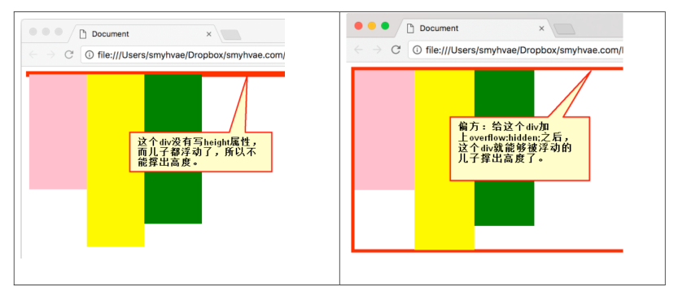

那么对于前言中的例子，我们同样可以使用这一属性：

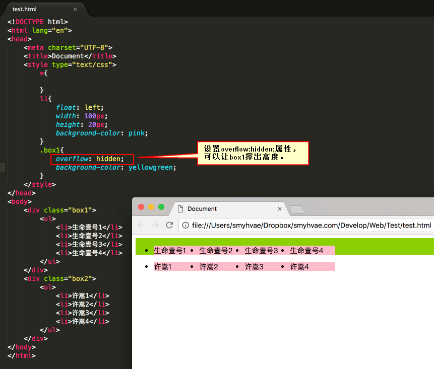

## 浮动清除的总结

> 我们在上一段讲了四种清除浮动的方法，本段来进行一个总结。

浮动的元素，只能被有高度的盒子关住。 也就是说，如果盒子内部有浮动，这个盒子有高，那么妥妥的，浮动不会互相影响。

### 1、加高法

工作上，我们绝对不会给所有的盒子加高度，这是因为麻烦，并且不能适应页面的快速变化。

```
<div>     //设置height
	<p></p>
	<p></p>
	<p></p>
</div>

<div>    //设置height
	<p></p>
	<p></p>
	<p></p>
</div>
```

### 2、`clear:both;`法

最简单的清除浮动的方法，就是给盒子增加clear:both；表示自己的内部元素，不受其他盒子的影响。

```
<div>
	<p></p>
	<p></p>
	<p></p>
</div>

<div>   //clear:both;
	<p></p>
	<p></p>
	<p></p>
</div>
```

浮动确实被清除了，不会互相影响了。但是有一个问题，就是margin失效。两个div之间，没有任何的间隙了。

### 3、隔墙法

在两部分浮动元素中间，建一个墙。隔开两部分浮动，让后面的浮动元素，不去追前面的浮动元素。 墙用自己的身体当做了间隙。

```
<div>
	<p></p>
	<p></p>
	<p></p>
</div>

<div class="cl h10"></div>

<div>
	<p></p>
	<p></p>
	<p></p>
</div>
```

我们发现，隔墙法好用，但是第一个div，还是没有高度。如果我们现在想让第一个div，自动根据自己的儿子撑出高度，我们就要想一些“小伎俩”。

内墙法：

```
<div>
	<p></p>
	<p></p>
	<p></p>
	<div class="cl h10"></div>
</div>

<div>
	<p></p>
	<p></p>
	<p></p>
</div>
```

内墙法的优点就是，不仅仅能够让后部分的p不去追前部分的p了，并且能把第一个div撑出高度。这样，这个div的背景、边框就能够根据p的高度来撑开了。

### 4、`overflow:hidden;`

这个属性的本意，就是将所有溢出盒子的内容，隐藏掉。但是，我们发现这个东西能够用于浮动的清除。 我们知道，一个父亲，不能被自己浮动的儿子撑出高度，但是，如果这个父亲加上了overflow:hidden；那么这个父亲就能够被浮动的儿子撑出高度了。这个现象，不能解释，就是浏览器的偏方。 并且,overflow:hidden;能够让margin生效。

**清除浮动的例子：**

我们现在举个例子，要求实现下图中无序列表部分的效果：


对比一下我们讲的四种清除浮动的方法。如果用外墙法，ul中不能插入div标签，因为ul中只能插入li，如果插入li的墙，会浪费语义。如果用内墙法，不美观。综合对比，还是用第四种方法来实现吧，这会让标签显得极其干净整洁：

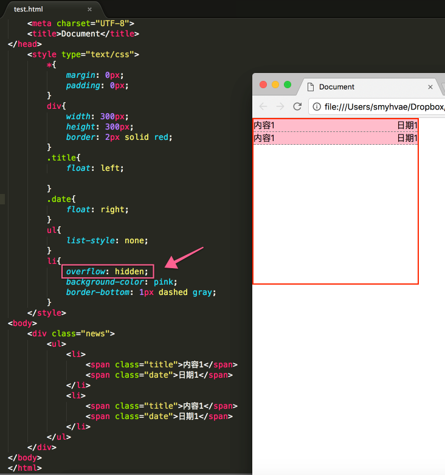

上方代码中，如果没有加`overflow:hidden;`，那么第二行的li会紧跟着第一行li的后面。

## 浏览器的兼容性问题

> 讲一下上述知识点涉及到的浏览器兼容问题。

### 兼容性1（微型盒子）

**兼容性的第一条**：IE6不支持小于12px的盒子，任何小于12px的盒子，在IE6中看都大。即：IE 6不支持微型盒子。

举个例子。我们设置一个height为 5px 、宽度为 200px的盒子，看下在IE 8和 IE 6中的显示效果：


解决办法很简单，就是将盒子的字号大小，设置为**小于盒子的高**，比如，如果盒子的高为5px，那就把font-size设置为0px(0px < 5px)。如下：

```
height: 5px;
_font-size: 0px;
```

我们现在介绍一下浏览器hack。hack就是“黑客”，就是使用浏览器提供的后门，针对某一种浏览器做兼容。

IE6留了一个**后门**：只要给css属性之前，加上**下划线**，这个属性就是IE6的专有属性。

比如说，我们给背景颜色这个属性加上下划线，就变成了`_background-color: green;`。效果如下：

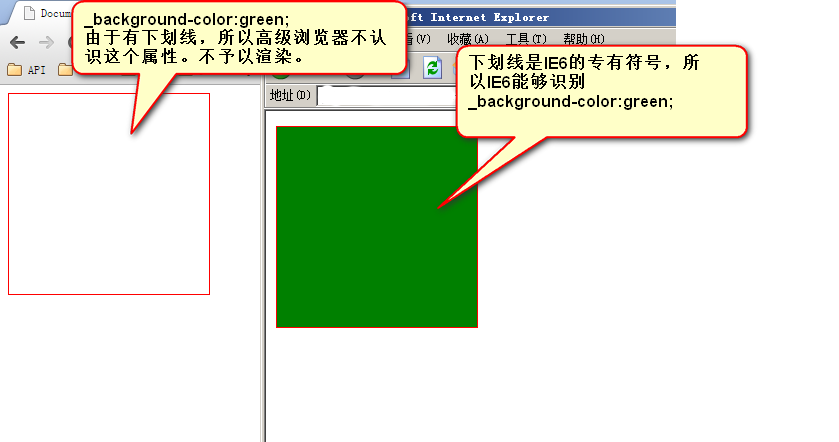

于是乎，为了解决微型盒子（即height小于12px）的问题，正确写法：（注意不要忘记下划线）

```
height: 10px;
_font-size:0;
```

### 兼容性2

**兼容性的第二条：**IE6不支持用`overflow:hidden;`来清除浮动。

解决办法，以毒攻毒。追加一条：

```
_zoom:1;
```

完整写法：

```
overflow: hidden;
_zoom:1;
```

实际上，`_zoom:1;`能够触发浏览器hasLayout机制。这个机制，不要深究了，因为只有IE6有。我们只需要让IE6好用，具体的实现机制，可以自行查阅。

需要强调的是，`overflow:hidden;`的本意，就是让溢出盒子的border的内容隐藏，这个功能是IE6兼容的。不兼容的是`overflow:hidden;`清除浮动的时候。

**总结：**

我们刚才学习的两个IE6的兼容问题，都是通过多写一条hack来解决的，这个我们称为伴生属性，即两个属性，要写一起写。

属性1：

```
height:6px;
_font-size:0;
```

属性2：

```
overflow:hidden;
_zoom:1;
```

## margin相关

> 我们来讲一下浮动中和margin相关的知识。

### margin塌陷/margin重叠

**标准文档流中，竖直方向的margin不叠加，取**较大的值**作为margin(水平方向的margin是可以叠加的，即水平方向没有塌陷现象)。如下图所示：

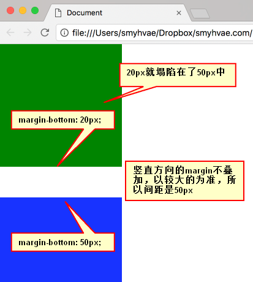

如果不在标准流，比如盒子都浮动了，那么两个盒子之间是没有塌陷现象的。

### 盒子居中`margin:0 auto;`

margin的值可以为auto，表示自动。当left、right两个方向都是auto的时候，盒子居中了：

```
margin-left: auto;
margin-right: auto;
```

盒子居中的简写为：

```
margin:0 auto;
```

对上方代码的理解：上下的margin为0，左右的margin都尽可能的大，于是就居中了。

注意：

- （1）只有标准流的盒子，才能使用`margin:0 auto;`居中。也就是说，当一个盒子浮动了、绝对定位了、固定定位了，都不能使用margin:0 auto;
- （2）使用`margin:0 auto;`的盒子，必须有width，有明确的width。（可以这样理解，如果没有明确的witdh，那么它的witdh就是霸占整行，没有意义）
- （3）`margin:0 auto;`是让盒子居中，不是让盒子里的文本居中。文本的居中，要使用`text-align:center;`

对上面的第三条总结一下：（非常重要）

```
margin:0 auto;    //让这个div自己在大容器中的水平方向上居中。
text-align: center;  //让这个div内部的文本居中。
```

顺便普及一下知识，text-align还有：

```
text-align:left;     //没啥用，因为默认居左
text-align:right;    //文本居右
```

### 善于使用父亲的padding，而不是儿子的margin

我们来看一个奇怪的现象。现在有下面这样一个结构：（div中放一个p）

```
	<div>
		<p></p>
	</div>
```

上面的结构中，我们尝试通过给儿子`p`一个`margin-top:50px;`的属性，让其与父亲保持50px的上边距。结果却看到了下面的奇怪的现象：

[](https://camo.githubusercontent.com/3d60e1843d805adfc9d910134789355b7363f928a6a68d8c8826bb1e08746479/687474703a2f2f696d672e736d79687661652e636f6d2f32303137303830365f313533372e706e67)

此时我们给父亲div加一个border属性，就正常了：

[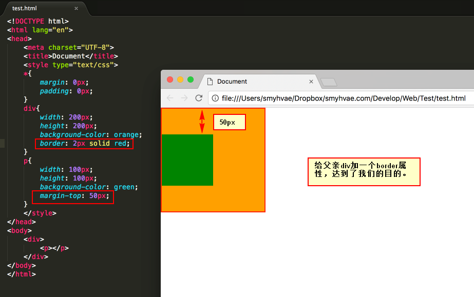](https://camo.githubusercontent.com/bf5d8a61b1f014549702a760b46549bc8db235306e0fddc6d32e21bfe0541283/687474703a2f2f696d672e736d79687661652e636f6d2f32303137303830365f313534342e706e67)

如果父亲没有border，那么儿子的margin实际上踹的是“流”，踹的是这“行”。所以，父亲整体也掉下来了。

**margin这个属性，本质上描述的是兄弟和兄弟之间的距离； 最好不要用这个marign表达父子之间的距离。**

所以，如果要表达父子之间的距离，我们一定要善于使用父亲的padding，而不是儿子的margin。

## 关于margin的IE6兼容问题

### IE6的双倍margin的bug：

当出现连续浮动的元素，携带与浮动方向相同的margin时，队首的元素，会双倍marign。

```
	<ul>
		<li></li>
		<li></li>
		<li></li>
	</ul>
```

[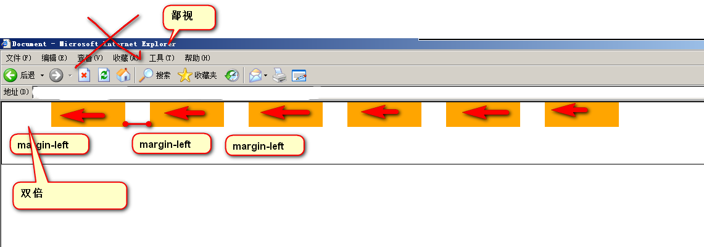](https://camo.githubusercontent.com/4bab1fa07c4e5e843ba91f28364e0e1808f5e0b4b367b88b19ca655eb7d14554/687474703a2f2f696d672e736d79687661652e636f6d2f32303137303830365f313535382e706e67)

解决方案：

（1）使浮动的方向和margin的方向，相反。

所以，你就会发现，我们特别喜欢，浮动的方向和margin的方向相反。并且，前端开发工程师，把这个当做习惯了。

```
	float: left;
	margin-right: 40px;
```

（2）使用hack：（没必要，别惯着这个IE6）

单独给队首的元素，写一个一半的margin：

```
<li class="no1"></li>
ul li.no1{
	_margin-left:20px;
}
```

PS：双倍margin的问题，面试经常问哦。

### IE6的3px bug

[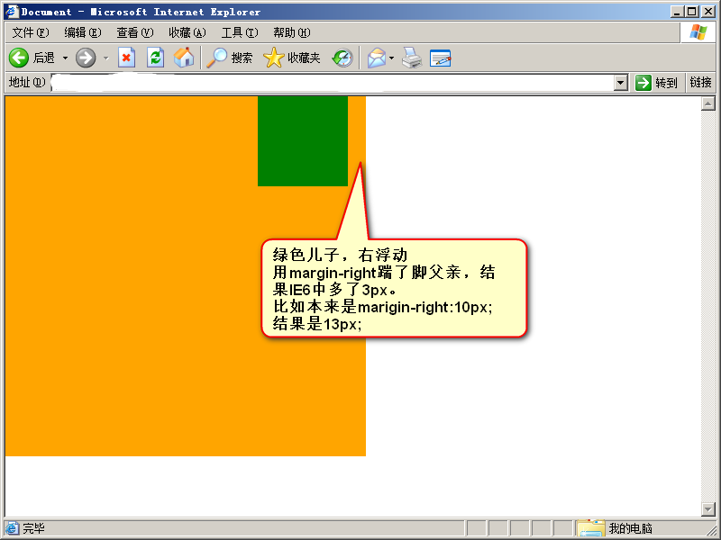](https://camo.githubusercontent.com/d2f3b24a251c06367ba7160c4ec7bfe314ca1cf530bcad5c3bc74ed2635bc0b3/687474703a2f2f696d672e736d79687661652e636f6d2f32303137303830365f313631362e706e67)

解决办法：不用管，因为根本就不允许用儿子踹父亲（即描述父子之间的距离，请用padding，而不是margin）。所以，如果你出现了3px bug，说明你的代码不标准。

IE6，千万不要跟他死坑、较劲，它不配。 格调要高，我们讲IE6的兼容性问题，就是为了增加面试的成功率，不是为了成为IE6的专家。

## Fireworks和others

### Fireworks

fireworks是Adobe公司的一个设计软件。功能非常多，我们以后用啥讲啥。Fireworks的默认文件格式是png。

标尺的快捷键：Ctrl + Alt+ R

### others

首行缩进两个汉字：

```
text-indent: 2em;
```

上方属性中，单位比较奇怪，叫做em，em就是汉字的一个宽度。indent的意思是缩进。

## 有什么用

布局用啊