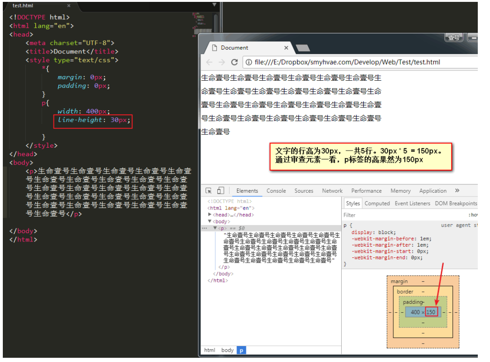
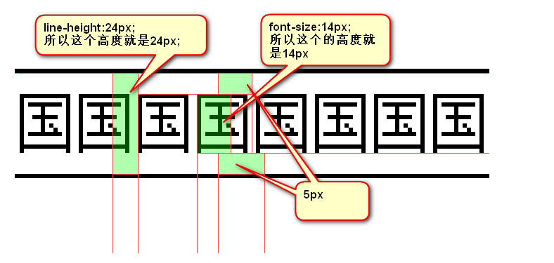
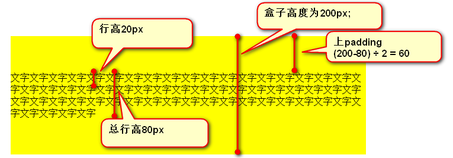
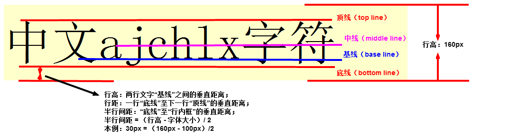
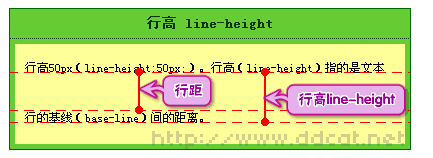
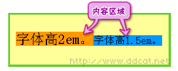
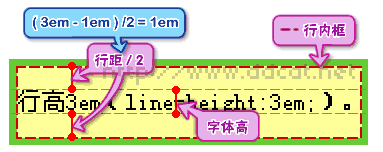
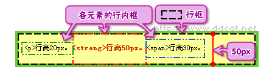
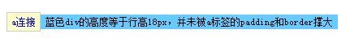

# 行高 line-height

参考链接：

[千古一号](https://github.com/ck-chenkang/myWeb/blob/main/Web/02-CSS%E5%9F%BA%E7%A1%80/01-CSS%E5%B1%9E%E6%80%A7%EF%BC%9A%E5%AD%97%E4%BD%93%E5%B1%9E%E6%80%A7%E5%92%8C%E6%96%87%E6%9C%AC%E5%B1%9E%E6%80%A7.md)

[深入理解CSS行高](https://www.cnblogs.com/rainman/archive/2011/08/05/2128068.html)

[深入理解CSS行高](https://www.cnblogs.com/dolphinX/p/3236686.html)

CSS中，所有的行，都有行高。盒子模型的padding，绝对不是直接作用在文字上的，而是作用在“行”上的。

如下图所示：



上图中，我们设置行高为30px，30px * 5 = 150px，通过查看审查元素，这个p标签的高度果然为150px。而且我们发现，我们并没有给这个p标签设置高度，显然是内容将其撑高的。

垂直方向来看，文字在自己的行里是居中的。比如，文字是14px，行高是24px，那么padding就是5px：



<span style="color:red">为了严格保证字在行里面居中，我们的工程师有一个约定： **行高、字号，一般都是偶数**。这样可以保证，它们的差一定偶数，就能够被2整除。</span>

## 如何让单行文本垂直居中

### 1. 这个不实用

小技巧：如果一段文本只有一行，如果此时设置**行高 = 盒子高**，就可以保证单行文本垂直居中。这个很好理解。

上面这个小技巧，只适用于单行文本垂直居中，不适用于多行。如果想让多行文本垂直居中，还需要计算盒子的padding。计算方式如下：



### 2. `vertical-align: middle;` 属性

`vertical-align`属性可用于指定**行内元素**（inline）、**行内块元素**（inline-block）、**表格的单元格**（table-cell）的垂直对齐方式。主要是用于图片、表格、文本的对齐。

代码举例：

```
vertical-align: middle; /*指定行级元素的垂直对齐方式。*/
```

## 深入理解

### 1.  基线、底线、顶线



- 行高指的是文本行的基线间的距离。
- 基线并不是汉字的下端沿，而是英文字母"x"的下端沿

### 2.  行距、行高



### 3.  内容区



- 底线和顶线包裹的区域，实际中不一定看得到，但却是存在。

### 4. 行内框



- 行内框只是一个概念，它无法显示出来，但是它又确实存在
- 它的高度就是行高
- 在没有其他因素（padding）影响的时候，行内框等于内容区域

### 5.  行框



- 行框（line box）。同行内框类似，行框是指本行的一个虚拟的矩形框
- 行框高度等于本行内所有元素中行高最大的值

### 元素对行高的影响

- 对于行内元素如em、strong、span和等，其padding、margin、border-top、border-bottom 不会增加行高。
  padding会覆盖；margin将重置为0；border-top和border-bottom同样会覆盖。
  padding-left、padding-right、border-left和border-right可用。
- img元素会影响行高
- 设置行内元素的padding、border和margin并不会撑大外层元素的高度，如下图：



### 扩展阅读

- [行高：line-height属性[1\]](http://www.ddcat.net/blog/?p=227)

- [行高：line-height属性[2\]——行高的计算与继承](http://www.ddcat.net/blog/?p=228)

- 行高：line-height属性[3]

  ，该文章包括：

  - 浏览器的差别与错误
  - 应用：单行文字在垂直方向居中

- [深入理解行高 line-height](http://home.cnblogs.com/group/topic/34540.html)（强烈推荐）

- [垂直对齐：vertical-align属性](http://www.ddcat.net/blog/?p=233)

## 行高有什么用

- 决定上下两行字之间的距离
- 充分利用行高还可以实现居中对齐的效果或者居于垂直任意位置的效果