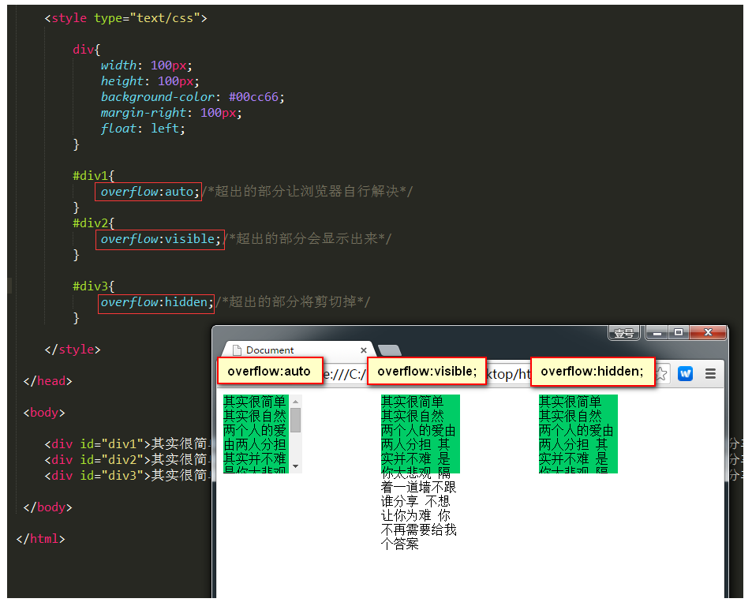

# overflow属性：超出范围的内容要怎么处理

 `overflow`属性的属性值可以是：

- `visible`：默认值。多余的内容不剪切也不添加滚动条，会全部显示出来。
- `hidden`：不显示超过对象尺寸的内容。
- `auto`：如果内容不超出，则不显示滚动条；如果内容超出，则显示滚动条。
- `scroll`：Windows 平台下，无论内容是否超出，总是显示滚动条。Mac 平台下，和 `auto` 属性相同。

针对上面的不同的属性值，我们来看一下效果： 举例：

```html
<!doctype html>
<html lang="en">
 <head>
  <meta charset="UTF-8">
  <meta name="Generator" content="EditPlus®">
  <meta name="Author" content="">
  <meta name="Keywords" content="">
  <meta name="Description" content="">
  <title>Document</title>

	<style type="text/css">

		div{
			width: 100px;
			height: 100px;
			background-color: #00cc66;
			margin-right: 100px;
			float: left;
		}

		#div1{
			overflow: auto;/*超出的部分让浏览器自行解决*/
		}
		#div2{
			overflow: visible;/*超出的部分会显示出来*/
		}

		#div3{
			overflow: hidden;/*超出的部分将剪切掉*/
		}

	</style>

 </head>

 <body>

	<div id="div1">其实很简单 其实很自然 两个人的爱由两人分担 其实并不难 是你太悲观 隔着一道墙不跟谁分享 不想让你为难 你不再需要给我个答案</div>
	<div id="div2">其实很简单 其实很自然 两个人的爱由两人分担 其实并不难 是你太悲观 隔着一道墙不跟谁分享 不想让你为难 你不再需要给我个答案</div>
	<div id="div3">其实很简单 其实很自然 两个人的爱由两人分担 其实并不难 是你太悲观 隔着一道墙不跟谁分享 不想让你为难 你不再需要给我个答案</div>
 </body>

</html>

```

效果：



## 有什么用

文本超过区域限制的策略