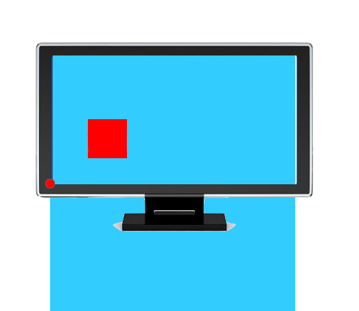
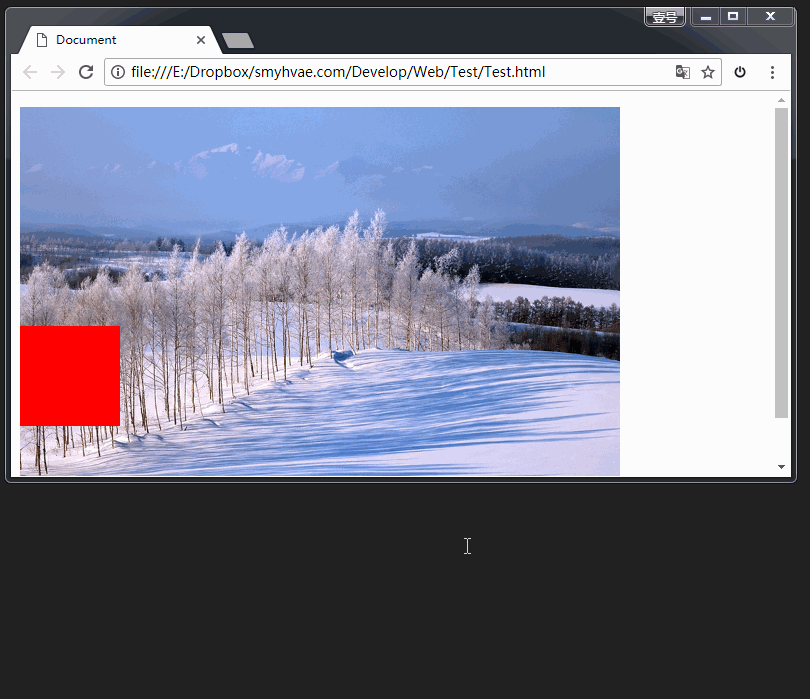

# CSS中的四种定位以及top和margin-top的区别

参考链接：

[CSS中的四种定位以及top和margin-top的区别](https://blog.csdn.net/qq_40935723/article/details/100182374)

<span style="color:red">这个文章里每一个字都不要放过</span>

**CSS中一共有四种定位分别是默认，相对，绝对，固定**

1，**position：static**，这种定位是默认的，一般没什么实际的作用。

2，**position：relative**,相对定位 ，**不会脱离文档流**，类似于static，按顺序排列，一般设置也不会有什么变化，可以通过margin-top/right/bottom/left来改变框的位置

3，**position：absolute**，绝对定位，这种定位**脱离文档流**，可以理解为跟其他的元素不再一个次元中，可以用top/right/bottom/left来控制位置，**absolute是相对于最近祖先非static定位来定位的**，如果说他的父级定位是默认的，那么他就会继续向上找父级的父级，直到找到非static定位为基准点，比如在下面的代码中

```html
<!DOCTYPE html>
<html>
<head>
    <!-- 规定字符集的编码为utf-8 -->
    <meta charset="utf-8">
    <style type="text/css">
   .div1{
        position: relative;
        width: 400px;
        height: 400px;
        border:2px solid red;
        margin:50px;
    }
    .div2{
        width: 200px;
        height: 200px;
        margin:50px;
        border:2px solid pink;
    }
    .div3{
        position: absolute;
        top: 0px;
        left: 0px;
        width: 100px;
        height: 100px;
        border:2px solid purple;
    }
    </style>
</head>
<body>
	<div class="div1">
    	<div class="div2">
        	<div class="div3"></div>
    	</div>
	</div>
</body>
</html>

```

结果如下：


图中的黑色边框的就是div3，我们可以看到top：0之后的位置在div1的左上角，但是div1是他父级的父级，但是我们要是给div2设置了position：relative之后会是怎样的结果呢？


我们可以看到div3现在定位到了div2的左上角，可见absolute在div2是relative定位之后起到了这样的作用，可以尝试一下，非父级是其他的两个定位之后的结果。

4，position：fixed，固定定位，**脱离文档流**，这种定位是相对与浏览器的窗口来定位，我们经常会看到网页中右下角有个回顶部的标记，无论鼠标滑轮怎么滑动他都不会改变他的位置。

**以上是我们的4种定位，下来说一点相关的的东西，我们经常会用到position：absolute，他是脱离文档流的不会对文档中的其他布局产生影响，absolute定位下的float：left/right是不起作用的，通常我们会在absolute下用top/right/bottom/left来改变他的位置，很多人认为只有绝对定位下top/right/bottom/left才起作用，其实不然，relative定位之下这几个属性也是可以使用的，在这种情况下这几个属性和margin-top/right/bottom/left的作用是类似的，都可以来改变盒子的位置，那么在relative定位下top和margin-top有什么关系呢？**

我们在上面的代码下去掉原来的div3，新加一个盒子div4并且这个盒子和div2是兄弟关系，div2和div4都使用position：relative，代码如下

```html
<!DOCTYPE html>
<html>
<head>
    <!-- 规定字符集的编码为utf-8 -->
    <meta charset="utf-8">
    <style type="text/css">
  .div1{
        position: relative;
        width: 400px;
        height: 400px;
        border:2px solid red;
        margin:50px;
    }
    .div2{
        width: 200px;
        height: 200px;
        position: relative;
        margin-left: 100px;
        border:2px solid pink;

    }
    .div4{
        position: relative;
        width: 100px;
        height: 100px;
        border:2px solid black;
        margin-left:100px;
    }
    </style>
</head>
<body>
<div class="div1">
    <div class="div2"></div>
    <div class="div4"></div>
</div>
</body>
</html>

```


图中的黑色边框的是div4，他的上边框现在距离是0，下来给他设置，margin-top:50px或者top:50px都会使div4向下移动50px，同时设置后向下移动100px，如果只设置margin-top:50px后，我们按F12进入开发者环境中可以看到这样的结果


也就是说设置margin-top后这个50px属于盒子模型中的一部分，但是如果我们设置了top：50px后会出现这样的结果


我们可以看到这个50px不属于盒子模型的一部分，他只是用定位来位移了一部分位置，这也就是relative定位下它俩的区别，并且top/right/bottom/left在relative下也可以使用，但是在默认定位下是不起作用的。

# 详细介绍

CSS的定位属性有三种，分别是绝对定位、相对定位、固定定位。

```
	position: absolute;  <!-- 绝对定位 -->

	position: relative;  <!-- 相对定位 -->

	position: fixed;     <!-- 固定定位 -->
```

下面逐一介绍。

## 相对定位

**相对定位**：让元素相对于自己原来的位置，进行位置调整（可用于盒子的位置微调）。

我们之前学习的背景属性中，是通过如下格式：

```
	background-position:向右偏移量 向下偏移量;
```

但这回的定位属性，是通过如下格式：

```
	position: relative;
	left: 50px;
	top: 50px;
```

相对定位的举例：

```
<!doctype html>
<html lang="en">
 <head>
  <meta charset="UTF-8">
  <meta name="Generator" content="EditPlus®">
  <meta name="Author" content="">
  <meta name="Keywords" content="">
  <meta name="Description" content="">
  <title>Document</title>

	<style type="text/css">

		body{
			margin: 0px;
		}

		.div1{
			width: 200px;
			height: 200px;
			border: 1px solid red;
		}

		.div2{
			position: relative;/*相对定位：相对于自己原来的位置*/
			left: 50px;/*横坐标：正值表示向右偏移，负值表示向左偏移*/
			top: 50px;/*纵坐标：正值表示向下偏移，负值表示向上偏移*/

			width: 200px;
			height: 200px;
			border: 1px solid red;
		}
	</style>
 </head>

 <body>

	<div class="div1">有生之年</div>
	<div class="div2">狭路相逢</div>

 </body>

</html>
```

效果：

[](https://camo.githubusercontent.com/a778f2dd486c3e4d49e86f862ea4a327a504796443db5683fa4eb8657f603061/687474703a2f2f696d672e736d79687661652e636f6d2f323031352d31302d30332d6373732d32382e706e67)

### 相对定位不脱标

**相对定位**：不脱标，老家留坑，**别人不会把它的位置挤走**。

也就是说，相对定位的真实位置还在老家，只不过影子出去了，可以到处飘。

### 相对定位的用途

如果想做“压盖”效果（把一个div放到另一个div之上），我们一般**不用**相对定位来做。相对定位，就两个作用：

- （1）微调元素
- （2）做绝对定位的参考，子绝父相

### 相对定位的定位值

- left：盒子右移
- right：盒子左移
- top：盒子下移
- bottom：盒子上移

PS：负数表示相反的方向。

↘：

```
	position: relative;
	left: 40px;
	top: 10px;
```

↙：

```
	position: relative;
	right: 100px;
	top: 100px;
```

↖：

```
	position: relative;
	right: 100px;
	bottom: 100px;
```

↗：

```
	position: relative;
	left: 200px;
	bottom: 200px;
```

[](https://camo.githubusercontent.com/ff8964b08834c522be6d1ed24b27597601718dfeeae125f5184b1a2a367c8725/687474703a2f2f696d672e736d79687661652e636f6d2f32303138303131355f313731362e706e67)

如果要描述上面这张图的方向，我们可以首先可以这样描述：

```
	position: relative;
	left: 200px;
	top: 100px;
```

因为`left: 200px`等价于`right: -200px`，所以这张图其实有四种写法。

## 绝对定位

**绝对定位**：定义横纵坐标。原点在父容器的左上角或左下角。横坐标用left表示，纵坐标用top或者bottom表示。

格式举例如下：

```
	position: absolute;  /*绝对定位*/
	left: 10px;  /*横坐标*/
	top/bottom: 20px;  /*纵坐标*/
```

### 绝对定位脱标

**绝对定位的盒子脱离了标准文档流。**

所以，所有的标准文档流的性质，绝对定位之后都不遵守了。

绝对定位之后，标签就不区分所谓的行内元素、块级元素了，不需要`display:block`就可以设置宽、高了。

### 绝对定位的参考点（重要）

（1）如果用**top描述**，那么参考点就是**页面的左上角**，而不是浏览器的左上角：

[](https://camo.githubusercontent.com/2ab9e2c54007dad73b1270ee0086a991a1fd0b1c1f29e05dcbb5e13ea9c4e683/687474703a2f2f696d672e736d79687661652e636f6d2f32303138303131355f323132302e706e67)

（2）如果用**bottom描述**，那么参考点就是**浏览器首屏窗口尺寸**（好好理解“首屏”二字），对应的页面的左下角：

[](https://camo.githubusercontent.com/66a0fe8057191ec1ccf296f9f193daf743cc0d483bda56fdb68602fc18879d62/687474703a2f2f696d672e736d79687661652e636f6d2f32303138303131355f323132312e706e67)

为了理解“**首屏**”二字的含义，我们来看一下动态图：



问题：

[](https://camo.githubusercontent.com/df65cac454b65162fe308e6d589a0eb9e51f77baf42ca7bab13843020834631b/687474703a2f2f696d672e736d79687661652e636f6d2f32303138303131355f323133312e706e67)

答案：

用bottom的定位的时候，参考的是浏览器首屏大小对应的页面左下角。

[](https://camo.githubusercontent.com/6b62dc27b5bd287a2ff32939a43e1837ff86e74c46e60b6cca7ae78aa12ea38e/687474703a2f2f696d672e736d79687661652e636f6d2f32303138303131355f323133322e706e67)

### 以盒子为参考点

一个绝对定位的元素，如果父辈元素中也出现了已定位（无论是绝对定位、相对定位，还是固定定位）的元素，那么将以父辈这个元素，为参考点。

如下：（子绝父相）

[](https://camo.githubusercontent.com/028908dcca2ed6a500d5204a0ee951e8d0ba84277bd4dd556c9fa8cfad2ac738/687474703a2f2f696d672e736d79687661652e636f6d2f32303138303131355f323231302e706e67)

以下几点需要注意。

（1） 要听最近的已经定位的祖先元素的，不一定是父亲，可能是爷爷：

```
		<div class="box1">        相对定位
			<div class="box2">    没有定位
				<p></p>           绝对定位，将以box1为参考，因为box2没有定位，box1就是最近的父辈元素
			</div>
		</div>
```

再比如：

```
		<div class="box1">        相对定位
			<div class="box2">    相对定位
				<p></p>           绝对定位，将以box2为参考，因为box2是自己最近的父辈元素
			</div>
		</div>
```

（2）不一定是相对定位，任何定位，都可以作为儿子的参考点：

子绝父绝、**子绝父相**、子绝父固，都是可以给儿子定位的。但是在工程上，如果子绝、父绝，没有一个盒子在标准流里面了，所以页面就不稳固，没有任何实战用途。

**工程应用：**

“**子绝父相**”有意义：这样可以保证父亲没有脱标，儿子脱标在父亲的范围里面移动。于是，工程上经常这样做：

> 父亲浮动，设置相对定位（零偏移），然后让儿子绝对定位一定的距离。

（3）绝对定位的儿子，无视参考的那个盒子的padding：

下图中，绿色部分是父亲div的padding，蓝色部分p是div的内容区域。此时，如果div相对定位，p绝对定位，那么， p将无视父亲的padding，在border内侧为参考点，进行定位：

[](https://camo.githubusercontent.com/ef61f3031a9c15698fd4aac80892399f1deb11210d7086b9b4046db4d30624e2/687474703a2f2f696d672e736d79687661652e636f6d2f32303138303131365f303831322e706e67)

**工程应用：**

绝对定位非常适合用来做“压盖”效果。我们来举个lagou.com上的例子。

现在有如下两张图片素材：

[](https://camo.githubusercontent.com/3df124b876bb0da848682caee814e613dbd642543ebf44b01d150b4c876c20af/687474703a2f2f696d672e736d79687661652e636f6d2f32303138303131365f313131352e706e67)

[](https://camo.githubusercontent.com/60b3ee14ad0552473cd7f8dbc1a10af9a8ecd2d35927395410d2b1f86b66c7fe/687474703a2f2f696d672e736d79687661652e636f6d2f32303138303131365f313131362e6a7067)

要求作出如下效果：

[](https://camo.githubusercontent.com/dabdc60cf1b0d0b0511a652df450411a69ce25d42c822fe7e898fb564a663314/687474703a2f2f696d672e736d79687661652e636f6d2f32303138303131365f313131372e706e67)

代码实现如下：

```
<!DOCTYPE html>
<html lang="en">
<head>
	<meta charset="UTF-8">
	<title>Document</title>
	<style type="text/css">
		.box{
			margin: 100px;
			width: 308px;
			height: 307px;
			border: 1px solid #FF7E00;
			position: relative;  /*子绝父相*/

		}
		.box .image img{
			width: 308px;
			height: 196px;
		}
		.box .dtc{
			display: block;  /*转为块级元素，才能设置span的宽高*/
			width: 52px;
			height: 28px;
			background-image: url(http://img.smyhvae.com/20180116_1115.png);
			background-position: -108px 0px; /*这里用到了精灵图*/
			position: absolute;  /*采用绝对定位的方式，将精灵图盖在最上层*/
			top: -9px;
			left: 13px;
		}
		.box h4{
			background-color: black;
			color: white;
			width:308px;
			height: 40px;
			line-height: 40px;
			position: absolute;
			top: 156px;
		}
	</style>
</head>
<body>
	<div class="box">
		<span class="dtc"></span>
		<div class="image">
			
		</div>
		<h4>广东深圳宝安区建安一路海雅缤纷城4楼</h4>
	</div>
</body>
</html>
```

代码解释如下：

- 为了显示“多套餐”那个小图，我们需要用到精灵图。
- “多套餐”下方黑色背景的文字都是通过“子绝父相”的方式的盖在大海报image的上方的。

代码的效果如下：

[](https://camo.githubusercontent.com/599742b0a90715697f079eaba44207813dae871a587efc9f384a870279381345/687474703a2f2f696d672e736d79687661652e636f6d2f32303138303131365f313333352e706e67)

### 让绝对定位中的盒子在父亲里居中

我们知道，如果想让一个**标准流中的盒子在父亲里居中**（水平方向看），可以将其设置`margin: 0 auto`属性。

可如果盒子是绝对定位的，此时已经脱标了，如果还想让其居中（位于父亲的正中间），可以这样做：

```
	div {
		width: 600px;
		height: 60px;
		position: absolute;  绝对定位的盒子
		left: 50%;           首先，让左边线居中
		top: 0;
		margin-left: -300px;  然后，向左移动宽度（600px）的一半
	}
```

如上方代码所示，我们先让这个宽度为600px的盒子，左边线居中，然后向左移动宽度（600px）的一半，就达到效果了。

[](https://camo.githubusercontent.com/38b2521da43f59159f7323b20b04e132d4d567ba0293be0c6ce521aad5c75c54/687474703a2f2f696d672e736d79687661652e636f6d2f32303138303131365f313335362e706e67)

我们可以总结成一个公式：

> left:50%; margin-left:负的宽度的一半

## 固定定位

**固定定位**：就是相对浏览器窗口进行定位。无论页面如何滚动，这个盒子显示的位置不变。

备注：IE6不兼容。

**用途1**：网页右下角的“返回到顶部”

比如我们经常看到的网页右下角显示的“返回到顶部”，就可以固定定位。

```
	<style type="text/css">
		.backtop{
			position: fixed;
			bottom: 100px;
			right: 30px;
			width: 60px;
			height: 60px;
			background-color: gray;
			text-align: center;
			line-height:30px;
			color:white;
			text-decoration: none;   /*去掉超链接的下划线*/
		}
	</style>
```

**用途2：**顶部导航条

我们经常能看到固定在网页顶端的导航条，可以用固定定位来做。

需要注意的是，假设顶部导航条的高度是60px，那么，为了防止其他的内容被导航条覆盖，我们要给body标签设置60px的padding-top。

顶部导航条的实现如下：

```
<!DOCTYPE html PUBLIC "-//W3C//DTD XHTML 1.0 Transitional//EN" "http://www.w3.org/TR/xhtml1/DTD/xhtml1-transitional.dtd">
<html xmlns="http://www.w3.org/1999/xhtml" xml:lang="en">
<head>
	<meta http-equiv="Content-Type" content="text/html;charset=UTF-8">
	<title>Document</title>
	<style type="text/css">
		*{
			margin: 0;
			padding: 0;
		}
body{
			/*为什么要写这个？*/
			/*不希望我们的页面被nav挡住*/
			padding-top: 60px;
			/*IE6不兼容固定定位，所以这个padding没有什么用，就去掉就行了*/
			_padding-top:0;
		}
		.nav{
			position: fixed;
			top: 0;
			left: 0;
	 		width: 100%;
			height: 60px;
			background-color: #333;
			z-index: 99999999;
		}
		.inner_c{
			width: 1000px;
			height: 60px;
			margin: 0 auto;

		}
		.inner_c ul{
			list-style: none;
		}
		.inner_c ul li{
			float: left;
			width: 100px;
			height: 60px;
			text-align: center;
			line-height: 60px;
		}
		.inner_c ul li a{
			display: block;
			width: 100px;
			height: 60px;
			color:white;
			text-decoration: none;
		}
		.inner_c ul li a:hover{
			background-color: gold;
		}
		p{
			font-size: 30px;
		}
		.btn{
			display: block;
			width: 120px;
			height: 30px;
			background-color: orange;
			position: relative;
			top: 2px;
			left: 1px;
		}
	</style>
</head>
<body>
	<div class="nav">
		<div class="inner_c">
			<ul>
				<li><a href="#">网页栏目</a></li>
				<li><a href="#">网页栏目</a></li>
				<li><a href="#">网页栏目</a></li>
				<li><a href="#">网页栏目</a></li>
				<li><a href="#">网页栏目</a></li>
				<li><a href="#">网页栏目</a></li>
				<li><a href="#">网页栏目</a></li>
				<li><a href="#">网页栏目</a></li>
				<li><a href="#">网页栏目</a></li>
				<li><a href="#">网页栏目</a></li>
			</ul>
		</div>
	</div>
</body>
</html>
```

### 5、z-index属性：

**z-index**属性：表示谁压着谁。数值大的压盖住数值小的。

有如下特性：

（1）属性值大的位于上层，属性值小的位于下层。

（2）z-index值没有单位，就是一个正整数。默认的z-index值是0。

（3）如果大家都没有z-index值，或者z-index值一样，那么在HTML代码里写在后面，谁就在上面能压住别人。定位了的元素，永远能够压住没有定位的元素。

（4）只有定位了的元素，才能有z-index值。也就是说，不管相对定位、绝对定位、固定定位，都可以使用z-index值。**而浮动的元素不能用**。

（5）从父现象：父亲怂了，儿子再牛逼也没用。意思是，如果父亲1比父亲2大，那么，即使儿子1比儿子2小，儿子1也能在最上层。

针对（1）（2）（3）条，举例如下：

这是默认情况下的例子：（div2在上层，div1在下层）

[](https://camo.githubusercontent.com/d4840401513359063c004ba6da2ce6c6eab6c882fcf8d38ef9e1f141121e222b/687474703a2f2f696d672e736d79687661652e636f6d2f323031352d31302d30332d6373732d33322e706e67)

现在加一个`z-index`属性，要求效果如下：

[](https://camo.githubusercontent.com/be9387f9de9ae3aee5e1f6478a9700ba87f4adfadd8a6aef66e1b30884df73b3/687474703a2f2f696d672e736d79687661652e636f6d2f323031352d31302d30332d6373732d33332e706e67)

第五条分析：

[](https://camo.githubusercontent.com/30ebfbdbf5e1e0fe1329ed999c91fdf8578fd4e1e2f4d0866a8ecaca647542fa/687474703a2f2f696d672e736d79687661652e636f6d2f32303138303131365f313434352e706e67)

z-index属性的应用还是很广泛的。当好几个已定位的标签出现覆盖的现象时，我们可以用这个z-index属性决定，谁处于最上方。也就是**层级**的应用。

**层级：**

（1）必须有定位（除去static）

（2）用`z-index`来控制层级数。

### 有什么用

- 修改元素的位置