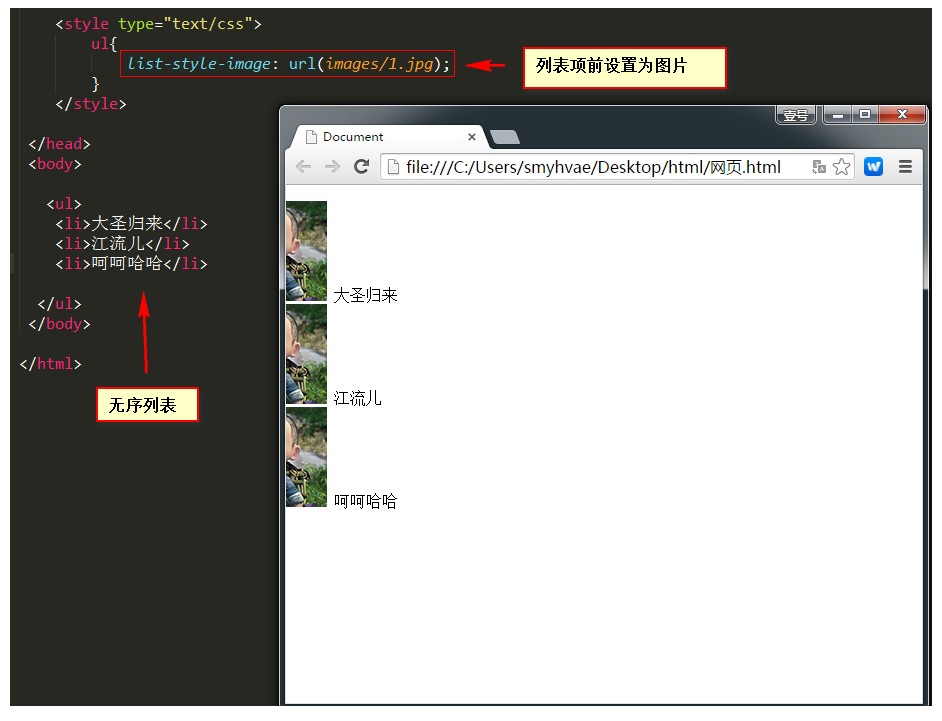
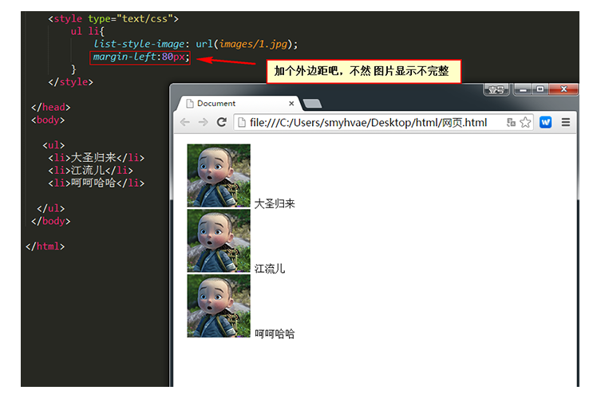
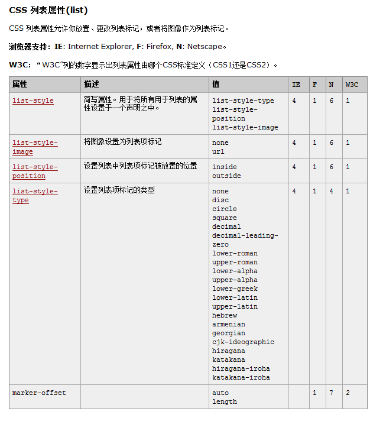

# 列表属性

```css
ul li{
	list-style-image:url(images/2.gif) ;  /*列表项前设置为图片*/
	margin-left:80px;  /*公有属性*/
}
```

另外还有一个简写属性叫做`list-style`，它的作用是：将上面的多个属性写在一个声明中。

我们来看一下`list-style-image`属性的效果：



给列表前面的图片加个边距吧，不然显示不完整：



这里来一张表格的图片吧，一览无遗：



## 有什么用

布局列表

