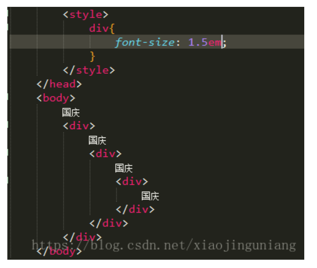

# 单位

参考链接：
[CSS单位](https://blog.csdn.net/xiaojinguniang/article/details/82918080)

html中的单位只有一种，那就是像素px，所以单位是可以省略的，但是在CSS中不一样。 **CSS中的单位是必须要写的**，因为它没有默认单位。

## 绝对单位

1 `in`=2.54`cm`=25.4`mm`=72`pt`=6`pc`。

各种单位的含义：

- `in`：英寸Inches (1 英寸 = 2.54 厘米)
- `cm`：厘米Centimeters
- `mm`：毫米Millimeters
- `pt`：点Points，或者叫英镑 (1点 = 1/72英寸)
- `pc`：皮卡Picas (1 皮卡 = 12 点)

## 相对单位

### 1.px

px像素（Pixel）。相对长度单位。像素px是相对于显示器屏幕分辨率而言的。

**PX特点**

- IE无法调整那些使用px作为单位的字体大小；
- 国外的大部分网站能够调整的原因在于其使用了em或rem作为字体单位；
- Firefox能够调整px和em，rem，但是96%以上的中国网民使用IE浏览器(或内核)。

### 2.em 

em是相对长度单位。相对于当前对象内文本的字体尺寸。如当前对行内文本的字体尺寸未被人为设置，则相对于浏览器的默认字体尺寸。

**EM特点**

- em的值并不是固定的；
- em会**继承**父级元素的字体大小。 

```
注意：

任意浏览器的默认字体高都是16px。所有未经调整的浏览器都符合: 1em=16px。那么12px=0.75em,10px=0.625em。

为了简化font-size的换算，需要在css中的body选择器中声明Font-size=62.5%，这就使em值变为 16px*62.5%=10px, 这样12px=1.2em, 10px=1em, 也就是说只需要将你的原来的px数值除以10，然后换上em作为单位就行了。

所以我们在写CSS的时候，需要注意两点：

1. body选择器中声明Font-size=62.5%；
2. 将你的原来的px数值除以10，然后换上em作为单位；
3. 重新计算那些被放大的字体的em数值。避免字体大小的重复声明。
也就是避免1.2 * 1.2= 1.44的现象。比如说你在#content中声明了字体大小为1.2em，那么在声明p的字体大小时就只能是1em，而不是1.2em, 因为此em非彼em，它因继承#content的字体高而变为了1em=12px。
```




### 3.rem

em是CSS3新增的一个相对单位（root em，根em），使用rem为元素设定字体大小时，仍然是相对大小，但相对的只是**HTML根元素**。这个单位可谓集相对大小和绝对大小的优点于一身，**通过它既可以做到只修改根元素就成比例地调整所有字体大小，又可以避免字体大小逐层复合的连锁反应。**目前，除了IE8及更早版本外，所有浏览器均已支持rem。对于不支持它的浏览器，应对方法也很简单，就是多写一个绝对单位的声明。这些浏览器会忽略用rem设定的字体大小。下面就是一个例子：

p {font-size:14px; font-size:.875rem;}

### px 与 rem 的选择？

对于只需要适配少部分手机设备，且分辨率对页面影响不大的，使用px即可 。

对于需要适配各种移动设备，使用rem，例如只需要适配iPhone和iPad等分辨率差别比较挺大的设备。

### **4.%**

一般宽泛的讲是相对于父元素，但是并不是十分准确。

1、对于普通定位元素就是我们理解的父元素

2、对于position: absolute;的元素是相对于已定位的父元素

3、对于position: fixed;的元素是相对于ViewPort（可视窗口)

### 5.vw

css3新单位，viewpoint width的缩写，视窗宽度，1vw等于视窗宽度的1%。

举个例子：浏览器宽度1200px, 1 vw = 1200px/100 = 12 px。

### 6.vh

css3新单位，viewpoint height的缩写，视窗高度，1vh等于视窗高度的1%。

举个例子：浏览器高度900px, 1 vh = 900px/100 = 9 px

### 7.vm

css3新单位，相对于视口的宽度或高度中较小的那个。其中最小的那个被均分为100单位的vm

举个例子：浏览器高度900px，宽度1200px，取最小的浏览器高度，1 vm = 900px/100 = 9 px。

### 有什么用

帮助布局、显示页面元素