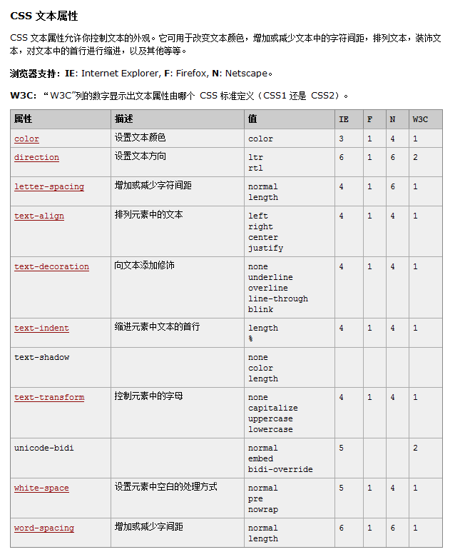

# 文本属性

CSS样式中，常见的文本属性有以下几种：

- `letter-spacing: 0.5cm ;` 单个字母之间的间距
- `word-spacing: 1cm;` 单词之间的间距
- `text-decoration: none;` 字体修饰：none 去掉下划线、**underline 下划线**、line-through 中划线、overline 上划线
- `text-transform: lowercase;` 单词字体大小写。uppercase大写、lowercase小写
- `color:red;` 字体颜色
- `text-align: center;` 在当前容器中的对齐方式。属性值可以是：left、right、center（**在当前容器的中间**）、justify
- `text-transform: lowercase;` 单词的字体大小写。属性值可以是：`uppercase`（单词大写）、`lowercase`（单词小写）、`capitalize`（每个单词的首字母大写）

这里来一张表格的图片吧，一览无遗：

## 有什么用

设置文档段落的属性

