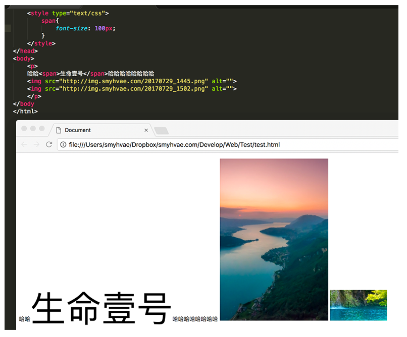

# 标注文档流

宏观地讲，我们的web页面和photoshop等设计软件有本质的区别：web页面的制作，是个“流”，必须从上而下，像“织毛衣”。而设计软件，想往哪里画个东西，都能画。

## 标准文档流的特性

### **（1）空白折叠现象：**

无论多少个空格、换行、tab，都会折叠为一个空格。

比如，如果我们想让img标签之间没有空隙，必须紧密连接：

```

```

### **（2）高矮不齐，底边对齐：**

举例如下：



### **（3）自动换行，一行写不满，换行写。**

## css中一共有三种手段，使一个元素脱离标准文档流：

- （1）浮动
- （2）绝对定位
- （3）固定定位

## 有什么用

理解Dom渲染的特点，更好的布局