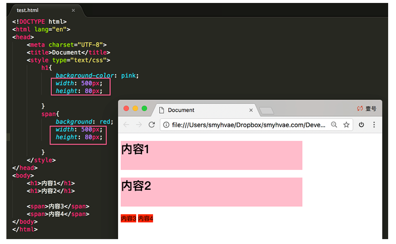
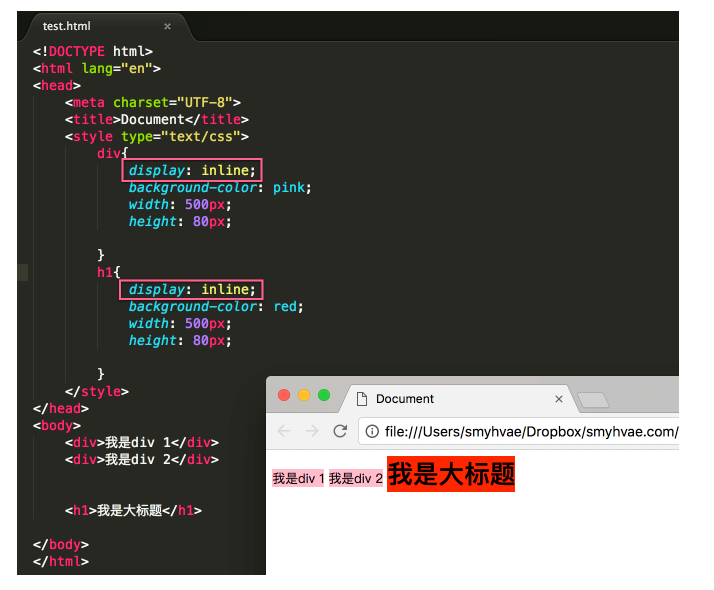
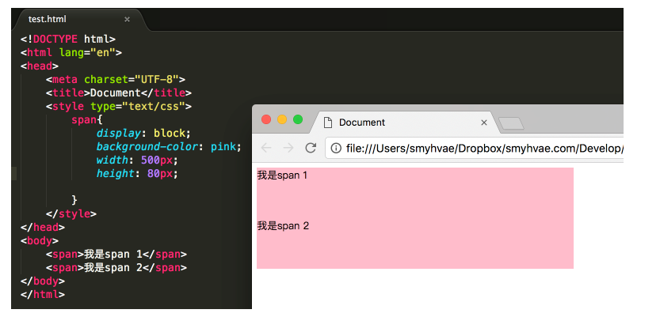

# 行内元素 块级元素

标准文档流等级森严。标签分为两种等级：

- 行内元素
- 块级元素

我们可以举一个例子，看看块级元素和行内元素的区别：


上图中可以看到，`h1`标签是块级元素，占据了整行，`span`标签是行内元素，只占据内容这一部分。

现在我们尝试给两个标签设置宽高。效果如下：



上图中，我们尝试给两个标签设置宽高，但发现，宽高属性只对块级元素`h1`生效。于是我们可以做出如下总结。

## <span style="color:red">**行内元素和块级元素的区别：**（非常重要）</span>

行内元素：

- 与其他行内元素并排；
- 不能设置宽、高。默认的宽度，就是文字的宽度。

块级元素：

- 霸占一行，不能与其他任何元素并列；
- 能接受宽、高。如果不设置宽度，那么宽度将默认变为父亲的100%。

## **行内元素和块级元素的分类：**

在以前的HTML知识中，我们已经将标签分过类，当时分为了：文本级、容器级。

从HTML的角度来讲，标签分为：

- 文本级标签：p、span、a、b、i、u、em。
- 容器级标签：div、h系列、li、dt、dd。

PS：为甚么说p是文本级标签呢？因为p里面只能放文字&图片&表单元素，p里面不能放h和ul，p里面也不能放p。

现在，从CSS的角度讲，CSS的分类和上面的很像，就p不一样：

- 行内元素：除了p之外，所有的文本级标签，都是行内元素。p是个文本级，但是是个块级元素。
- 块级元素：所有的容器级标签都是块级元素，还有p标签。

我们把上面的分类画一个图，即可一目了然：


## 行内元素和块级元素的相互转换

我们可以通过`display`属性将块级元素和行内元素进行相互转换。display即“显示模式”。

#### **块级元素可以转换为行内元素：**

一旦，给一个块级元素（比如div）设置：

```
display: inline;
```

那么，这个标签将立即变为行内元素，此时它和一个span无异。inline就是“行内”。也就是说：

- 此时这个div不能设置宽度、高度；
- 此时这个div可以和别人并排了。

举例如下：



#### 行内元素转换为块级元素：

同样的道理，一旦给一个行内元素（比如span）设置：

```
display: block;
```

那么，这个标签将立即变为块级元素，此时它和一个div无异。block”是“块”的意思。也就是说：

- 此时这个span能够设置宽度、高度
- 此时这个span必须霸占一行了，别人无法和他并排
- 如果不设置宽度，将撑满父亲

举例如下：



标准流里面的限制非常多，导致很多页面效果无法实现。如果我们现在就要并排、并且就要设置宽高，那该怎么办呢？办法是：移民！**脱离标准流**！

## css中一共有三种手段，使一个元素脱离标准文档流：

- （1）浮动
- （2）绝对定位
- （3）固定定位

