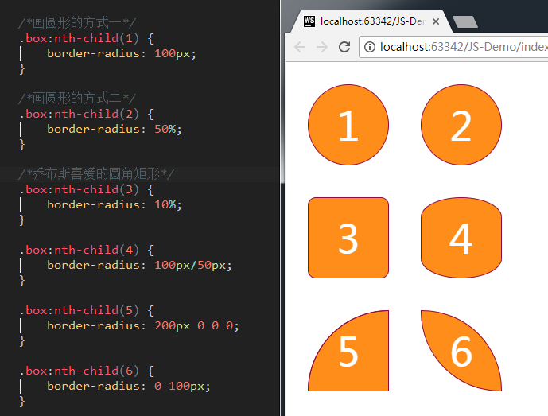
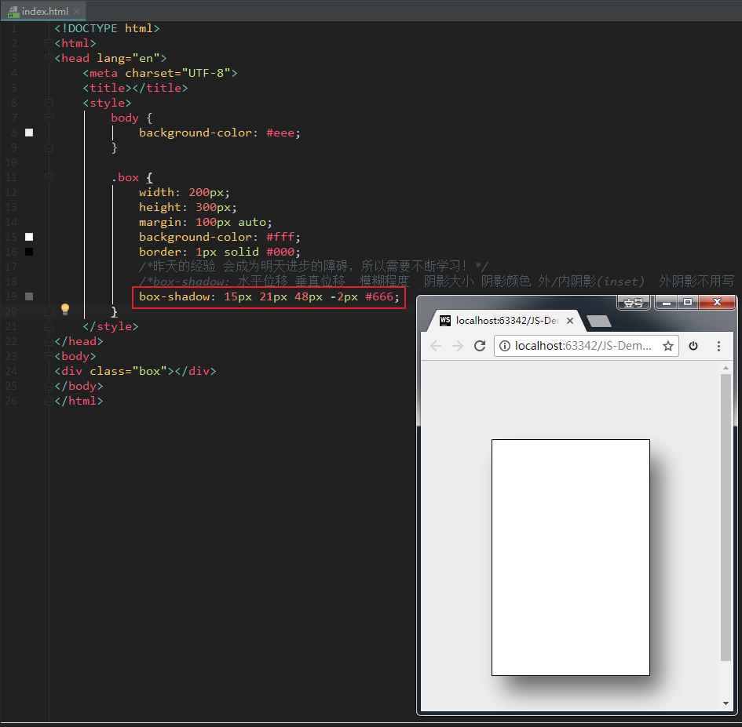
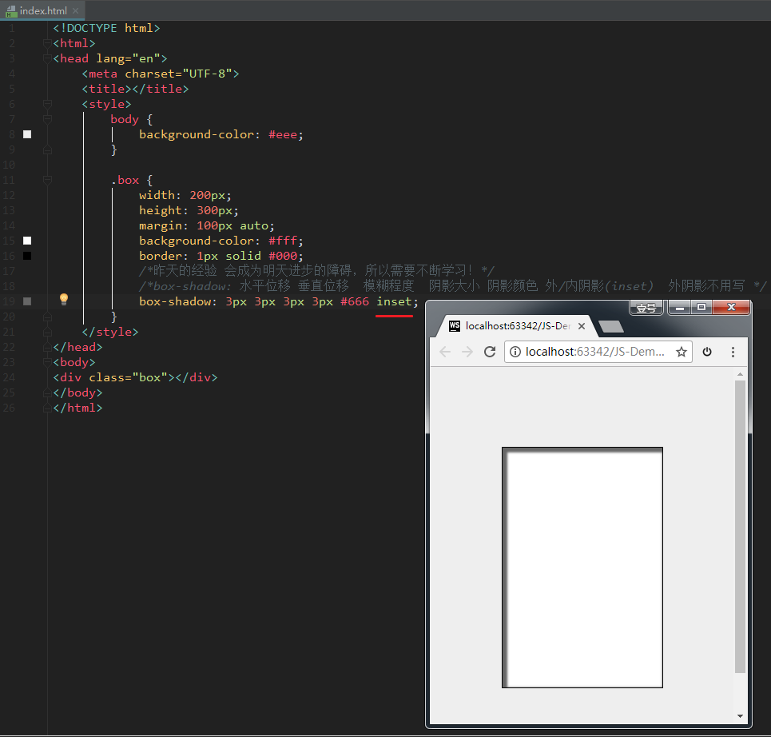
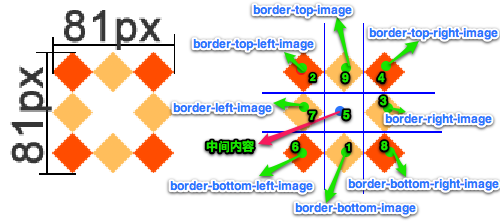
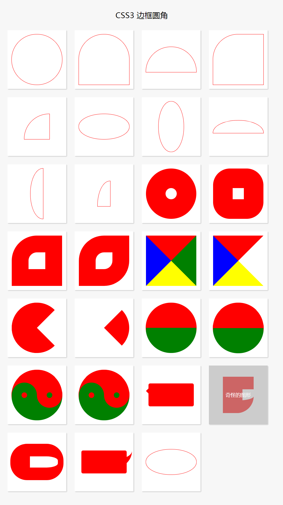
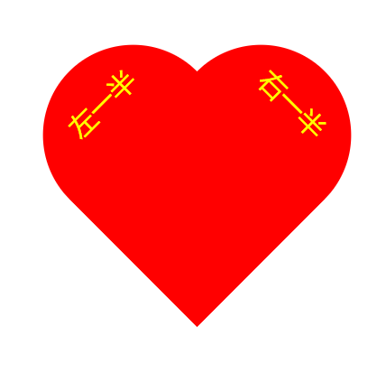
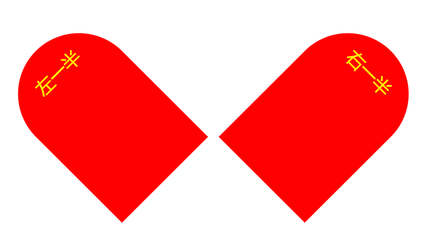

## 边框

边框的属性很多，其中**边框圆角**和**边框阴影**这两个属性，应用十分广泛，兼容性也相对较好，且符合**渐进增强**的原则，需要重点熟悉。

### 边框圆角：`border-radius` 属性

边框的每个圆角，本质上是一个圆，圆有**水平半径**和**垂直半径**：如果二者相等，就是圆；如果二者不等， 就是椭圆。

单个属性的写法：

```
	border-top-left-radius: 60px 120px;        //参数解释：水平半径   垂直半径

	border-top-right-radius: 60px 120px;

	border-bottom-left-radius: 60px 120px;

	border-bottom-right-radius: 60px 120px;
```

复合写法：

```
	border-radius: 60px/120px;             //参数：水平半径/垂直半径

	border-radius: 20px 60px 100px 140px;  //从左上开始，顺时针赋值。如果当前角没有值，取对角的值

	border-radius: 20px 60px;
```

最简洁的写法：（四个角的半径都相同时）

```
	border-radius: 60px;
```

举例：

```
<!DOCTYPE html>
<html>
<head lang="en">
    <meta charset="UTF-8">
    <title></title>
    <style>

        .parent {
            width: 400px;
        }
        .box {
            width: 100px;
            height: 100px;
            float: left;
            border: 1px solid rgb(144, 12, 63);
            margin: 20px;
            text-align: center;
            line-height: 100px;
            color: #fff;
            font-size: 50px;
            background-color: rgb(255, 141, 26);

        }

        /*画圆形的方式一*/
        .box:nth-child(1) {
            border-radius: 50px;
        }

        /*画圆形的方式二*/
        .box:nth-child(2) {
            border-radius: 50%;
        }

        .box:nth-child(3) {
            border-radius: 100px 0 0 0;
        }

        .box:nth-child(4) {
            border-radius: 100px/50px;
        }

        .box:nth-child(5) {
            border-radius: 10%;
        }

        .box:nth-child(6) {
            border-radius: 0 100px;
        }

    </style>
</head>
<body>

<div class="parent">
    <div class="box">1</div>
    <div class="box">2</div>
    <div class="box">3</div>
    <div class="box">4</div>
    <div class="box">5</div>
    <div class="box">6</div>
</div>
</body>
</html>
```

效果如下：

[](https://camo.githubusercontent.com/a3cde88245f255aecaf75e549db091f59bf69b17ad21cfe0eb9e8b0451841519/687474703a2f2f696d672e736d79687661652e636f6d2f32303138303230375f313735302e706e67)

### 边框阴影：`box-shadow` 属性

格式举例：

```
	box-shadow: 水平偏移 垂直偏移 模糊程度 阴影大小 阴影颜色

	box-shadow: 15px 21px 48px -2px #666;
```

参数解释：

- 水平偏移：正值向右 负值向左。
- 垂直偏移：正值向下 负值向上。
- 模糊程度：不能为负值。

效果如下：

[](https://camo.githubusercontent.com/de493b9b895363ef43ccd5409ee07604694cec4806b2584d78b38e192a771b06/687474703a2f2f696d672e736d79687661652e636f6d2f32303138303230375f323032372e706e67)

另外，后面还可以再加一个inset属性，表示内阴影。如果不写，则默认表示外阴影。例如：

```
	box-shadow:3px 3px 3px 3px #666 inset;
```

效果如下：

[](https://camo.githubusercontent.com/a0946bd7792bed6efc8aa6d7454990283ae4d18fe4d01856e0198522f128ba87/687474703a2f2f696d672e736d79687661652e636f6d2f32303138303230375f323032382e706e67)

**注意**：设置边框阴影不会改变盒子的大小，即不会影响其兄弟元素的布局。

我们还可以设置多重边框阴影，实现更好的效果，增强立体感。

### 边框图片

边框图片有以下属性：

```
	/* 边框图片的路径*/
	border-image-source: url("images/border.png");

	/* 图片边框的裁剪*/
	border-image-slice: 27;

	/*图片边框的宽度*/
	border-image-width: 27px;

	/*边框图片的平铺*/
	/* repeat :正常平铺 但是可能会显示不完整*/
	/*round: 平铺 但是保证 图片完整*/
	/*stretch: 拉伸显示*/
	border-image-repeat: stretch;
```

我们也可以写成一个综合属性：

```
	 border-image: url("images/border.png") 27/20px round;
```

这个属性要好好理解，我们假设拿下面这张图来作为边框图片：

[](https://camo.githubusercontent.com/1eb8391753c95ef854f9d7b4c647fd02891149e62f9824c16d3214a7de5f4d43/687474703a2f2f696d672e736d79687661652e636f6d2f32303138303230375f323034352e706e67)

[](https://camo.githubusercontent.com/39a585dedcf0f5510faec8c98cfb084ffabb603d330100f416a641b10485e848/687474703a2f2f696d672e736d79687661652e636f6d2f32303138303230375f323034362e706e67)

这张图片将会被“切割”成**九宫格**形式，然后进行平铺。四个角位置、形状保持不变，中心位置和水平垂直向两个方向平铺：

[](https://camo.githubusercontent.com/1967a19a76cda8db32cf6ac4cb2457a538f39556f57c1447dab4fbf72cb82d9b/687474703a2f2f696d672e736d79687661652e636f6d2f32303138303230375f323035302e706e67)

再具体一点：

[](https://camo.githubusercontent.com/2236d03d99346bc756eb47dda06d6a0ee555ad57ccc51641b3975652625e84be/687474703a2f2f696d672e736d79687661652e636f6d2f32303138303230375f323035312e706e67)

## CSS3 常见边框汇总

```
<!DOCTYPE html>
<html lang="en">
<head>
    <meta charset="UTF-8">
    <title>CSS3 边框</title>
    <style>
        body, ul, li, dl, dt, dd, h1, h2, h3, h4, h5 {
            margin: 0;
            padding: 0;
        }

        body {
            background-color: #F7F7F7;
        }

        .wrapper {
            width: 1000px;
            margin: 0 auto;
            padding: 20px;
            box-sizing: border-box;
        }

        header {
            padding: 20px 0;
            margin-bottom: 20px;
            text-align: center;
        }

        header h3 {
            line-height: 1;
            font-weight: normal;
            font-size: 28px;
        }

        .main {
            /*overflow: hidden;*/
        }

        .main:after {
            content: '';
            clear: both;
            display: block;
        }

        .main .item {
            width: 210px;
            height: 210px;
            margin: 0 30px 30px 0;
            display: flex;
            position: relative;
            background-color: #FFF;
            float: left;
            box-shadow: 2px 2px 5px #CCC;
        }

        .main .item:after {
            content: attr(data-brief);
            display: block;
            width: 100%;
            height: 100%;
            text-align: center;
            line-height: 210px;
            position: absolute;
            top: 0;
            left: 0;
            color: #FFF;
            font-family: '微软雅黑';
            font-size: 18px;
            background-color: rgba(170, 170, 170, 0);
            z-index: -1;
            transition: all 0.3s ease-in;
        }

        .main .item:hover:after {
            background-color: rgba(170, 170, 170, 0.6);
            z-index: 100;
        }

        .main .item:nth-child(4n) {
            margin-right: 0;
        }

        /*.main .item:nth-last-child(-n+5) {
            margin-bottom: 0;
        }*/

        /* 以上是骨架样式 */
        /* 1、2、3、4 顺时针 */
        .border-radius {
            width: 180px;
            height: 180px;
            margin: auto;
            border: 1px solid red;
            /*border-radius: 50% 30% 20%;*/
        }

        .square {
            border-radius: 0;
        }

        /*拱形*/
        .item:nth-child(1) .border-radius {
            border-radius: 90px;
        }

        /*拱形*/
        .item:nth-child(2) .border-radius {
            border-radius: 90px 90px 0 0;
        }

        /*半圆*/
        .item:nth-child(3) .border-radius {
            height: 90px;
            border-radius: 90px 90px 0 0;
        }

        /*左上角*/
        .item:nth-child(4) .border-radius {
            /*height: 90px;*/
            border-radius: 90px 0 0 0;
        }

        /*四分之一圆*/
        .item:nth-child(5) .border-radius {
            width: 90px;
            height: 90px;
            border-radius: 90px 0 0 0;
        }

        /*横着的椭圆*/
        .item:nth-child(6) .border-radius {
            height: 90px;
            /*border-radius: 50%;*/
            border-radius: 90px 90px 90px 90px / 45px 45px 45px 45px;
            /*border-radius: 45px / 90px;*/
        }

        /*竖着的椭圆*/
        .item:nth-child(7) .border-radius {
            width: 90px;
            border-radius: 45px 45px 45px 45px / 90px 90px 90px 90px;
        }

        /*半个横着的椭圆*/
        .item:nth-child(8) .border-radius {
            height: 45px;
            border-radius: 90px 90px 0 0 / 45px 45px 0 0;
        }

        /*半个竖着的椭圆*/
        .item:nth-child(9) .border-radius {
            width: 45px;
            border-radius: 45px 0 0 45px / 90px 0 0 90px;
        }

        /*四分之一竖着的椭圆*/
        .item:nth-child(10) .border-radius {
            width: 45px;
            height: 90px;
            border-radius: 45px 0 0 0 / 90px 0 0 0;
        }

        /*饼环*/
        .item:nth-child(11) .border-radius {
            width: 40px;
            height: 40px;
            border: 70px solid red;
            border-radius: 90px;
        }

        /*圆饼*/
        .item:nth-child(12) .border-radius {
            width: 40px;
            height: 40px;
            border: 70px solid red;
            border-radius: 60px;
        }

        /*左上角圆饼*/
        .item:nth-child(13) .border-radius {
            width: 60px;
            height: 60px;
            border: 60px solid red;
            border-radius: 90px 0 0 0;
        }

        /*对角圆饼*/
        .item:nth-child(14) .border-radius {
            width: 60px;
            height: 60px;
            border: 60px solid red;
            border-radius: 90px 0 90px 0;
        }

        /*四边不同色*/
        .item:nth-child(15) .border-radius {
            width: 0px;
            height: 0px;
            border-width: 90px;
            border-style: solid;
            border-color: red green yellow blue;
        }

        /*右透明色*/
        .item:nth-child(16) .border-radius {
            width: 0px;
            height: 0px;
            border-width: 90px;
            border-style: solid;
            border-color: red green yellow blue;
            border-right-color: transparent;
        }

        /*圆右透明色*/
        .item:nth-child(17) .border-radius {
            width: 0px;
            height: 0px;
            border-width: 90px;
            border-style: solid;
            border-color: red;
            border-right-color: transparent;
            border-radius: 90px;
        }

        /*圆右红透明色*/
        .item:nth-child(18) .border-radius {
            width: 0px;
            height: 0px;
            border-width: 90px;
            border-style: solid;
            border-color: transparent;
            border-right-color: red;
            border-radius: 90px;
        }

        /*阴阳图前世*/
        .item:nth-child(19) .border-radius {
            width: 180px;
            height: 0px;
            border-top-width: 90px;
            border-bottom-width: 90px;
            border-style: solid;
            border-top-color: red;
            border-bottom-color: green;
            /*border-right-color: red;*/
            border-radius: 90px;
        }

        /*阴阳图前世2*/
        .item:nth-child(20) .border-radius {
            width: 180px;
            height: 90px;
            border-bottom-width: 90px;
            border-style: solid;
            border-bottom-color: green;
            background-color: red;
            /*border-right-color: red;*/
            border-radius: 90px;
        }

        /*阴阳图今生*/
        .item:nth-child(21) .border-radius {
            width: 180px;
            height: 90px;
            border-bottom-width: 90px;
            border-style: solid;
            border-bottom-color: green;
            background-color: red;
            border-radius: 90px;
            position: relative;
        }

        .item:nth-child(21) .border-radius::after,
        .item:nth-child(21) .border-radius::before {
            content: '';
            position: absolute;
            top: 50%;
            width: 20px;
            height: 20px;
            /*margin: -10px 0 0 0;*/
            border-width: 35px;
            border-style: solid;
            border-radius: 45px;
        }

        /*左阴阳*/
        .item:nth-child(21) .border-radius::after {
            background-color: red;
            border-color: green;
        }

        /*右阴阳*/
        .item:nth-child(21) .border-radius::before {
            background-color: green;
            border-color: red;
            right: 0;
        }

        /*右阴阳*/
        .item:nth-child(22) .border-radius {
            width: 180px;
            height: 90px;
            border-bottom-width: 90px;
            border-bottom-color: green;
            border-bottom-style: solid;
            background-color: red;
            border-radius: 90px;
            position: relative;
        }

        .item:nth-child(22) .border-radius::after,
        .item:nth-child(22) .border-radius::before {
            content: '';
            position: absolute;
            top: 50%;
            width: 20px;
            height: 20px;
            border-width: 35px;
            border-style: solid;
            border-radius: 45px;
        }

        .item:nth-child(22) .border-radius::before {
            border-color: green;
            background-color: red;
        }

        .item:nth-child(22) .border-radius::after {
            right: 0;
            border-color: red;
            background-color: green;
        }

        /*消息框*/
        .item:nth-child(23) .border-radius {
            width: 160px;
            height: 80px;
            background-color: red;
            border-radius: 6px;
            position: relative;
        }

        .item:nth-child(23) .border-radius::after {
            content: '';
            width: 0;
            height: 0;
            border-width: 10px;
            border-style: solid;
            border-color: transparent;
            border-right-color: red;
            position: absolute;
            top: 16px;
            left: -20px;
        }

        /*奇怪的图形*/
        .item:nth-child(24) .border-radius {
            width: 40px;
            height: 40px;
            border-width: 45px 0 45px 70px;
            border-style: solid;
            border-radius: 0 0 60px 0;
            border-color: red;
        }

        /*奇怪的图形2*/
        .item:nth-child(25) .border-radius {
            width: 100px;
            height: 40px;
            border-width: 45px 20px 45px 70px;
            border-style: solid;
            border-radius: 60px;
            border-color: red;
        }

        /*QQ对话*/
        .item:nth-child(26) .border-radius {
            width: 160px;
            height: 80px;
            background-color: red;
            border-radius: 6px;
            position: relative;
        }

        .item:nth-child(26) .border-radius::after {
            content: '';
            position: absolute;
            top: 0;
            right: -20px;
            width: 30px;
            height: 30px;
            border-width: 0 0 30px 30px;
            border-style: solid;
            border-bottom-color: red;
            border-left-color: transparent;
            border-radius: 0 0 60px 0;
        }

        /*圆角的百分比设置 */
        .item:nth-child(27) .border-radius {
            width: 180px;
            /*height: 180px;*/
            height: 90px;
            border-radius: 50%;
            border-radius: 90px/45px;

            /*百分比是按横竖两个对应的方向的长度进行计算*/
        }

    </style>
</head>
<body>
<div class="wrapper">
    <header>
        <h3>CSS3 边框圆角</h3>
    </header>
    <div class="main">
        <div class="item" data-brief="整圆">
            <div class="border-radius"></div>
        </div>
        <div class="item" data-brief="拱形">
            <div class="border-radius"></div>
        </div>
        <div class="item" data-brief="半圆">
            <div class="border-radius"></div>
        </div>
        <div class="item" data-brief="左上角">
            <div class="border-radius"></div>
        </div>
        <div class="item" data-brief="四分之一圆">
            <div class="border-radius"></div>
        </div>
        <div class="item" data-brief="横着的椭圆">
            <div class="border-radius"></div>
        </div>
        <div class="item" data-brief="竖着的椭圆">
            <div class="border-radius"></div>
        </div>
        <div class="item" data-brief="半个横着的椭圆">
            <div class="border-radius"></div>
        </div>
        <div class="item" data-brief="半个竖着的椭圆">
            <div class="border-radius"></div>
        </div>
        <div class="item" data-brief="四分之一竖着的椭圆">
            <div class="border-radius"></div>
        </div>
        <div class="item" data-brief="饼环">
            <div class="border-radius"></div>
        </div>
        <div class="item" data-brief="圆饼">
            <div class="border-radius"></div>
        </div>
        <div class="item" data-brief="左上角圆饼">
            <div class="border-radius"></div>
        </div>
        <div class="item" data-brief="对角圆饼">
            <div class="border-radius"></div>
        </div>
        <div class="item" data-brief="四边不同色">
            <div class="border-radius"></div>
        </div>
        <div class="item" data-brief="右透明色">
            <div class="border-radius"></div>
        </div>
        <div class="item" data-brief="圆右透明色">
            <div class="border-radius"></div>
        </div>
        <div class="item" data-brief="圆右红透明色">
            <div class="border-radius"></div>
        </div>
        <div class="item" data-brief="阴阳图前世">
            <div class="border-radius"></div>
        </div>
        <div class="item" data-brief="阴阳图前世2">
            <div class="border-radius"></div>
        </div>
        <div class="item" data-brief="阴阳图今生">
            <div class="border-radius"></div>
        </div>
        <div class="item" data-brief="阴阳图今生2">
            <div class="border-radius"></div>
        </div>
        <div class="item" data-brief="消息框">
            <div class="border-radius"></div>
        </div>
        <div class="item" data-brief="奇怪的图形">
            <div class="border-radius"></div>
        </div>
        <div class="item" data-brief="奇怪的图形2">
            <div class="border-radius"></div>
        </div>
        <div class="item" data-brief="QQ对话">
            <div class="border-radius"></div>
        </div>
        <div class="item" data-brief="圆角百分比">
            <div class="border-radius"></div>
        </div>
    </div>
</div>
</body>
</html>
```

效果如下：

[](https://camo.githubusercontent.com/0306df515f07f85b5a5e1f5e1007efccab8d07fc4a075d3500a7b1b178f21162/687474703a2f2f696d672e736d79687661652e636f6d2f32303138303230385f313733302e706e67)

## 爱心

```
<!DOCTYPE html>
<html>
<head lang="en">
    <meta charset="UTF-8">
    <title></title>
    <style>
        .heart {
            width: 200px;
            height: 300px;
            /*border: 1px solid #000;*/
            margin: 100px auto;
            position: relative;
        }

        .heart::before, .heart::after {
            content: "左一半";
            width: 100%;
            height: 100%;
            position: absolute;
            background-color: red;
            left: 0;
            top: 0;

            border-radius: 100px 100px 0 0;
            transform: rotate(-45deg);
            text-align: center;
            line-height: 100px;
            color: yellow;
            font-size: 30px;
            font-family: "MIcrosoft Yahei";
        }

        .heart::after {
            content: "右一半";
            left: 71px;
            transform: rotate(45deg);
        }
    </style>
</head>
<body>
<div class="heart">

</div>
</body>
</html>
```

效果如下：

[](https://camo.githubusercontent.com/7a8a90264da59d560edbad27ade76df201d08c29f854986ac69c9978d5acc6e4/687474703a2f2f696d672e736d79687661652e636f6d2f32303138303230385f313733372e706e67)

它其实是下面这两个盒子叠起来的：

[](https://camo.githubusercontent.com/26e15809b3362b6f02e34c72dd4bf62f9209c1669e42ff19800c929d1fd1392e/687474703a2f2f696d672e736d79687661652e636f6d2f32303138303230385f313733382e706e67)

改变 `.heart::after` 的 left值，即可叠起来。