# 选择器

## CSS 的四种基本选择器

CSS 选择器：就是指定 CSS 要作用的标签，那个标签的名称就是选择器。意为：选择哪个容器。

CSS 的选择器分为两大类：基本选择题和扩展选择器。

**基本选择器：**

- 标签选择器：针对**一类**标签
- ID 选择器：针对某**一个**特定的标签使用
- 类选择器：针对**你想要的所有**标签使用
- 通用选择器（通配符）：针对所有的标签都适用（不建议使用）

下面来分别讲一讲。

### 1、标签选择器：选择器的名字代表 html 页面上的标签

标签选择器，选择的是页面上所有这种类型的标签，所以经常描述“**共性**”，无法描述某一个元素的“个性”。

举例：

```
p{ font-size:14px; }
```

上方选择器的意思是说：所有的`<p>`标签里的内容都将显示 14 号字体。

效果：

[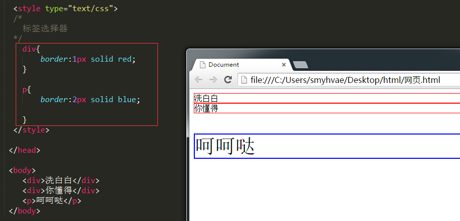](https://camo.githubusercontent.com/b402dcac8431f78c7a5bca704fb0a5ad98609c923f579de89fcbf637ec80e796/687474703a2f2f696d672e736d79687661652e636f6d2f323031352d31302d30332d6373732d30362e706e67)

再比如说，我想让“生命壹号学完了安卓，继续学前端哟”这句话中的“前端”两个变为红色字体，那么我可以用`<span>`标签把“前端”这两个字围起来，然后给`<span>`标签加一个标签选择器。

代码如下：

```
<!DOCTYPE html>
<html lang="en">
    <head>
        <meta charset="UTF-8" />
        <title>Document</title>
        <style type="text/css">
            span {
                color: red;
            }
        </style>
    </head>
    <body>
        <p>生命壹号学完了安卓，继续学<span>前端</span>哟</p>
    </body>
</html>
```

【总结】需要注意的是：

（1）所有的标签，都可以是选择器。比如 ul、li、label、dt、dl、input。

（2）无论这个标签藏的多深，一定能够被选择上。

（3）选择的所有，而不是一个。

### 2、ID 选择器：规定用`#`来定义

针对某一个特定的标签来使用，只能使用一次。css 中的 ID 选择器以”#”来定义。

举例：

```
#mytitle{ border:3px dashed green; }
```

效果：

[](https://camo.githubusercontent.com/e06ccd058b69c86027f97347c02c21c05155b89bc8fe328b7a12316893d42ddf/687474703a2f2f696d672e736d79687661652e636f6d2f323031352d31302d30332d6373732d30382e706e67)

id 选择器的选择符是“#”。

任何的 HTML 标签都可以有 id 属性。表示这个标签的名字。这个标签的名字，可以任取，但是：

- （1）只能有字母、数字、下划线。
- （2）必须以字母开头。
- （3）不能和标签同名。比如 id 不能叫做 body、img、a。

另外，特别强调的是：**HTML 页面，不能出现相同的 id，哪怕他们不是一个类型**。比如页面上有一个 id 为 pp 的 p，一个 id 为 pp 的 div，是非法的！

**一个标签可以被多个 css 选择器选择：**

比如，我们可以同时让标签选择器和 id 选择器作用于同一个标签。如下：

[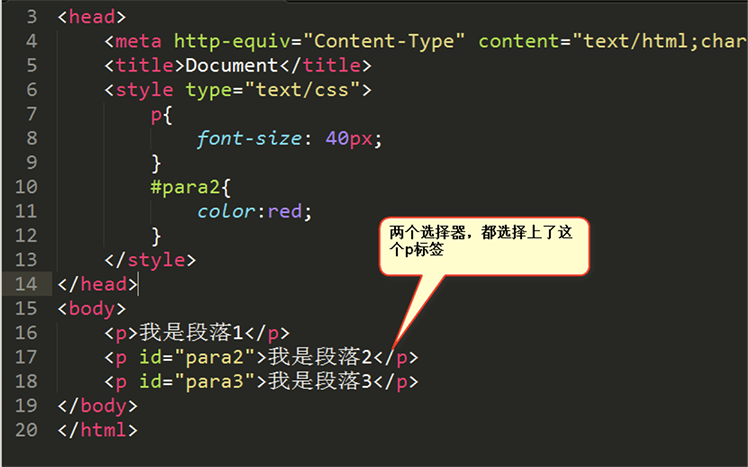](https://camo.githubusercontent.com/d59ba9c643db8157bd69a17b66a8a7cd657b66a4ceedef4020ba503ba723dc2d/687474703a2f2f696d672e736d79687661652e636f6d2f32303137303731305f313733372e706e67)

然后我们通过网页的审查元素看一下效果：

[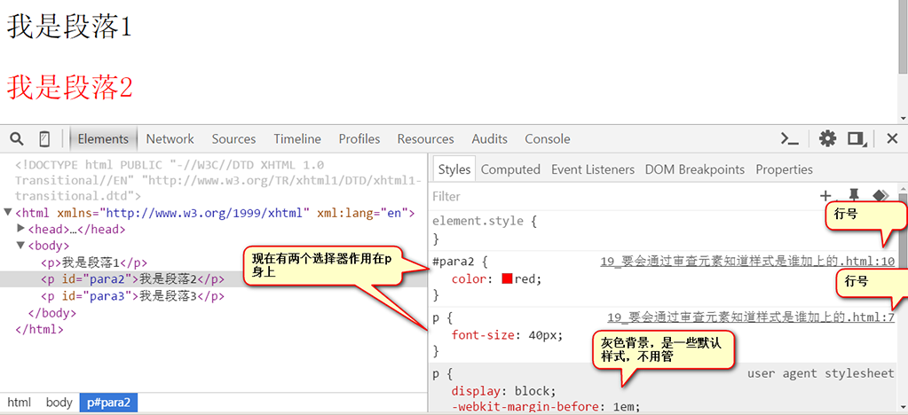](https://camo.githubusercontent.com/785637b6d6764536be744b393a0d74634dc37f52139443c2299c29888dcf9c69/687474703a2f2f696d672e736d79687661652e636f6d2f32303137303731315f313534302e706e67)

现在，假设选择器冲突了，比如 id 选择器说这个文字是红色的，标签选择器说这个文字是绿色的。那么听谁的？ 实际上，css 有着非常严格的计算公式，能够处理冲突.

一个标签可以被多个 css 选择器选择，共同作用，这就是“**层叠式**”的第一层含义（第一层含义和第二层含义，放到 css 基础的第三篇文章里讲）。

### 3、类选择器：规定用圆点`.`来定义

、针对**你想要的所有**标签使用。优点：灵活。

css 中用`.`来表示类。举例如下：

```
.one{ width:800px; }
```

效果：

[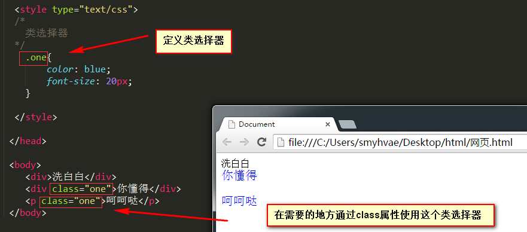](https://camo.githubusercontent.com/494c2799550d8c44fca1d8b62b6e51850f7f016b493416726868a5e2e3b3c7bb/687474703a2f2f696d672e736d79687661652e636f6d2f323031352d31302d30332d6373732d30372e706e67)

和 id 非常相似，任何的标签都可以携带 id 属性和 class 属性。class 属性的特点：

- 特性 1：类选择器可以被多种标签使用。
- 特性 2：同一个标签可以使用多个类选择器。用**空格**隔开。举例如下：（正确）

```
<h3 class="teshu  zhongyao">我是一个h3啊</h3>
```

初学者常见的错误，就是写成了两个 class。举例如下：（错误）

```
<h3 class="teshu" class="zhongyao">我是一个h3啊</h3>
```

**类选择器使用的举例：**

类选择器的使用，能够决定一个人的 css 水平。

比如，我们现在要做下面这样一个页面：

[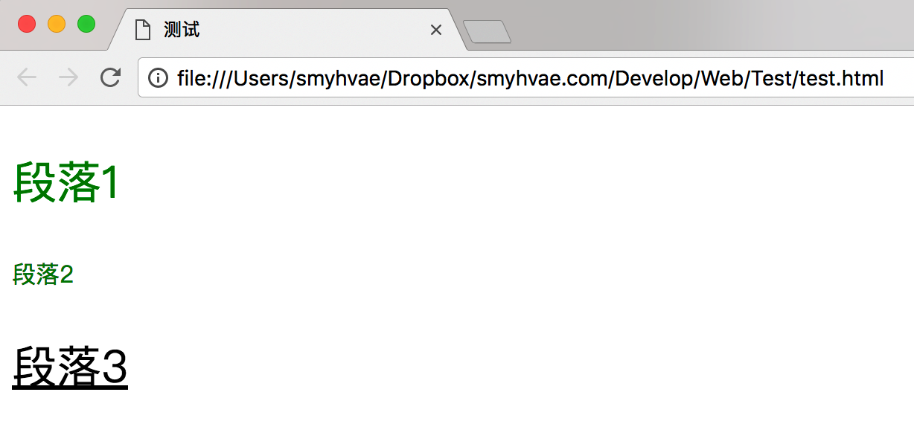](https://camo.githubusercontent.com/b7f3fead25d6074c94cecc164468901ac4a8b8bcc689a38d804b3ff86d771b75/687474703a2f2f696d672e736d79687661652e636f6d2f32303137303731315f313633392e706e67)

正确的思路，就是用所谓“公共类”的思路，就是我们类就是提供“公共服务”，比如有绿、大、线，一旦携带这个类名，就有相应的样式变化。对应 css 里的代码如下：

```
<style type="text/css">
    .lv {
        color: green;
    }
    .da {
        font-size: 30px;
    }
    .xian {
        text-decoration: underline;
    }
</style>
```

然后让每个标签去选取自己想要用的类选择器：

```
<p class="lv da">段落1</p>
<p class="lv xian">段落2</p>
<p class="da xian">段落3</p>
```

也就是说：

（1）不要去试图用一个类名，把某个标签的所有样式写完。这个标签要多携带几个类，共同完成这个标签的样式。

（2）每一个类要尽可能小，有“公共”的概念，能够让更多的标签使用。

问题：到底用 id 还是用 class？

答案：尽可能的用 class，除非极特殊的情况可以用 id。

原因：id 是 js 用的。也就是说，js 要通过 id 属性得到标签，所以 css 层面尽量不用 id，要不然 js 就很别扭。另一层面，我们会认为一个有 id 的元素，有动态效果。

举例如下：

[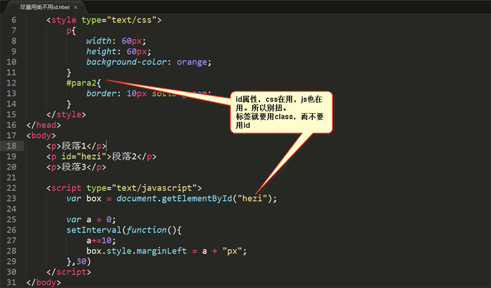](https://camo.githubusercontent.com/176dade4108685c1217ceecf797b22c141e136a37dcab71c500564c938d6b426/687474703a2f2f696d672e736d79687661652e636f6d2f32303137303731315f313730362e706e67)

上图所示，css 和 js 都在用同一个 id，会出现不好沟通的情况。

我们记住这句话：**类上样式，id 上行为**。意思是说，`class`属性交给 css 使用，`id`属性交给 js 使用。

**上面这三种选择器的区别：**

- 标签选择器针对的是页面上的一类标签。
- ID 选择器是只针对特定的标签(一个)，ID 是此标签在此页面上的唯一标识。
- 类选择器可以被多种标签使用。

### 4、通配符`*`：匹配任何标签

通用选择器，将匹配任何标签。不建议使用，IE 有些版本不支持，大网站增加客户端负担。

效率不高，如果页面上的标签越多，效率越低，所以页面上不能出现这个选择器。

举例：

```
* {
    margin-left: 0px;
    margin-top: 0px;
}
```

效果：

[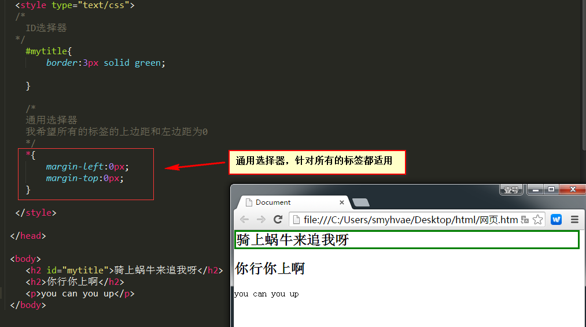](https://camo.githubusercontent.com/192fc1abf359556204de7d10f694be3427c1b93ed0761c810bb2070fbd003526/687474703a2f2f696d672e736d79687661652e636f6d2f323031352d31302d30332d6373732d30392e706e67)

## CSS 的几种高级选择器

**高级选择器：**

- 后代选择器：用空格隔开
- 交集选择器：选择器之间紧密相连
- 并集选择器（分组选择器）：用逗号隔开
- 伪类选择器

下面详细讲一下这几种高级（扩展）选择器。

### 1、后代选择器: 定义的时候用空格隔开

对于`E F`这种格式，表示**所有属于 E 元素后代的 F 元素**，有这个样式。空格就表示后代。

后代选择器，就是一种平衡：共性、特性的平衡。当要把**某一个部分的所有的什么**，进行样式改变，就要想到后代选择器。

后代选择器，描述的是祖先结构。

看定义可能有点难理解，我们来看例子吧。

举例 1：

```
<style type="text/css">
    .div1 p {
        color: red;
    }
</style>
```

空格就表示后代。`.div1 p` 表示`.div1`的后代所有的`p`。

这里强调一下：这两个标签不一定是连续紧挨着的，只要保持一个后代的关联即可。也就是说，选择的是后代，不一定是儿子。

举例：

```
<style type="text/css">
    h3 b i {
        color: red;
    }
</style>
```

上方代码的意思是说：定义了`<h3>`标签中的`<b>`标签中的`<i>`标签的样式。 同理：h3 和 b 和 i 标签不一定是连续紧挨着的，只要保持一个后代的关联即可。

效果：

[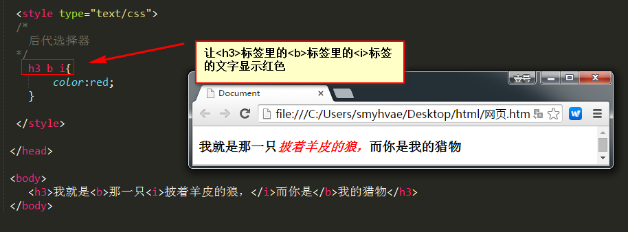](https://camo.githubusercontent.com/2572150a0b751f2367337a849a516063a4f22ae3e0c83f1658c394363be8378a/687474703a2f2f696d672e736d79687661652e636f6d2f323031352d31302d30332d6373732d31312e706e67)

或者还有下面这种写法：

[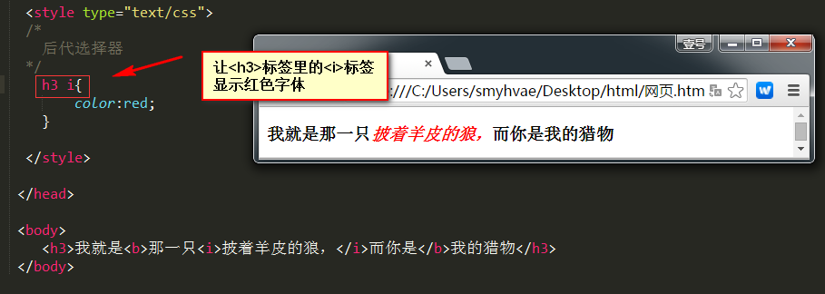](https://camo.githubusercontent.com/ac6f639ee1b77703a4bfd7a17809cb72ae1356eb0198bfac59735330cacfc120/687474703a2f2f696d672e736d79687661652e636f6d2f323031352d31302d30332d6373732d31322e706e67)

上面的这种写法，`<h3>`标签和`<i>`标签并不是紧挨着的，但他们保持着一种后代关系。

还有下面这种写法：（含类选择器、id 选择器都是可以的）

[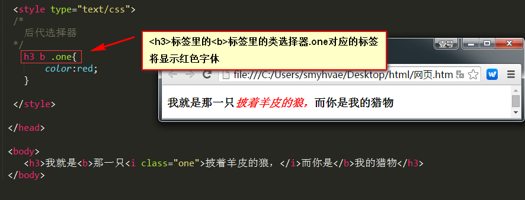](https://camo.githubusercontent.com/425b3edca919f10ff1afc733f60b8f8ed22eac9af37c8c89403279c948475135/687474703a2f2f696d672e736d79687661652e636f6d2f323031352d31302d30332d6373732d31332e706e67)

我们在开头说了：**后代选择器，描述的是一种祖先结构**。我们举个例子来说明这句话：

```
<!DOCTYPE html>
<html lang="en">
    <head>
        <meta charset="UTF-8" />
        <title>Document</title>
        <style type="text/css">
            div div p {
                color: red;
            }
        </style>
    </head>
    <body>
        <div>
            <div class="div2">
                <div class="div3">
                    <div class="div4">
                        <p>我是什么颜色？</p>
                    </div>
                </div>
            </div>
        </div>
    </body>
</html>
```

上面 css 中的`div div p`，也能使文字的颜色变红。通过浏览器的审查元素，我们可以看到 p 元素的祖先列表：

[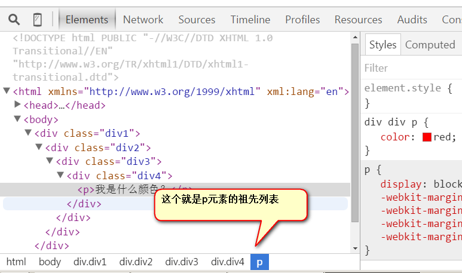](https://camo.githubusercontent.com/57eccea3e54ded4133ee2d44d1fb29119532f98ca06342f8bff1949542bc2b3d/687474703a2f2f696d672e736d79687661652e636f6d2f32303137303731315f313833362e706e67)

讲到这里，我们再提一个 VS Code 的快捷键：

在 VS Code 中输入`p#haha`，按 tab 键后，会生成`<p id="haha"></p>`。

在 VS Code 中输入`p.haha`，按 tab 键后，会生成`<p class="haha"></p>`。

### 2、交集选择器：定义的时候紧密相连

定义交集选择器的时候，两个选择器之间紧密相连。一般是以标签名开头，比如`div.haha`，再比如`p.special`。

如果后一个选择器是类选择器，则写为`div.special`；如果后一个选择器 id 选择器，则写为`div#special`。

来看下面这张图就明白了：

[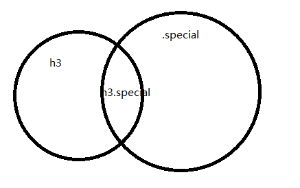](https://camo.githubusercontent.com/5b53f53a5f40d1ee2061b55b4263c26b8b0d411109b0de304a0e5ed182c6f6c1/687474703a2f2f696d672e736d79687661652e636f6d2f32303137303731315f313835312e706e67)

```
h3.special {
    color: red;
}
```

选择的元素要求同时满足两个条件：必须是 h3 标签，然后必须是 special 标签。

举例：

```
<!DOCTYPE html>
<html lang="en">
    <head>
        <meta charset="UTF-8" />
        <title>交集选择器测试</title>
        <style type="text/css">
            h3.special {
                color: red;
            }
        </style>
    </head>
    <body>
        <h3 class="special zhongyao">标题1</h3>
        <h3 class="special">我也是标题</h3>
        <p>我是段落</p>
    </body>
</html>
```

效果如下：

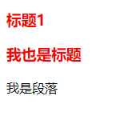

注意，交集选择器没有空格。所以，没有空格的`div.red`（交集选择器）和有空格的`div .red`（后代选择器）不是一个意思。

交集选择器可以连续交：（一般不要这么写）

```
h3.special.zhongyao {
    color: red;
}
```

上面这种写法，是 IE7 开始兼容的，IE6 不兼容。

### 3、并集选择器：定义的时候用逗号隔开

三种基本选择器都可以放进来。

举例：

```
p,
h1,
#mytitle,
.one {
    color: red;
}
```

效果：

[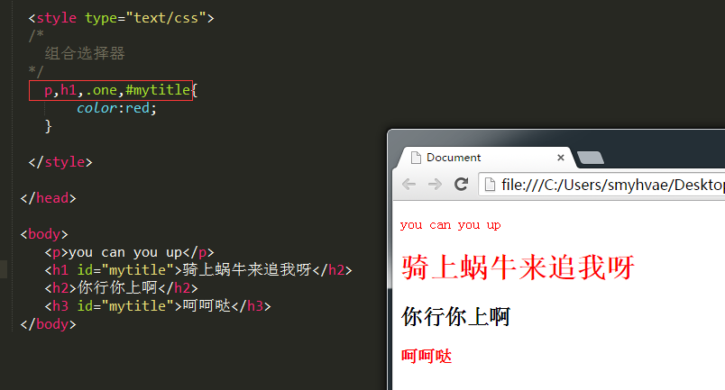](https://camo.githubusercontent.com/884006b221ce4b3d4d045135d763777eb572c5404c82396a442cbe8585e859f3/687474703a2f2f696d672e736d79687661652e636f6d2f323031352d31302d30332d6373732d31302e706e67)

## 一些 CSS3 选择器

> 所有的 CSS3 选择器，我们放在 CSS3 的内容里介绍。本文暂时先接触一部分。

### 浏览器的兼容性问题

> 我们可以用`IETester`这个软件测一下 CSS 在各个版本 IE 浏览器上的显示效果。

IE： 微软的浏览器，随着操作系统安装的。所以每个 windows 都有 IE 浏览器。各版本如下：

- windows xp 操作系统安装的 IE6
- windows vista 操作系统安装的 IE7
- windows 7 操作系统安装的 IE8
- windows 8 操作系统安装的 IE9
- windows10 操作系统安装的 edge

浏览器兼容问题，要出，就基本上就是出在 IE6、7 身上，这两个浏览器是非常低级的浏览器。

为了测试浏览器 CSS 3 的兼容性，我们可以在网上搜"css3 机器猫"关键字，然后在不同的浏览器中打开如下链接：

- http://www1.pconline.com.cn/pcedu/specialtopic/css3-doraemon/

测试结果如下：

[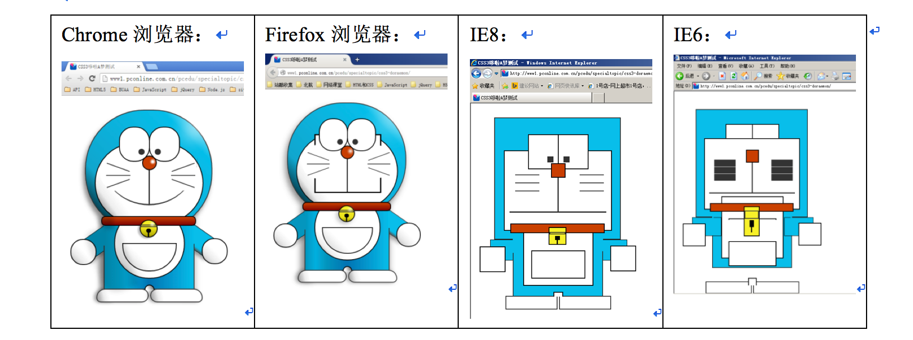](https://camo.githubusercontent.com/20dee846ca4b4af1fcb293f701e0354fc16d3a62549fdc2bc106aba7bd09305f/687474703a2f2f696d672e736d79687661652e636f6d2f32303137303731315f313933392e706e67)

我们可以在[百度统计](http://tongji.baidu.com/data/)里查看浏览器的市场占有率：

- IE9 5.94%
- IE8 21.19%
- IE7 4.79%
- IE6 4.11%

我们可以在http://html5test.com/results/desktop.html中查看

[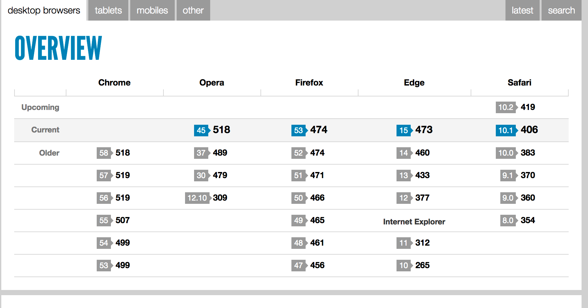](https://camo.githubusercontent.com/62e83a17da4ef6bd1198b1c5e816371ec3cd6903165385509e9ae52e139ca730/687474703a2f2f696d672e736d79687661652e636f6d2f32303137303731315f313934382e706e67)

我们要知道典型的 IE6 兼容问题（面试要问），但是做项目我们兼容到 IE8 即可。不解决 IE8 以下的兼容问题，目的在于：培养更高的兴趣和眼光，别天天的跟 IE6 较劲。

我们可以用「IETester」软件看看 css 在各个浏览器中的显示效果。

### 1.子代选择器，用符号`>`表示

> IE7 开始兼容，IE6 不兼容。

```
div > p {
    color: red;
}
```

div 的儿子 p。和 div 的后代 p 的截然不同。

能够选择：

```
<div>
    <p>我是div的儿子</p>
</div>
```

不能选择：

```
<div>
    <ul>
        <li>
            <p>我是div的重孙子</p>
        </li>
    </ul>
</div>
```

### 2.序选择器

> IE8 开始兼容；IE6、7 都不兼容

设置无序列表`<ul>`中的第一个`<li>`为红色：

```
<style type="text/css">
    ul li:first-child {
        color: red;
    }
</style>
```

设置无序列表`<ul>`中的最后一个`<li>`为红色：

```
ul li:last-child {
    color: blue;
}
```

序选择器还有更复杂的用法，以后再讲。

由于浏览器的更新需要过程，所以现在如果公司还要求兼容 IE6、7，那么就要自己写类名：

```
<ul>
    <li class="first">项目</li>
    <li>项目</li>
    <li>项目</li>
    <li>项目</li>
    <li>项目</li>
    <li>项目</li>
    <li>项目</li>
    <li>项目</li>
    <li>项目</li>
    <li class="last">项目</li>
</ul>
```

用类选择器来选择第一个或者最后一个：

```
ul li.first{ color:red; } ul li.last{ color:blue; }
```

### 3.下一个兄弟选择器

> IE7 开始兼容，IE6 不兼容。

`+`表示选择下一个兄弟

```
<style type="text/css">
    h3 + p {
        color: red;
    }
</style>
```

上方的选择器意思是：选择的是 h3 元素后面紧挨着的第一个兄弟。

```
<h3>我是一个标题</h3>
<p>我是一个段落</p>
<p>我是一个段落</p>
<p>我是一个段落</p>
<h3>我是一个标题</h3>
<p>我是一个段落</p>
<p>我是一个段落</p>
<p>我是一个段落</p>
<h3>我是一个标题</h3>
<p>我是一个段落</p>
<p>我是一个段落</p>
<p>我是一个段落</p>
<h3>我是一个标题</h3>
```

效果如下：

[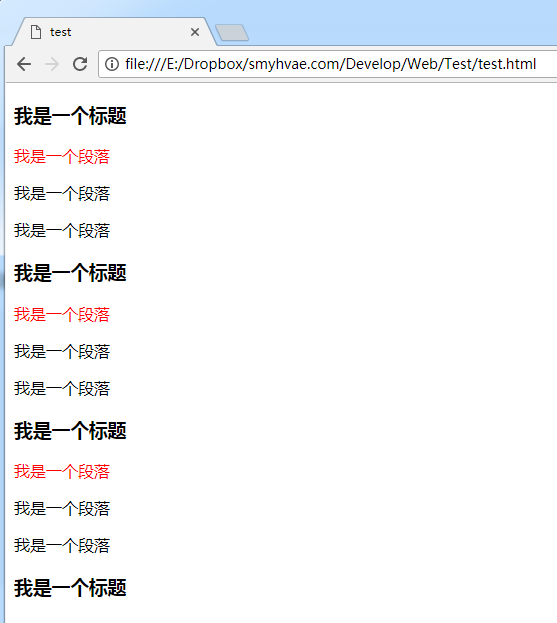](https://camo.githubusercontent.com/735485ad5191ec7928bffb76658435956aaadbda9761b01e27707261b303db2e/687474703a2f2f696d672e736d79687661652e636f6d2f32303137303731315f313935302e706e67)

这种选择器作用不大。