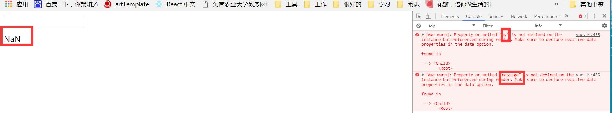

# vue组件中camelCased (驼峰式) 命名与 kebab-case（短横线命名）

参考链接：

[vue组件中驼峰式命名和短横线命名](https://blog.csdn.net/wangxiaoxiaosen/article/details/75005949)

在vue官网上有这样的一句话：
“camelCase vs. kebab-case
**HTML 属性**是不区分大小写的。所以，当使用的不是字符串模版，camelCased (驼峰式) 命名的 prop 需要转换为相对应的 kebab-case (短横线隔开式) 命名： 如果你使用字符串模版，则没有这些限制。”
小森表示对这句话好懵啊！
经过自己的各种倒弄终于得到了下边的东西。
##重点在这里：
1、html特性不区分大小写：

```html
<!DOCTYPE html>
<html lang="en">
<head>
    <meta charset="UTF-8">
    <title>prop动态=绑定</title>
    <script src="vue.js"></script>
</head>
<body>

<div id="app">
    <input type="text" v-model="message">
    <!--<child v-bind:myMEssage="message"></child>-->
    <child v-bind:mymessage="message"></child>
    <!--由于HTML的特性不识别大小写，所以“myMEssage”与“mymessage”是一样的，都解析为小写。故而下边的组件也应该是小写。-->
</div>
<script>
    Vue.component('child',{
    //此处都为小写。
        props:['mymessage'],
        template:'<p>{{mymessage}}</p>'
    });
    new Vue({
        el:'#app',
        data:{
            message:''
        }
    })
</script>
</body>
</html>

```

2、组件中使用camelCased（驼峰式）命名，在html中应改为kebab-case（短横线）命名方式。

```html
<!DOCTYPE html>
<html lang="en">
<head>
    <meta charset="UTF-8">
    <title>prop动态=绑定</title>
    <script src="vue.js"></script>
</head>
<body>

<div id="app">
    <input type="text" v-model="message">
    <child v-bind:my-message="message"></child>
    <!--此处的my-message只能是短横线命名（若为驼峰式则全部转换为小写。）-->
</div>
<script>
    Vue.component('child',{
//        props:['my-message'],
        props:['myMessage'],//props中传递的数据可以为驼峰式也可以为短横线式，他们在此处是相互转换的

        template:'<p>{{myMessage}}</p>'
        // 此处有限制，是字符串模板，{{ }}语法中不能是短横线连接方式。此处只能是驼峰命名方式。若为短横线的命名方式，则会报错。如下图：
    });
    new Vue({
        el:'#app',
        data:{
            message:''
        }
    })
</script>
</body>
</html>

```

