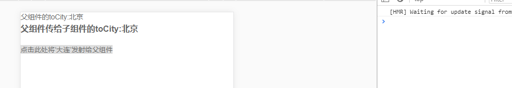
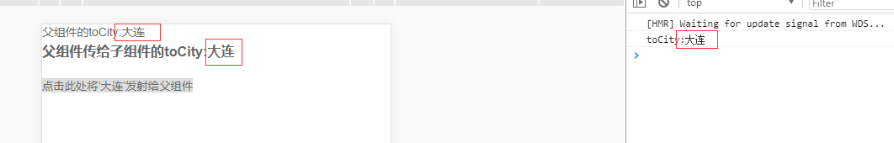

# Vue.$emit() 子组件向父组件传值

[参考]: https://blog.csdn.net/sllailcp/article/details/78595077

1、父组件可以使用 props 把数据传给子组件。
2、子组件可以使用 $emit,让父组件监听到自定义事件 。

vm.$emit( event, arg ) //触发当前实例上的事件

vm.$on( event, fn );//监听event事件后运行 fn； 

例如：子组件：

```html
<template>
  <div class="train-city">
    <h3>父组件传给子组件的toCity:{{sendData}}</h3> 
    <br/><button @click='select(`大连`)'>点击此处将‘大连’发射给父组件</button>
  </div>
</template>
<script>
  export default {
    name:'trainCity',
    props:['sendData'], // 用来接收父组件传给子组件的数据
    methods:{
      select(val) {
        let data = {
          cityname: val
        };
        this.$emit('showCityName',data);//select事件触发后，自动触发showCityName事件
      }
    }
  }
</script>
```

父组件：

```html
<template>
    <div>
        <div>父组件的toCity{{toCity}}</div>
        <train-city @showCityName="updateCity" :sendData="toCity"></train-city>
    </div>
<template>
<script>
  import TrainCity from "./train-city";
  export default {
    name:'index',
    components: {TrainCity},
    data () {
      return {
        toCity:"北京"
      }
    },
    methods:{
      updateCity(data){//触发子组件城市选择-选择城市的事件
        this.toCity = data.cityname;//改变了父组件的值
        console.log('toCity:'+this.toCity)
      }
    }
  }
</script>

```

图一：点击之前的数据



图二：点击之后的数据

