​                                            


### 文章目录

- [Angular](#Angular_3)
- [一 介绍](#__4)
- - - [1.1 Angular 的概念模型](#11_Angular__6)
    - [1.2 环境搭建](#12__12)
    - [1.3 结构介绍](#13__40)
  - [二 组件模板](#__110)
  - - [2.1 JS 模板引擎的设计思路](#21_JS__115)
    - [2.2 Mustache 语法](#22_Mustache__122)
    - [2.3 属性绑定](#23__159)
    - [2.4 事件绑定](#24__170)
    - [2.5 双向绑定](#25__184)
    - [2.6 结构性指令](#26__195)
    - [2.7 属性型指令](#27__249)
    - [2.8 管道](#28__305)
  - [三 组件通信](#__317)
  - - [3.1 直接通信](#31__330)
    - [3.2 Service 单例](#32_Service__496)
    - [3.3 原生ApI通信](#33_ApI_635)
  - [四 生命周期](#__668)
  - - [4.1 Angular钩子函数](#41_Angular_677)
    - [4.2 组件加载策略](#42__759)
  - [五 内容投影](#__793)
  - - [5.1 动态投影](#51__797)
    - [5.2 注解使用](#52__836)
  - [六 路由](#__969)
  - - [6.1 路由的基本使用](#61__975)
    - [6.2 路由与懒加载模块](#62__1035)
    - [6.3 嵌套路由](#63__1084)
    - [6.4 共享模板](#64__1140)
    - [6.5 路由传值](#65__1167)
    - [6.6 路由事件](#66__1305)
    - [6.7 模块预加载](#67__1343)
    - [6.8 路由守卫](#68__1407)
  - [七 表单](#__1530)
  - - [7.1 双向数据绑定](#71___1537)
    - [7.2 表单校验](#72___1543)
  - [八 RxJS](#__RxJS_1558)
  - - [8.1 基本实现](#81__1566)
    - [8.2 数据交互](#82___1686)
    - 


建议学之前先看TypeScript :[我劝你学一下TypeScript（TypeScipt有这篇就够了）](https://blog.csdn.net/weixin_44451022/article/details/115876037?spm=1001.2014.3001.5501).


# Angular

# 一 介绍

### 1.1 Angular 的概念模型

- `Component`（组件）是整个框架的核心，也是终极目标。“组件 化”的意义有 2 个：一是分治，因为有了组件之后，我们可以把各种逻辑 封装在组件内部，避免混在一起；二是复用，封装成组件之后不仅可以在 项目内部复用，而且还可以沉淀下来跨项目复用。
- `NgModule`（模块）是组织业务代码的利器按照自己的业务场景， 把组件、服务、路由打包到模块里面，形成一个个的积木块，然后再用这 些积木块来搭建出高楼大厦。
- `Router`（路由）的角色也非常重要，它有 3 个重要的作用：一是封装 浏览器的 `History`操作；二是负责异步模块的加载；三是管理组件的生命周期。

### 1.2 环境搭建

- 先保证有Node.js环境
- 安装脚手架

```shell
npm install -g @angular/cli
1
```

- 创建项目

```shell
ng new my-project-name
1
```

- 运行项目

```shell
ng serve --open
1
```

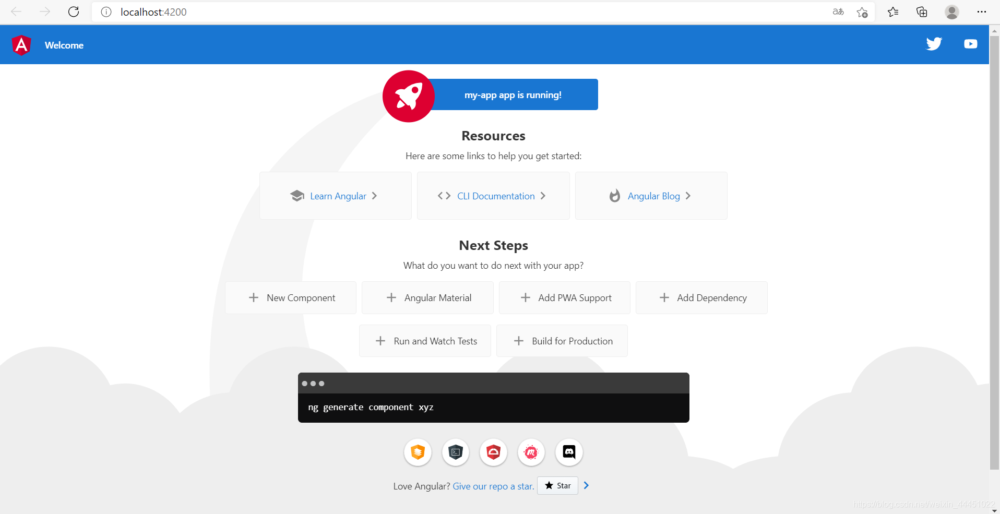

- 注意点：   
  - 这里是 `serve`，不是 `server`，我看到一些初学者经常坑在这个地方。
  - 如果需要修改端口号，可以用 `ng serve --port` 命令来进行指 定。
  - `ng serve --open` 可以自动打开默认的浏览器。 如果想让编译的包更小一些，可以使用 `ng serve --prod`。

### 1.3 结构介绍

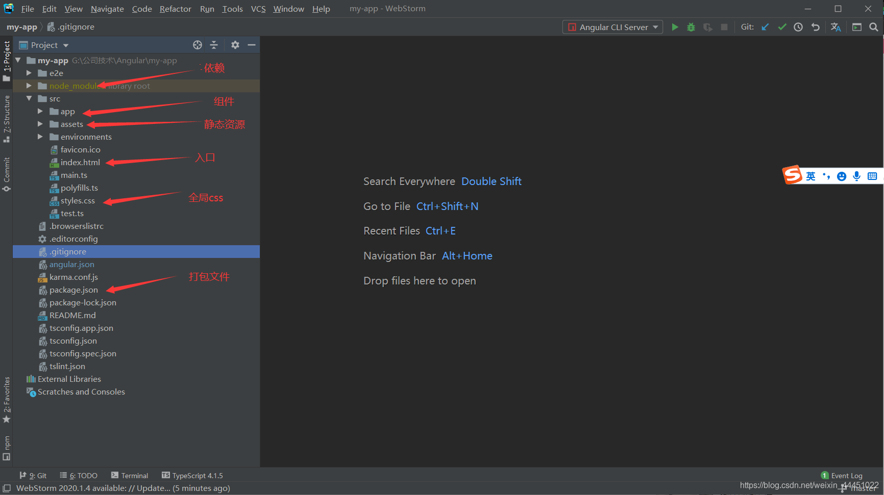

几乎所有前端[框架](https://so.csdn.net/so/search?q=框架&spm=1001.2101.3001.7020)都在玩`组件化`，而且最近都不约而同地选择了`标签化`这种思路，Angular 也不例外。 对于新版本的 Angular 来说，一切都是围绕着`组件化`来展开的，**组件是 Angular 的核心概念模型。**

- `app.module.ts`

```typescript
// 导入模块 告诉angular 如何组装
import { NgModule } from '@angular/core';
// 解析浏览器模块
import { BrowserModule } from '@angular/platform-browser';
// angular核心组件
import { AppRoutingModule } from './app-routing.module';
// angular 根模块
import { AppComponent } from './app.component';
import { HeadComponent } from './components/head/head.component';

// NgModule 装饰器告诉angular如何编译和启动
@NgModule({
  //当前运行的组件
  declarations: [
    AppComponent,
    HeadComponent
  ],
  // 组件运行需要的依赖的其他模块
  imports: [
    BrowserModule,
    AppRoutingModule
  ],
  // 配置项目需要的服务
  providers: [],
  // 指定应用主视图
  bootstrap: [AppComponent]
})

export class AppModule { }
1234567891011121314151617181920212223242526272829
```

- 组件组成

```typescript
// 导入核心模块
import { Component } from '@angular/core';

@Component({
  selector: 'app-root', // 组件名
  templateUrl: './app.component.html', // html
  styleUrls: ['./app.component.css'] // css
})
// 属性
export class AppComponent {
  title = 'my-app';
}
123456789101112
```

- 创建新组件

```shell
ng -g component 组件名
// ng g component components/head
12
```

- 说明：   
  - `@Component`：这是一个 `Decorator（`装饰器），其作用类似于 `Java` 里面的 `Annotation`（注解）。
  - `selector`：组件的标签名，外部使用者可以这样来使用以上组件，。 默认情况下，ng 命令生成出来的组件都会带上一个 `app` 前缀，如果你不 喜欢，可以在 `angular-cli.json` 里面修改 `prefix`配置项，设置为空字符串 将会不带任何前缀。
  - `templateUrl`：引用外部 `HTML` 模板。如果你想直接编写内联模板， 可以使用 `template`，支持 `ES 6`引入的“模板字符串”写法，请点击这里 查看具体详情。
  - `styleUrls`：引用外部 `CSS`样式文件，这是一个数组，也就意味着可以 引用多份`CSS` 文件。
  - `export class AppComponent`：这是 ES 6 里面引入的模块和 `class` 定义方式。

## **二 组件模板** 

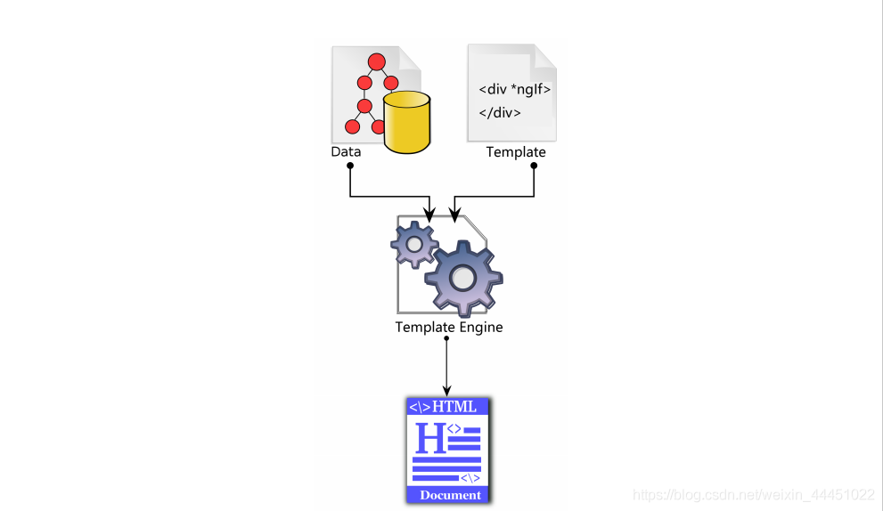

### 2.1 JS 模板引擎的设计思路

- 综合来说，无论是哪一种前端模板，大家都比较推崇“轻逻辑”（`Logic-less`） 的设计思路。
- 简而言之，所谓“轻逻辑”就是说，不能在模板里面编写非常复杂的 `JavaScript` 表达式。
- 最重要的原因是怕影响运行性能，因为模板可能会被执行很多次。
- 对于`Angular`来说，强调“轻逻辑”还有另一个原因：在组件的整个生命周期 里面，模板函数会被执行很多次。

### 2.2 Mustache 语法

- 插值语法

```typescript
// html
<p>{{title}}</p>
// ts
public title='我是插入语法'
1234
```

- 数学运算

```
<h3>1+1={{1+1}}</h3>
1
```

- 调用组件方法

```typescript
// html
<h3>可以调用方法{{getVal()}}</h3
// ts
public getVal():any{
 return 65535;
 }
123456
```

- 局部变量

```html
<input #heroInput>
<p>{{heroInput.value}}</p>
12
```

**模板局部变量 > 指令中的同名变量 > 组件中的同名属性**

### 2.3 属性绑定

属性绑定是用方括号来做的

```typescript
// html
;
// ts
public imgSrc:string="./assets/imgs/1.jpg";
1234
```

### 2.4 事件绑定

事件绑定是用圆括号来做的

```typescript
// html
<button class="btn btn‐success" (click)="btnClick($event)">测试事件</butto
n>
//ts
public btnClick(event):void{
 alert("测试事件绑定！");
 }
1234567
```

### 2.5 双向绑定

`Angular`是第一个把“双向数据绑定”这个特性带到前端来的框架，这也是 `Angular`当年最受开发者追捧的特性之一。双向绑定是通过方括号里面套一个圆括号来做的。

```typescript
// html
<font‐resizer [(size)]="fontSizePx"></font‐resizer>
//ts
public fontSizePx:number=14;
1234
```

### 2.6 结构性指令

Angular 有 3 个内置的结构型指令：`*ngIf、*ngFor、ngSwitch。ngSwitch` 的 语法比较啰嗦，使用频率小一些。

- `ngIf`

```typescript
// html
<p>if判断语句</p>
<p *ngIf="flag">
正确
</p>
<p *ngIf="!flag">
  正确
</p>
// ts
 public flag: boolean = false;
12345678910
```

- `ngFor`

```typescript
// html
<ul>
  <li *ngFor="let user of UserList;let key=index">
    {{key}}+{{user.name}}
  </li>
</ul>
//ts
public UserList: any[] = [{
    name: '哈哈'
  }, {
    name: '不是吧'
  }];
123456789101112
```

- `ngSwitch`

```typescript
// html
<p>switch语句</p>
<ul [ngSwitch]="OrderStatus">
  <li *ngSwitchCase="1">已发货</li>
  <li *ngSwitchCase="2">未发货</li>
  <li *ngSwitchDefault>无效订单</li>
</ul>
//ts
public OrderStatus: number = 1;
123456789
```

**特别注意：一个 HTML 标签上只能同时使用一个结构型的指令。**

因为“结构型”指令会修改 `DOM` 结构，如果在一个标签上使用多个结构型指 令，大家都一起去修改 `DOM`结构。

### 2.7 属性型指令

使用频率比较高的 3 个内置指令分别是：`NgClass、NgStyle 和 NgModel。`

- `NgClass`

```typescript
//html 
<p>class属性修改</p>
<div [ngClass]="{red:flag,dark:!flag}" >
  哈哈哈
</div>

//css
.red{
  color: brown;
}
.dark{
  color: aqua;
}
// ts
public flag: boolean = false;
123456789101112131415
```

- `NgStyle`

`ngStyle`这种方式相当于在代码里面写`CSS` 样式，比较丑陋，违反了注意点分 离的原则，而且将来不太好修改，非常不建议这样写。

```html
// html 
<p>style样式修改</p>
<div [ngStyle]="{'color':'red'}" >
  哈哈哈哈
</div>
12345
```

- `NgModel`

请注意，如果需要使用 `NgModel`来进行双向数据绑定，必须要在对应的模块里 面`import FormsModule`。

```typescript
import {FormsModule } from '@angular/forms';
 imports: [
    FormsModule
  ]
1234
// html
<p>双向绑定</p>
<input type="text" [(ngModel)]="keyword" />
{{keyword}}
// ts
public keyword: string | undefined;
123456
```

### 2.8 管道

管道的一个典型作用是用来格式化数据（过滤器）

```typescript
// html
<p>管道</p>
<div>现在的时间是{{time | date:'yyyy-MM-dd HH:mm:ss'}}</div>
// ts
public time: any = new Date();
12345
```

## **三 组件通信** 

组件就像零散的积木，我们需要把这些积木按照一定的规则拼装起来，而且要让 它们之间能相互进行通讯，这样才能构成一个有机的完整系统。在真实的应用中，组件最终会构成树形结构，就像人类社会中的家族树一样，在树形结构里面，组件之间有几种典型的关系：**父子关系、兄弟关系、没有直接关系**。

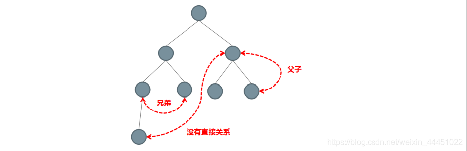

- 直接的父子关系，父组件直接访问子组件的 `public`属性和方法
- 直接的父子关系，借助于 `@Input` 和 `@Output`进行通讯
- 没有直接关系，借助于`Service`单例进行通讯
- 利用 `cookie`和 `localstorage`进行通讯
- 利用 ``Session` 进行通讯

### 3.1 直接通信

> 父组件访问子组件`@ViewChild`

对于有直接父子关系的组件，父组件可以直接访问子组件里面 public 型的属性和方法

- 子组件

```typescript
import { Component, OnInit } from '@angular/core';

@Component({
  selector: 'app-child',
  templateUrl: './child.component.html',
  styleUrls: ['./child.component.css']
})
export class ChildComponent implements OnInit {


  //子组件属性
  private child='我是子组件的属性';

  constructor() { }

  ngOnInit(): void {
  }

  //子组件方法
  run(){
    console.log("子组件正在跑")
  }

}

12345678910111213141516171819202122232425
```

- 父组件

```typescript
//html
<app-child #child></app-child>
<button type="button" (click)="getchild()">获取子组件的值</button>
// ts
import { Component, OnInit ,ViewChild} from '@angular/core';

@Component({
  selector: 'app-father',
  templateUrl: './father.component.html',
  styleUrls: ['./father.component.css']
})
export class FatherComponent implements OnInit {

  @ViewChild('child') child:any;

  constructor() { }

  ngOnInit(): void {

  }

  getchild(){
    //获取属性
    console.log(this.child.child);
    //获取方法
    this.child.run();
  }
}
12345678910111213141516171819202122232425262728
```

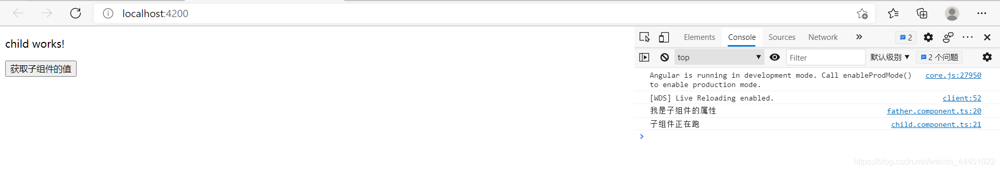

以上是通过在模板里面定义局部变量的方式来直接调用子组件里面的 `public`型 方法。在父组件的内部也可以访问到子组件的实例，需要利用到 `@ViewChild`装饰器

> 子组件访问父组件`@Input()`

- 父组件

```typescript
// html
<app-child #child [father]='father' [runs] ='run'></app-child>
<button type="button" (click)="getchild()">获取子组件的值</button>
//ts
import { Component, OnInit ,ViewChild} from '@angular/core';

@Component({
  selector: 'app-father',
  templateUrl: './father.component.html',
  styleUrls: ['./father.component.css']
})
export class FatherComponent implements OnInit {

  @ViewChild('child') child:any;

  // 父组件属性
  public father:string='我是父组件属性';

  constructor() { }

  ngOnInit(): void {

  }

  getchild(){
    //获取属性
    console.log(this.child.child);
    //获取方法
    this.child.run();
  }

  run(){
    console.log("父组件正在跑")
  }

}

12345678910111213141516171819202122232425262728293031323334353637
```

- 子组件

```typescript
// html
<p>child works!</p>
<button type="button" (click)="getpather()">获取父组件的信息</button>
// ts
import { Component, OnInit,Input } from '@angular/core';

@Component({
  selector: 'app-child',
  templateUrl: './child.component.html',
  styleUrls: ['./child.component.css']
})
export class ChildComponent implements OnInit {

  @Input()
  public father:string | undefined;

  @Input()
  public runs:any;


  //子组件属性
  private child='我是子组件的属性';

  constructor() { }

  ngOnInit(): void {
  }

  //子组件方法
  run(){
    console.log("子组件正在跑")
  }

  //父组件方法
  getpather(){
    console.log(this.father);
    this.runs();
  }
}

12345678910111213141516171819202122232425262728293031323334353637383940
```

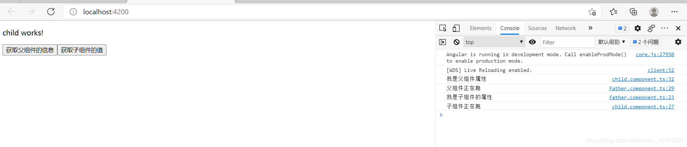

### 3.2 Service 单例

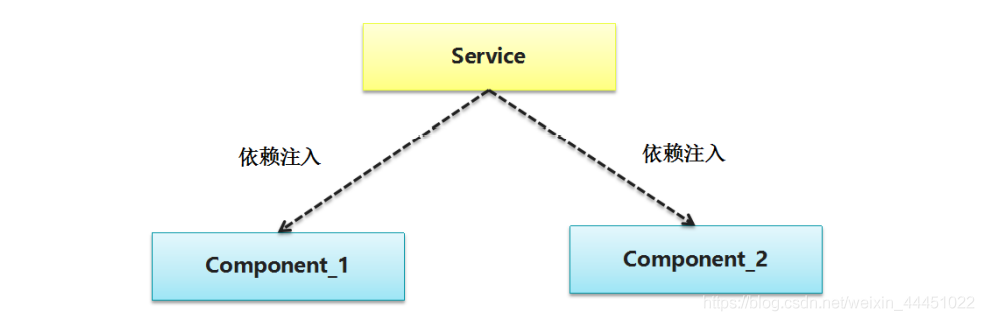

如果你在根模块（一般是 `app.module.ts`）的 `providers` 里面注册一个 `Service`，那么这个 `Service`就是全局单例的，这样一来我们就可以利用这个单 例的 `Service`在不同的组件之间进行通讯了

- 创建一个服务

```
ng g service [路径] 服务名
1
```

- `app.module.ts`注册服务

```typescript
import { NgModule } from '@angular/core';
import { BrowserModule } from '@angular/platform-browser';

import { AppRoutingModule } from './app-routing.module';
import { AppComponent } from './app.component';
import { FatherComponent } from './direct/father/father.component';
import { ChildComponent } from './direct/child/child.component';
// 服务
import { PublicService } from './public.service'
@NgModule({
  declarations: [
    AppComponent,
    FatherComponent,
    ChildComponent
  ],
  imports: [
    BrowserModule,
    AppRoutingModule
  ],
  //注册服务
  providers: [PublicService],
  bootstrap: [AppComponent]
})
export class AppModule { }
123456789101112131415161718192021222324
```

- 引用服务（哪里需要，引入服务）

```typescript
// 服务
import { PublicService } from './public.service'
//初始化服务
// DI注入
 constructor(public asy:AsynchronizationServicPublicService ) {}
12345
```

- 方式：   
  - 比较粗暴的方式：我们可以在 `Service`里面定义 `public` 型的共享变 量，然后让不同的组件都来访问这块变量，从而达到共享数据的目的。
  - 优雅一点的方式：利用 `RxJS`，在 `Service`里面定义一个`public`型的 `Subject`（主题），然后让所有组件都来 `Subscribe（订阅）`这个主题，类 似于一种“事件总线”的效果。

> 消息总线方式

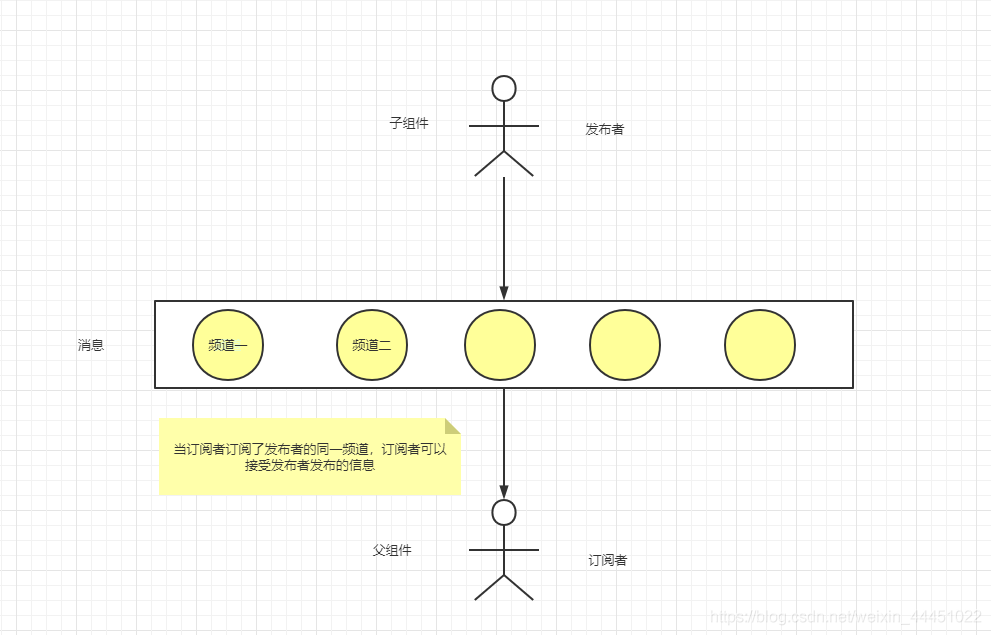

- 服务的配置

```typescript
import { Injectable } from '@angular/core';
import { Subject } from 'rxjs';

@Injectable({
  providedIn: 'root'
})
export class PublicService {

  //一个频道
  public eventBus:Subject<any> = new Subject();

  constructor() { }
}

1234567891011121314
```

- 子组件

```typescript
// html 
<button type="button" (click)="send()">发布消息</button>
// ts
import { Component, OnInit } from '@angular/core';
// 调用服务
import {PublicService} from '../../public.service';

@Component({
  selector: 'app-child1',
  templateUrl: './child1.component.html',
  styleUrls: ['./child1.component.css']
})
export class Child1Component implements OnInit {
// 初始服务
  constructor(public service:PublicService) { }

  ngOnInit(): void {
  }
  send(){
    this.service.eventBus.next("我是子组件发生的信息！！！")
  }
}
12345678910111213141516171819202122
```

- 父组件

```typescript
// html
<button type="button" (click)="get()">获取消息</button>
//ts
import { Component, OnInit } from '@angular/core';
import {PublicService} from '../../public.service'

@Component({
  selector: 'app-father1',
  templateUrl: './father1.component.html',
  styleUrls: ['./father1.component.css']
})
export class Father1Component implements OnInit {

  constructor(public service:PublicService) { }

  ngOnInit(): void {
  }

  get(){
    this.service.eventBus.subscribe((valus)=>{
      console.log(valus);
    })
  }
}
123456789101112131415161718192021222324
```

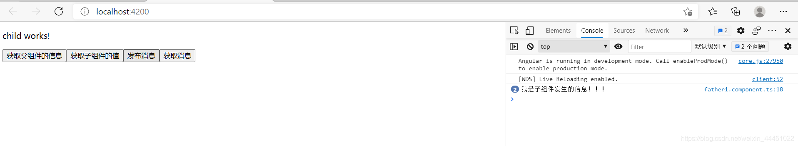

### 3.3 原生ApI通信

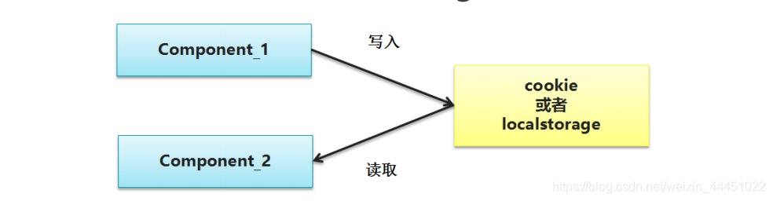

- 写入组件

```typescript
//html
<button type="button" (click)="write()">写数据</button>
//ts
//写数据
  write(){
    window.localStorage.setItem("json",JSON.stringify({name:'我是爸爸',age:18}));
  }
1234567
```

- 读取组件

```
//html
<button type="button" (click)="get()">读数据</button>
// ts
get():void{
    let json=window.localStorage.getItem("json");
    // window.localStorage.removeItem("json");
    console.log(json)
  }
12345678
```

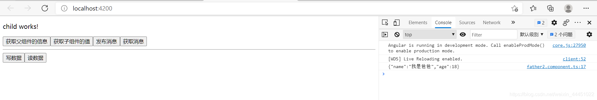

很多朋友写 `Angular` 代码的时候出现了思维定势，总感觉 `Angular`会封装所 有东西，实际上并非如此，比如`cookie、localstorage`这些东西都可以直接 用原生的 `API` 进行操作。千万别忘记原生的那些 `API`啊，都能用的！

## **四 生命周期** 

无论使用什么样的前端框架，只要编写 `UI` 组件，生命周期都是必须要考虑的重 要内容。请展开你的想象，如果让你来设计 `UI` 系统，组件有几个重要的阶段一 定是绕不开的。

- 初始化（`init`）阶段：在这个阶段需要把组件`new` 出来，把一些属性 设置上去等这些操作。
- 渲染（`render`）阶段：在这个阶段需要把组件的模板和数据结合起 来，生成 `HTML` 标签结构，并且要整合到现有的 `DOM`树里面去。
- 存活阶段：既然带有 `UI`，那么在组件的存活期内就一定会和用户进行 交互。一般来说，带有 `UI`的系统都是通过事件机制进行用户交互的。也 就是说，这个阶段将会处理大量的用户事件，如鼠标点击、键盘按键、手 指触摸。
- 销毁（`destory`）阶段：最后，组件使用完了，需要把一些资源释放 掉。最典型的操作是需要把组件上的所有事件全部清理干净，避免造成内存泄漏。

### 4.1 Angular钩子函数

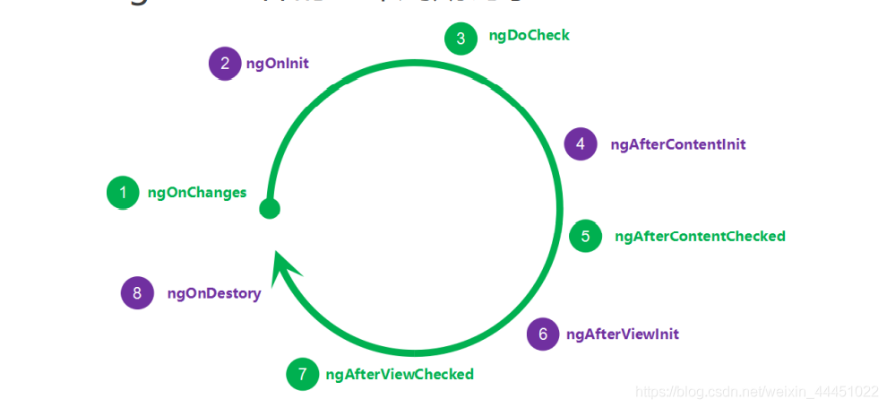

- `Angular`一共暴露了 8 个钩子，构造函数不算。 并没有组件或者指令会实现全部钩子。
- 绿色的 4 个钩子可能会被执行很多次，紫色的只会执行一次。
- `Content` 和`View` 相关的 4 个钩子只对组件有效，指令上不能使用。 因为在新版本的 `Angular` 里面，指令不能带有 `HTML`模板，指令没有自 己的`UI`，当然就没有 `View`和 `Content`相关的钩子了。
- 请不要在生命周期钩子里面实现复杂的业务逻辑，尤其是那 4 个会被 反复执行的钩子，否则一定会造成界面卡顿。

参考官网：https://angular.cn/guide/lifecycle-hooks

```typescript
// html
<div class="panel panel-primary">
    <div class="panel-heading">{{title}}</div>
    <div class="panel-body">
      <p *ngFor="let log of logs;let i=index;">
        {{log}}
      </p>
    </div>
  </div>
  <button type="button"(click)="update()">修改值</button>
// ts
import { Component, OnInit ,Input } from '@angular/core';

@Component({
  selector: 'app-life',
  templateUrl: './life.component.html',
  styleUrls: ['./life.component.sass']
})
export class LifeComponent implements OnInit {

  public logs: Array<string> = [];

  @Input()
  public title: string = "父层的传递进来的标题";

  constructor() {
    this.logs.push("构造函数初始化了")
   }

   
  ngOnChanges() {
    this.logs.push("1-ngOnChanges:当 Angular 设置或重新设置数据绑定的输入属性时响应。");
  }

  ngOnInit() {
    this.logs.push("2-ngOnInit:在 Angular 第一次显示数据绑定和设置指令/组件的输入属性之后，初始化指令/组件。");
  }

  ngDoCheck() {
    this.logs.push("3-ngDoCheck:检测，并在发生 Angular 无法或不愿意自己检测的变化时作出反应");
  }

  ngAfterContentInit() {
    this.logs.push("4-ngAfterContentInit:当 Angular 把外部内容投影进组件视图或指令所在的视图之后调用");
  }

  ngAfterContentChecked() {
    this.logs.push("5-ngAfterContentChecked:每当 Angular 检查完被投影到组件或指令中的内容之后调用。");
  }

  ngAfterViewInit() {
    this.logs.push("6-ngAfterViewInit:当 Angular 初始化完组件视图及其子视图或包含该指令的视图之后调用。");
  }

  ngAfterViewChecked() {
    this.logs.push("7-ngAfterViewChecked:每当 Angular 做完组件视图和子视图或包含该指令的视图的变更检测之后调用。");
  }

  ngOnDestory() {
    this.logs.push("8-ngOnDestory:每当 Angular 每次销毁指令/组件之前调用并清扫。");
  }
  update(){
    this.title="我是修改后的值"
  }
}
1234567891011121314151617181920212223242526272829303132333435363738394041424344454647484950515253545556575859606162636465
```

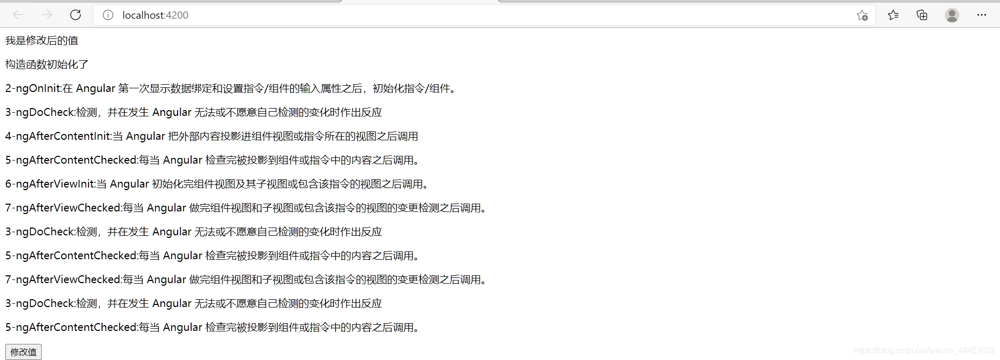

### 4.2 组件加载策略

- 在真实的业务系统中，组件会构成 Tree 型结构，就像这样：


- 发生变化时：


这时候，Angular 将会从根组件开始，遍历整颗组件树，把所有组件上的 `ngDoCheck()`方法都调用一遍

- 极端情况下：

请注意，默认情况下，无论哪个叶子组件上发生了变化，都会把整个组件树遍历 一遍。如果组件树非常庞大，嵌套非常深，很明显会有效率问题。在绝大部分时 间里面，并不会出现每个组件都需要刷新的情况，根本没有必要每次都去全部遍 历。因此 Angular 提供了一种叫做`OnPush`的策略，只要把某个组件上的检测 策略设置为 `OnPush`，就可以忽略整个子树了，就像这样：


- 开启方法

在需要的组件配置：

```typescript
@Component({
  selector: 'app-life',
  templateUrl: './life.component.html',
  styleUrls: ['./life.component.sass'],
  //组件加载策略的改变
  changeDetection:ChangeDetectionStrategy.OnPush
})
1234567
```

## **五 内容投影** 

运行时动态改变组件模版的内容。没路由那么复杂，只是一段`html`，没有业务逻辑。`ngContent`指令将父组件模版上的任意片段投影到子组件上。

### 5.1 动态投影

- 子组件

```html
<h3>组件投影</h3>
<div>
  <div class="bg-primary">
  
    <ng-content select=".head"></ng-content>
  </div>
  <div class="bg-warning">
   
    <ng-content select=".content"></ng-content>
  </div>
  <div class="bg-success">
   
    <ng-content select=".foot"></ng-content>
    <ng-content select='h1'></ng-content>
    
  </div>
</div>
1234567891011121314151617
```

- 主组件

```typescript
<!-- 组件名 -->
<app-touyin>
    <div class="head">这是头部</div>
  <div class="content">这是默认内容</div>
  <div class="foot bg-success">这是尾部</div>
  <h1>这是投影部分</h1>
</app-touyin>
1234567
```

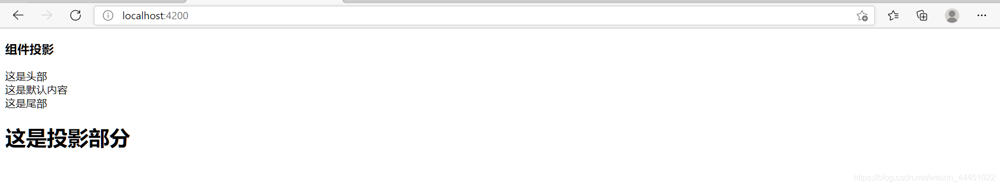

### 5.2 注解使用

- 如何访问投影进来的复杂组件？
- 如何访问被监听组件上的 public 属性？
- 如何监听被投影组件上的事件？
- 如何访问投影进来的 HTML 元素？
- 如何给被投影进来的 HTML 元素添加 CSS 样式？

> `@ContentChild`:我们可以利用 `@ContentChild`这个装饰器来操控被投影进来的组件。

- 子组件

```
//html
<h1>我是Text02的组件</h1>
12
```

- 父组件

```typescript
//html
<h1>我是Text01的组件</h1>
<ng-content></ng-content>
//ts
import { Component, ContentChild, ContentChildren, ElementRef, OnInit, QueryList } from '@angular/core';
import { Test02Component } from "../test02/test02.component";

@Component({
  selector: 'app-test01',
  templateUrl: './test01.component.html',
  styleUrls: ['./test01.component.css']
})
export class Test01Component implements OnInit {

  //注解的写法
 @ContentChild(Test02Component)
 childTwo:Test02Component | undefined;

  constructor() { }

  ngOnInit(): void {
    
  }

  ngAfterContentInit():void{
    console.log(this.childTwo);
  }
}
12345678910111213141516171819202122232425262728
```

- `app.html`

```html
<app-test01>
  <app-test02></app-test02>
</app-test01>
123
```

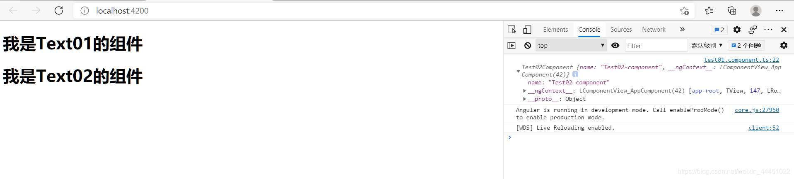

> `@ContentChildren` 是一个复数形式。当被投影进来的是 一个组件列表的时候，我们可以用 `@ContentChildren` 来进行操控。

> `@ViewChild` 这个装饰器来操控直属的子组件。

- 子组件

```typescript
import { Component, OnInit } from '@angular/core';

@Component({
  selector: 'app-child',
  templateUrl: './child.component.html',
  styleUrls: ['./child.component.css']
})
export class ChildComponent implements OnInit {

  public title='我是子组件的信息';

  constructor() { }

  ngOnInit(): void {
  }

  run(){
    console.log("子组件正在跑！！！")
  }

}
123456789101112131415161718192021
```

- 父组件

```typescript
//html
<p>我是父组件</p>
<app-child></app-child>
//ts
import { Component, OnInit,ViewChild } from '@angular/core';
// 导入子组件
import { ChildComponent  } from "../child/child.component";

@Component({
  selector: 'app-father',
  templateUrl: './father.component.html',
  styleUrls: ['./father.component.css']
})
export class FatherComponent implements OnInit {

  @ViewChild(ChildComponent) child:ChildComponent|undefined;

  constructor() { }

  ngOnInit(): void {
  }

  ngAfterViewInit(): void {
    console.log(this.child?.title);
    this.child?.run();
  }

}

1234567891011121314151617181920212223242526272829
```

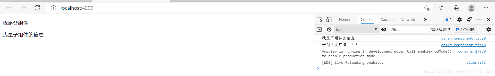

> `@ViewChildren`:操控多个直属的子组件

## **六 路由** 

**Angular 中的 Router 模块会负责模块的加载、组件的初始化、 销毁等操作，它是整个乐队的总指挥。**

Angular 新版本的路由机制极其强大，除了能支持无限嵌套之外，还能支持**模 块懒加载、预加载、权限控制、辅助路由**等高级功能。

### 6.1 路由的基本使用

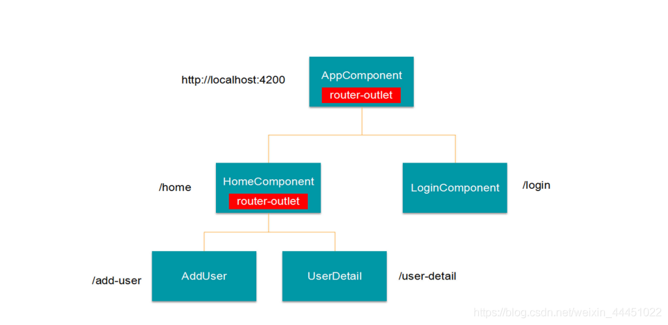

- 路由配置文件

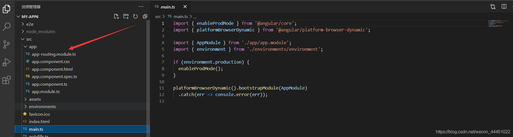

- 新建3个模块

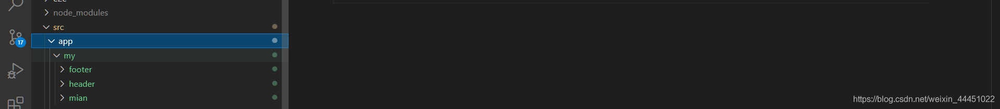

- 主模块

```html
<div class="ok">
  <a [routerLink]="[ 'header']">头部</a>
  <a [routerLink]="[ 'main' ]">主体</a>
  <a [routerLink]="[ 'footer' ]">尾部</a>
</div>
<router-outlet></router-outlet>
123456
```

- 注册路由

```typescript
import { NgModule } from '@angular/core';
import { RouterModule, Routes } from '@angular/router';
//注册模块
import { HeaderComponent } from './my/header/header.component';
import { MianComponent } from './my/mian/mian.component';
import { FooterComponent } from './my/footer/footer.component';

//注册路由
const routes: Routes = [{
  path:'header',
  component:HeaderComponent
},{
  path:'main',
  component:MianComponent
},{
  path:'footer',
  component:FooterComponent
}
];

@NgModule({
  imports: [RouterModule.forRoot(routes)],
  exports: [RouterModule]
})
export class AppRoutingModule { }

1234567891011121314151617181920212223242526
```

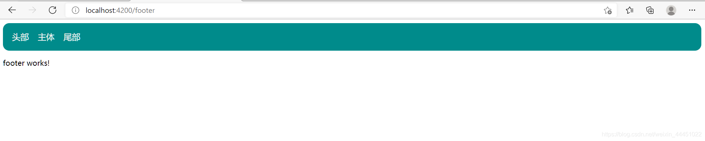

### 6.2 路由与懒加载模块

**目的很简单：提升 `JS`文件的加载速度、提升 `JS`文件的执行效率。**

对于一些大型的后台管理系统来说，里面可能会有上千份 `JS`文件，如果把所有 `JS`全部都压缩到一份文件里面，那么这份文件的体积可能会超过`5M`，这是不 能接受的，尤其对于移动端应用。

- 创建路由命令

```
ng g module 路径 --routing
1
```

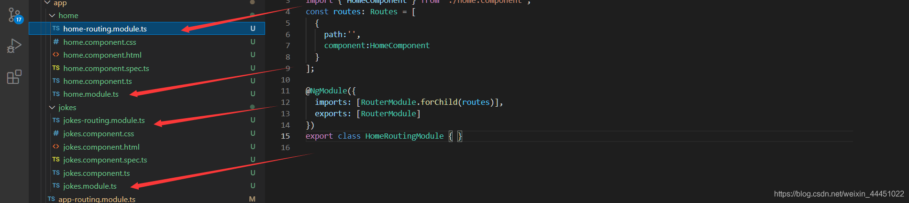

- 配置主路由

```typescript
import { NgModule } from '@angular/core';
import { RouterModule, Routes } from '@angular/router';


const routes: Routes = [{
  path:'',
  redirectTo:'home',
  pathMatch:'full'
},
  {
      path:'home',
      loadChildren: () => import("./home/home.module").then(m => m.HomeModule)
  },
  {
      path:'jokes',
      loadChildren: () => import("./jokes/jokes.module").then(m => m.JokesModule)
  },
  {
  path:'**',
      loadChildren: () => import("./home/home.module").then(m => m.HomeModule)
}];

@NgModule({
  imports: [RouterModule.forRoot(routes)],
  exports: [RouterModule]
})
export class AppRoutingModule { }

12345678910111213141516171819202122232425262728
```

**F12 如果你看到某个 chunk 文件出现了，就表示一切就绪，特性模块被惰性加载成功了。**

### 6.3 嵌套路由

在真实的系统中，菜单肯定不止一层，我们继续修改上面的例子，**给它加一个二多级菜单**，实现侧边栏的转换`styles.scss`全局样式设置，根组件的`css`只对应根组件，设置子路由，引入模块，配置子路由,`children`是一个数组，里边包含对象,属性`path，component`

```typescript
{
 path:'home',
 component:HomeComponent,
 children:[
   {
     path:'set',
     component:SettingComponent
   },{
     path: 'welcome',
     component: WelcomeComponent
   }
 ]
}
12345678910111213
 <div class="left">
    <a [routerLink]="[ '/home/welcome']">欢迎</a>

    <br>
    <br>
    <a [routerLink]="[ '/home/set']">系统设置</a>
</div>

<div class="right">
    //挂载子路由
    <router-outlet></router-outlet>
</div>
123456789101112
```

配置路由,配置所有查找不到的路径到欢迎页面

```typescript
children:[
   {
     path:'set',
     component:SettingComponent
   },{
     path: 'welcome',
     component: WelcomeComponent
   },{
     //配置所有查找不到的路由
     path: '**',
     redirectTo:WelcomeComponent
   }
]
12345678910111213
```

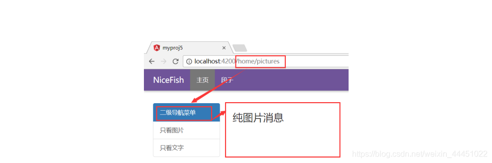

### 6.4 共享模板

创建共享模块能让你更好地组织和梳理代码。你可以把常用的指令、管道和组件放进一个模块中，然后在应用中其它需要这些的地方导入该模块。将共有的模块抽取出来，形成一个单独的组件，哪里需要，就引用该模块。

```typescript
import { NgModule } from '@angular/core';
//共有模块
import { UserInfoComponent } from '../user-info/user-info.component';
import { OrderInfoComponent } from '../order-info/order-info.component';

@NgModule({
  declarations: [
    UserInfoComponent,
    OrderInfoComponent
  ],
  imports: [],
    // 暴露模块
  exports:[
    UserInfoComponent,
    OrderInfoComponent
  ],
  providers: [],
  bootstrap: []
})
export class SharedModule { }
1234567891011121314151617181920
```

### 6.5 路由传值

- 创建项目是创建路由配置
- 导入组件

```typescript
import { HomeComponent } from './components/home/home.component';
import { NewsComponent } from './components/news/news.component';
import { ProductComponent } from './components/product/product.component';
123
```

- 配置路由

```typescript
// 路由配置 ：根据不同的url动态的加载组件
import { NgModule } from '@angular/core';
import { RouterModule, Routes } from '@angular/router';
//导入需要配置的组件
import { IndexComponent } from './my/index/index.component';
import { NewComponent } from './my/new/new.component';
import { GoodsComponent } from './my/goods/goods.component';
import { GoodsDataComponent } from './my/goods-data/goods-data.component';

// 路由配置
const routes: Routes = [
  {
    path: 'home',
    component:IndexComponent
  },{
    path:'news',
    component:NewComponent
  },{
    path:'goods',
    component:GoodsComponent
  },
  {path:'goodsdata/:aid',
  component:GoodsDataComponent},
  // 匹配不到路由时重定向到home页面  这个一定要放在路由配置的最下边，否则它下边的配置都不会生效
  {
    path:'**',
    redirectTo:'home'
  }
]

@NgModule({
  imports: [RouterModule.forRoot(routes)],
  exports: [RouterModule]
})
export class AppRoutingModule { }
1234567891011121314151617181920212223242526272829303132333435
```

- Get传值与动态路由跳转

```html
<p>goods works!</p>
<ul>
    <li *ngFor="let item of list,let key=index">
        <!-- get传值 -->
        <!-- <a [routerLink]="[ '/goodsdata']" [queryParams]='{aid:key}'>{{key+item}}</a> -->
        <!-- 动态路由传值 -->
        <a [routerLink]="[ '/goodsdata', key ]">{{key}}---{{item}}</a>
    </li>
</ul>
123456789
import { Component, OnInit } from '@angular/core';
// 组件接受值
import { ActivatedRoute } from '@angular/router';

@Component({
  selector: 'app-goods-data',
  templateUrl: './goods-data.component.html',
  styleUrls: ['./goods-data.component.css']
})
export class GoodsDataComponent implements OnInit {

  public list:any[]=['哈哈哈','不是吧','可以的','OK吧'];

  constructor(public active:ActivatedRoute) { 
    //active.queryParams是Rxjs数据，需要subscribe
    this.active.queryParams.subscribe((data)=>{
    console.log(data)
    //active.params是Rxjs数据，需要subscribe
    this.active.params.subscribe((data)=>{
      console.log(data)
    })
 
})
  }

  ngOnInit(): void {
  }
}
12345678910111213141516171819202122232425262728
{path:'goodsdata/:aid',//注意：
  component:GoodsDataComponent},
12
```

- Js实现路由跳转

  - **动态路由**

    ```typescript
    //引入路由
    import {Router} from '@angular/router'
    
    //声明路由
    constructor(public router:Router) { }
    
    ngOnInit(): void {
    }
    getContens(){
      //路由跳转
      this.router.navigate(['/content/','123'])
    }
    123456789101112
    ```

  - **Get**

    ```typescript
    //引入路由
    import {Router,NavigationExtras} from '@angular/router'
    // js实现get跳转
      getJs(){
    
        let queryParams:NavigationExtras={
          queryParams:{'pid':123}
        }
        this.router.navigate(['/home'],queryParams)
    
      }
    1234567891011
    ```

### 6.6 路由事件

```
Angular`的路由上面暴露了 7 个事件：`NavigationStart 、 RoutesRecognized、RouteConfigLoadStart 、RouteConfigLoadEnd、 NavigationEnd、NavigationCancel、
```

- `NavigationStart`：导航开始
- `NavigationEnd`：导航结束
- `NavigationCancel`：取消导航
- `NavigationError`：导航出错
- `RoutesRecoginzed`：路由已认证

```typescript
import { Component, OnInit } from '@angular/core';
// 引入自己需要的事件
import { Router,NavigationStart } from '@angular/router';

@Component({
  selector: 'home',
  templateUrl: './home.component.html',
  styleUrls: ['./home.component.scss']
})
export class HomeComponent implements OnInit {

  constructor(private router: Router) {

  }

  ngOnInit() {
    this.router.events.subscribe((event) => {
      console.log(event);
      //可以用instanceof来判断事件的类型，然后去做你想要做的事情
      console.log(event instanceof NavigationStart);
    });
  }
}


12345678910111213141516171819202122232425
```

### 6.7 模块预加载

`Angular` 内置了两种预加载策略：`PreloadAllModules`和 `NoPreloading`， ``PreloadAllModules `的意思是：预加载所有模块，不管有没有被访问到。也就 是说，要么就一次预加载所有异步模块，要么就彻底不做预加载。

- 引入策略配置

```typescript
import { PreloadAllModules, RouterModule, Routes } from '@angular/router';
1
```

- 修改加载策略

```typescript
RouterModule.forRoot(appRoutes,{preloadingStrategy:PreloadAllModules}
1
```

- 你想进一步做一些优化，希望 实现自己的预加载策略，最好能在路由配置里面加入一些自定义的配置项，让某 些模块预加载、某些模块不要进行预加载。（按需加载）

  - 修改路由配置

  ```typescript
  export const appRoutes:Routes=[
      {
  		path:'',
  		redirectTo:'home',
  		pathMatch:'full'
  	},
      {
          path:'home',
          loadChildren: () => import("./home/home.module").then(m => m.HomeModule)
      },
      {
          path:'jokes',
          data:{preload:true},
          loadChildren: () => import("./jokes/jokes.module").then(m => m.JokesModule)
      },
      {
          path:'picture',
          data:{preload:false},
          loadChildren: () => import("./picture/picture.module").then(m => m.PictureModule)
      },
      {
  		path:'**',
          loadChildren: () => import("./home/home.module").then(m => m.HomeModule)
  	}
  ];
  12345678910111213141516171819202122232425
  ```

  - 增加配置

  ```typescript
  import { Route,PreloadingStrategy } from '@angular/router';
  import { Observable } from "rxjs";
  import "rxjs/add/observable/of";
  
  export class MyPreloadingStrategy implements PreloadingStrategy {
      preload(route: Route, fn: () => Observable<any>): Observable<any>{
          return route.data&&route.data.preload?fn():Observable.of(null);
      }
  }
  123456789
  ```

  OK，这样一来，模块预加载的控制权就完全交到你自己的手里了，你可以继续 修改这个预加载策略，比如用加个延时，或者根据其他某个业务条件来决定是不 是要执行预加载。

### 6.8 路由守卫

在实际的业务开发过程中，我们经常需要限制某些 URL 的可访问性，比如，对 于系统管理界面，只有那些拥有管理员权限的用户才能打开。

Angular提供了一些**钩子**帮助控制进入或离开路由。这些钩子就是路由守卫，可以通过这些钩子实现上面场景。

- `CanActivate`: 处理导航到某路由的情况。
- `CanDeactivate`: 处理从当前路由离开的情况。
- `Resolve`: 在路由激活之前获取路由数据。

请特别注意：前端代码应该默认被看成是不安全的，安全的重头戏应该放在 `Server` 端，而前端只是做一些基本的防护。

- 先建守卫

```
ng g guard 路径
// a 选择全部创建
12
```

- 主组件注册服务

```typescript
//权限服务导入
import { LoginGuard } from "./guard/login.guard";

providers: [LoginGuard],
1234
```

- 编写业务代码

```typescript
import { Injectable } from '@angular/core';
import { CanActivate, CanActivateChild, CanDeactivate, CanLoad, Route, UrlSegment, ActivatedRouteSnapshot, RouterStateSnapshot, UrlTree } from '@angular/router';
import { Observable } from 'rxjs';
// 提供服务，后端验证权限是否通过
@Injectable()
export class LoginGuard implements CanLoad,CanActivate,CanActivateChild{
    
    constructor(){

    }

    /**
     * 验证是否有权限加载一个异步模块
     */
    canLoad(){
        //在真实的应用里面需要写一个Service到后端去验证权限
        return true;
    }

    /**
     * 验证路由是否可以激活
     */
    canActivate(){
        //在真实的应用里面需要写一个Service到后端去验证权限
        return true;
    }

    /**
     * 验证子路由是否可以激活
     */
    canActivateChild(){
        //在真实的应用里面需要写一个Service到后端去验证权限
        return true;
    }
}

123456789101112131415161718192021222324252627282930313233343536
```

- 主路由需要验证的模块配置

```typescript
export const appRoutes:Routes=[
    {
		path:'',
		redirectTo:'home',
		pathMatch:'full'
	},
    {
        path:'home',
        loadChildren: () => import('./home/home.module').then(m => m.HomeModule)
    },
    {
        path:'jokes',
        data:{preload:true},
        canLoad:[LoginGuard],
        canActivate:[LoginGuard],
        loadChildren: () => import('./jokes/jokes.module').then(m => m.JokesModule)
    },
    {
        path:'picture',
        data:{preload:false},
        loadChildren: () => import('./picture/picture.module').then(m => m.PictureModule)
    },
    {
		path:'**',
        loadChildren: () => import('./home/home.module').then(m => m.HomeModule)
	}
];
123456789101112131415161718192021222324252627
```

- 控制路由的退出

当用户已经在表单里面输入了大量的内容，如果不小心导航到了其他 URL，那么输入的内容就会全部丢失。

```typescript
import { Injectable } from '@angular/core';
import { CanDeactivate } from '@angular/router';
import { JokesComponent } from './jokes.component';

@Injectable()
export class JokesGuard implements CanDeactivate<any>{
   canDeactivate(component:JokesComponent){
       console.log(component);
       if(!component.saved){
           return window.confirm("确定不保存吗？");
       }
       return t
       rue;
   }
}
123456789101112131415
```

## **七 表单** 

Angular 提供了两种不同的方法来通过表单处理用户输入：响应式表单和模板驱动表单。 两者都从视图中捕获用户输入事件、验证用户输入、创建表单模型、修改数据模型，并提供跟踪这些更改的途径。

- **响应式表单**提供对底层表单对象模型直接、显式的访问。它们与模板驱动表单相比，更加健壮：它们的可扩展性、可复用性和可测试性都更高。如果表单是你的应用程序的关键部分，或者你已经在使用响应式表单来构建应用，那就使用响应式表单。
- **模板驱动表单**依赖**模板中的**指令来创建和操作底层的对象模型。它们对于向应用添加一个简单的表单非常有用，比如电子邮件列表注册表单。它们很容易添加到应用中，但在扩展性方面不如响应式表单。如果你有可以只在模板中管理的非常基本的表单需求和逻辑，那么模板驱动表单就很合适。

### 7.1 双向数据绑定

- 要想使用`[(ngModel)]`进行双向绑定，必须在你的 `@NgModule`定 义里面 `import FormsModule`模块
- 用双向绑定的时候，必须给 标签设置 `name` 或者`id`，否则会报错 （这个行为挺奇怪的，吐槽一下）。
- 表单上面展现的字段和你处理业务用的数据模型不一定完全一致，推 荐设计两个 `Model`，一个用来给表单进行绑定操作，一个用来处理你的业 务。

### 7.2 表单校验

- `valid`，校验成功
- `invalid`，校验失败
- `pending`，表单正在提交过程中
- `pristine`，数据依然处于原始状态，用户没有修改过
- `dirty`，数据已经变脏了，被用户改过了
- `touched`，被触摸或者单击过
- `untouched`，未被触摸或者单击
- `enabled`，启用状态
- `disabled`，禁用状态
- `submitted`，可以用来判断表单是否已经被提交

**我们可以利用这些标志位来判断表单和输入项的状态。**

## **八 RxJS** 

在使用 `Ajax` 的过程中，经常会遇到这种情况，我们需要在一个 `Ajax` 里面嵌套 另一个 `Ajax`调用，有时候甚至需要嵌套好几层`Ajax`调用，于是就形成了所谓 的回调地狱。

`RxJS` 是 `ReactiveX`编程理念的 `JavaScript`版本。`ReactiveX`来自微软，它是一种针对异步数据流的编程。简单来说，它将一切数据，包括 `HTTP` 请求，`DOM` 事件或者普通数据等包装成流的形式，然后用强大丰富的操作符对流进行处理，使你能以同步编程的方式处理异步数据，并组合不同的操作符来轻松优雅的实现你所需要的功能。

官网：[ReactiveX](http://reactivex.io/)

### 8.1 基本实现

- 创建一个服务

```
ng g service 路径
1
```

- 编写服务

```typescript
import { Injectable } from '@angular/core';

import {Observable} from 'rxjs';

@Injectable({
  providedIn: 'root'
})
export class AsynchronizationService {

  constructor() { }

  // 同步方法
  get(){
    console.log("我是同步方法！！！！")
  }
  // 回调方法
  getCallBack(data:any){
    //定时函数
    setTimeout(()=>{

    var name='哈哈哈哈哈';
    data(name);

    },1000)
  };

  // permise
  getpermise(){
    let promise = new Promise(resolve => {
      setTimeout(() => {
      resolve('---promise timeout---');
      }, 2000);
      });
      
    return promise;
  }
   
  //  Rajs
  getRajs(){
    let stream = new Observable(observer => {
      setTimeout(() => {
      observer.next('时间用完了');
      }, 2000);
      });
    return stream;
  }

  //多次执行
  getcountRajs(){
    //初始值
    let count=0;
    return new Observable<any>(observer => {
      //迭代
      setInterval(() => {
      count++;
      observer.next('时间用完了'+count);
      }, 1000);
      });
  }
}
123456789101112131415161718192021222324252627282930313233343536373839404142434445464748495051525354555657585960
```

- 服务调用

```typescript
import { Component, OnInit } from '@angular/core';

// 引用服务
import {AsynchronizationService} from '../../services/asynchronization.service';

@Component({
  selector: 'app-test',
  templateUrl: './test.component.html',
  styleUrls: ['./test.component.css']
})
export class TestComponent implements OnInit {


  // DI注入
  constructor(public asy:AsynchronizationService ) {
    // 同步方法
    this.asy.get();
    // 回调方法
    this.asy.getCallBack((data:any)=>{
      console.log(data);
    });
    // permise
    this.asy.getpermise().then(
      value => console.log(value)
    )
    // Rajs
    this.asy.getRajs().subscribe(value => console.log(value));
    //多次调用
    setTimeout(() => {
    this.asy.getcountRajs().subscribe(value => console.log(value))
    }, 1000);
    //超时调用
    
   }

  
  ngOnInit(): void {
  }

}

123456789101112131415161718192021222324252627282930313233343536373839404142
```

### 8.2 数据交互

> Get

- 注册模块

```typescript
import {HttpClientModule} from '@angular/common/http';
imports: [
    BrowserModule,
    HttpClientModule
]
12345
```

- 导入模块

```
import {HttpClient} from "@angular/common/http";
//初始化
constructor(public http:HttpClient) {

   }
12345
```

- 前端请求

```typescript
//Get提供请求接口
  GetData():any{
    // url
    var api = "http://a.itying.com/api/productlist";
    // 异步交互
    this.http.get(api).subscribe((response:any) => {
    console.log(response);
    this.list=response.result;
});
123456789
```

> Post

- 注册模块

```typescript
import {HttpClientModule} from '@angular/common/http';
imports: [
    BrowserModule,
    HttpClientModule
]
12345
```

- 引用模块

```typescript
import {HttpClient,HttpHeaders} from "@angular/common/http";
constructor(public http:HttpClient) { }
12
```

- 前端请求

```typescript
// Post提交数据
  PostData(){
    // 设置请求头格式
  const httpOptions = {headers: new HttpHeaders({ 'Content-Type': 'application/json' })};
    //请求Url
  let url='localhost:80/index'
  // 格式：url，发送数据，请求头信息
  this.http.post(url,{name:'小王',age:'20',httpOptions}).subscribe((Response)=>{console.log(Response)})

  }
12345678910
```

> Jsoup

- 注册模块

```typescript
import {HttpClientModule,HttpClientJsonpModule} from '@angular/common/http';
imports: [
    BrowserModule,
    HttpClientModule,
    HttpClientJsonpModule
]
123456
```

- 引用模块

```typescript
import {HttpClient} from "@angular/common/http";
constructor(public http:HttpClient) { }
12
```

- 前端调用

```typescript
/Jsoup解决跨域问题
  JsoupData(){
    // url
    var api = "http://a.itying.com/api/productlist";
    // 格式：url,回调函数
    this.http.jsonp(api,'callback').subscribe((Response)=>{console.log(Response)})
  }
1234567
```

> axios

- 安装

```
cnpm install axios --save
1
```

- 引用

```
import axios from 'axios';
1
```

- 前端请求

```typescript
// axios 异步请求数据
  AxiosData(){
    var api='http://a.itying.com/api/productlist';
    axios.get(api).then(function(response){
    console.log(response)
  })
123456
```

### 