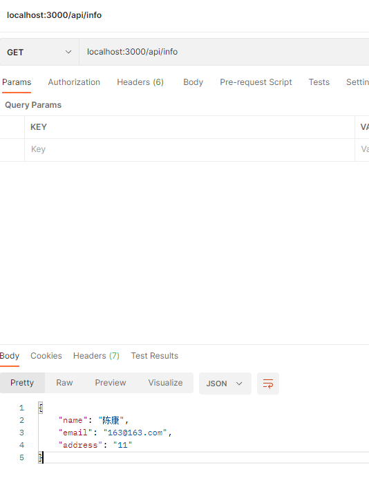

# HTTP

# 1.准备后端项目

```shell
mkdir expressEnd
cd expressEnd
npm init
npm install express
```

`package.json`

```json
{
  "main": "index.js",
  "scripts": {
    "test": "echo \"Error: no test specified\" && exit 1",
    "start":"node index.js" //增加这一行
  }
}
```

`index.json`

```js
const express = require('express')
const app = express()
const port = 3000

app.get('/api/info', (req, res) => {
  res.send({
    name:"陈康",
    email:"163@163.com",
    address:"11"
  })
})

app.listen(port, () => {
  console.log(`Example app listening on port ${port}`)
})

```

配置vscode nodejs debug环境，然后按F5启动调试



# 2. 从服务端获取数据：get

```shell
# 创建项目
ng new http01
# 创建http服务，用于发送http
ng g service http/myHttp
# 创建组件，请求后数据业务处理
ng g c components/http
# 返回数据模板
ng g interface interfaces/myhttp/responseTemplate
# 返回数据data里面具体的信息
ng g interface interfaces/myhttp/personInfo
```

## 2.1 跨域问题

为了不存在跨域问题，提前创建

`proxy.config.json`

```
{
  "/api": {
    "target": "http://localhost:3000",
    "secure": "false"
  }
}
```

这个的意思就是`/api`前面的路由,会替换成`http://localhost:3000`;

比如：`http://localhost:65500/api/info`，会这样`http://localhost:3000/api/info`

`package.json`

```
"start": "ng serve --port 65500 --open --proxy-config proxy.config.json"
```

## 2.2 正文

`app.module.ts`

```
import { NgModule } from '@angular/core';
import { BrowserModule } from '@angular/platform-browser';

// 一、引入 HttpClientModule
import { HttpClientModule } from '@angular/common/http'

import { AppRoutingModule } from './app-routing.module';
import { AppComponent } from './app.component';
import { HttpComponent } from './components/http/http.component';

@NgModule({
  declarations: [
    AppComponent,
    HttpComponent
  ],
  imports: [
    BrowserModule,
    AppRoutingModule,
    HttpClientModule // 二、使用
  ],
  providers: [],
  bootstrap: [AppComponent]
})
export class AppModule { }
```

`response-template.ts`

```js
export interface ResponseTemplate <T> {
    /**
   * 接口响应码
   */
     code: number;
     /**
      * 响应信息
      */
     msg: string;
     /**
      * 响应数据
      */
     data: T;
     /**
      * 响应时间
      */
     time: number;
}
```

`person-info.ts`

```js
export interface PersonInfo {
  /**
   * 姓名
   */
  name: string;

  /**
   * 邮箱
   */
  email: string;

  /**
   * 住址
   */
  address: string;
}
```

`my-http.service.ts`

```js
import { Injectable } from '@angular/core';

// 引入 HttpClient 类
import { HttpClient } from '@angular/common/http';

// 引入 接口响应类
import  { ResponseTemplate } from '../interfaces/myhttp/response-template'
import  { PersonInfo } from '../interfaces/myhttp/person-info'

import { Observable } from 'rxjs';


@Injectable({
  providedIn: 'root'
})
export class MyHttpService {

  constructor( private http: HttpClient) { }


  _getData(): Observable<ResponseTemplate<PersonInfo>>{
    const url = '/api/info';
    console.log("url: " + url);
    return this.http.get<ResponseTemplate<PersonInfo>>(url);
  }
}
```

`http.component.html`

```html
<h1>Http组件</h1>
<p>获取的数据:</p>
<pre>
  {{ responseData | json }}
</pre>
<p><button (click)="getData()">发送请求</button></p>
```

`http.component.ts`

```js
import { Component, OnInit } from '@angular/core';

// 一、引入服务
import { MyHttpService } from 'src/app/http/my-http.service';

// 二、引入相应类
import  { ResponseTemplate } from '../../interfaces/myhttp/response-template'
import  { PersonInfo } from '../../interfaces/myhttp/person-info'

@Component({
  selector: 'app-http',
  templateUrl: './http.component.html',
  styleUrls: ['./http.component.scss']
})
export class HttpComponent implements OnInit {

  public responseData!: ResponseTemplate<PersonInfo>;

  constructor(private myHttpService: MyHttpService) { }

  ngOnInit(): void {

  }

  getData(){
    this.myHttpService._getData().subscribe((response:ResponseTemplate<PersonInfo>)=>{
      console.log(response);
      this.responseData = response;
    });
  }
}
```


# 3. 发送数据到服务端
