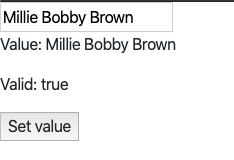

# NgModel指令

[原文](https://juejin.cn/post/7115245216969261092)

使用双向绑定，我们可以显示一个数据属性，并在用户做出改变时更新该属性。双向绑定为你的应用程序中的组件提供了一种分享数据的方式。

你可以使用双向绑定监听事件并在父子组件之间同步更新值。

# 一、**Angular NgModel**  双向数据绑定

Angular NgModel是一个内置的指令，它从域模型中创建一个FormControl实例，并将其绑定到表单控制元素上。**ngmodel**指令将**HTML**控件（**input, select, textarea**）的值与应用数据绑定。

我们只需在组件元素和**HTML**元素中都能实现这一点。双向绑定使用的语法是[()]**或**bind-关键字。

双向绑定使用的是属性绑定和事件绑定的语法。属性绑定使用的语法是括号[]**或**bind-**，事件绑定使用的语法是小括号**（）**或**on，这些绑定被视为单向绑定。

双向绑定在两个方向都起作用，就是设置值和获取值。双向绑定使用一个特定的名称模式。

好了，让我们使用**Angular CLI**安装**Angular**。

## **第1步：使用AngularCLI安装Angular** 

输入以下命令来安装**Angular**：

```bash
npm install -g @angular/cli
```

现在，使用下面的命令生成Angular项目：

```arduino
ng new model
```

它将创建一个Angular的模板：

现在，在**app.module.ts** 文件中导入**FormsModule**：

```typescript
// app.module.ts

import { BrowserModule } from '@angular/platform-browser';
import { NgModule } from '@angular/core';
import { FormsModule } from '@angular/forms';

import { AppComponent } from './app.component';

@NgModule({
  declarations: [
    AppComponent
  ],
  imports: [
    BrowserModule,
    FormsModule
  ],
  providers: [],
  bootstrap: [AppComponent]
})
export class AppModule { }
```

## **第2步：创建AppData模型** 

在**src >> app** 文件夹内，创建一个名为**AppData.ts** 的文件并添加以下代码：

```typescript
// AppData.ts

export class AppData {
  constructor(
      public name: String
  ) {}
}
```

所以，在这里我们采取了一个名为name的属性，类型为**String**。

现在，在**app.component.ts** 文件中导入这个模型文件：

```typescript
// app.component.ts

import { Component } from '@angular/core';
import { AppData } from './AppData';

@Component({
  selector: 'app-root',
  templateUrl: './app.component.html',
  styleUrls: ['./app.component.css']
})
export class AppComponent {
  title = 'app';
  data = new AppData('');
}
```

## **第3步：添加HTML代码** 

好了，为了正确地使用ngModel进行双向数据绑定，我们需要在**app.component.html** 文件中编写以下代码：

```python
<input type="text" class="form-control" id="name" 
  required
  [(ngModel)]="data.name" />

<p>Hello {{ data.name }}!</p>
```

- 对于每个`input` 标签，我们使用`ngModel` 指令来绑定数据的语法。 `[(ngModel)]="data.name"` (**AppData** 是`app.component.ts` 中的数据模型) 类
- 为`input` 标签添加了一个`name` 属性。当把`[(ngModel)]` 与表单结合使用时，这是个要求。

保存文件并转到**[http://localhost:4200](https://link.juejin.cn?target=http%3A%2F%2Flocalhost%3A4200)**

你可以看到，使用NgModel指令，我们可以做双向的数据绑定。

## **了解NgModel** 

看一下源代码，我们会发现**ngModel**带有一个属性绑定。

属性绑定[ngModel]**负责更新底层的输入**DOM元素。

Angular允许使用**[()]**的速记语法，也叫 "**盒中香蕉**"。

所以，毕竟是**ngModel**的一个实现细节，实现了双向的数据绑定。

# 二、**模板变量引用** 

| 标识符  | 用法                         |
| :------ | :--------------------------- |
| ngModel | #myTemplateVar="**ngModel**" |

FormControl实例跟踪一个值、用户交互和控件的验证状态，并使视图与模型保持同步。如果在父表单中使用，该指令也会将自己注册为子控制表单。

这个指令可以单独使用，也可以作为大表单的一部分。 使用ngModel选择器来激活它。

如果你用[]语法对ngModel进行单向绑定，它接受域模型作为一个可选的输入；改变组件类中域模型的值会在视图中设置一个值。

如果你有[()]语法的双向绑定（也被称为 "香蕉箱语法"），UI中的值总是同步回你的类中的域模型。

如果我们需要检查相关FormControl的属性（如有效性状态），将指令导出到本地模板变量中，使用ngModel作为键（例如：#myVar=" ngModel"）。

然后，你使用指令的控制属性来访问控件，但无论如何，大多数使用的属性（如valid和dirty）都会落到控件上，以便直接访问。

首先，我们需要在**app.module.ts** 文件中导入FormsModule。

```javascript
import { FormsModule } from '@angular/forms';

imports: [
    ...
    FormsModule
  ],
```

否则，我们会得到像**compiler.js:2175未发现的错误。模板解析错误。没有将 "exportAs "设置为 "ngModel "的指令。**

现在，在**app.component.ts** 文件中写下以下代码：

```python
// app.component.ts

import { Component } from '@angular/core';

@Component({
  selector: 'app-root',
  template: `
    <input [(ngModel)]="name" #it="ngModel" required>
    <p>Value: {{ name }}</p>
    <p>Valid: {{ it.valid }}</p>
    <button (click)="setValue()">Set value</button>
  `,
  styleUrls: ['./app.component.css']
})

export class AppComponent {
  name = '';
  setValue() { this.name = 'Millie Bobby Brown'; }
}
```

保存并转到浏览器：

如果你按下**setValue按钮，** 将有以下输出：

[](https://link.juejin.cn?target=https%3A%2F%2Fappdividend.com%2Fwp-content%2Fuploads%2F2018%2F10%2FAngular-NgModel-Example-ngmodel-Directive-In-Angular.png)

当在


在父表单的上下文中，通常不需要包括单向或双向绑定，因为父表单会为你同步值。

你可以通过使用ngForm（**#f=" ngForm**"）将其属性导出到本地模板变量中来访问它。在表单提交时，在需要的地方使用一个变量。

如果你需要将初始值填充到表单中，只要你在提交时使用导出的表单的值而不是域模型的值，使用ngModel的单向绑定往往就足够了。

# 三、**在Angular的表单中使用ngModel** 

下面的例子显示了在表单内使用ngModel的控件：

```css
import { Component } from '@angular/core';
import {NgForm} from '@angular/forms';
@Component({
  selector: 'app-root',
  template: `
    <form #it="ngForm" (ngSubmit)="onSubmit(it)" novalidate>
      <input name="first" ngModel required #first="ngModel">
      <input name="last" ngModel required #last="ngModel">
      <button>Submit</button>
    </form>
    <p>First name value: {{ first.value }}</p>
    <p>First name valid: {{ first.valid }}</p>
    <p>last name value: {{ last.value }}</p>
    <p>last name valid: {{ last.valid }}</p>
    <p>Form value: {{ it.value | json }}</p>
    <p>Form valid: {{ it.valid }}</p>
  `,
  styleUrls: ['./app.component.css']
})
export class AppComponent {
  onSubmit(it: NgForm) {
    console.log(it.value);  // { first: '', last: '' }
    console.log(it.valid);  // false
  }
}
```

现在，到浏览器上看看angular ngmodel的神奇之处。

# 四、**Angular ngmodel不工作** 

如果你是Angular的初学者，在使用表单时，你经常会遇到Angular ngmodel不工作，或者双向数据绑定没有达到预期效果的问题。

这个问题经常发生在Angular的新手身上，为了解决这个问题，在你的**app.module.ts**文件中导入**FormsModule** 。所有与表单相关的函数和属性都定义在**FormsModule**下。

除了**app.module** .**ts** 文件中模块声明的导入部分需要FormsModule外，你还需要使用表单标签或**ngForm**指令来启用ngModel的功能。

如果你独立使用ngModel，不在某个地方使用表单，你不需要为输入指定一个名字，就像下面这样：

```javascript
<pre class="lang:default decode:true">
 <input ... [(ngModel)]="model.something"`>
</pre>
```

但是当你在表单中使用它的时候，name属性就成为必须的了：

```xml
<form>
  <input ... name="prop" [(ngModel)]="model.prop"`>
</form>
```

当在标签中使用ngModel时，你也需要提供一个name属性，以便在该名称下向父表单注册控件。

# **Angular ngmodel方法** 

### #ngOnChanges()

这是一个生命周期方法，当指令的输入发生变化时调用，仅供内部使用。

请看下面的语法：

```scss
ngOnChanges(change: SimpleChanges)
```

参数被称为change，是一个由键/值对组成的对象，用于改变输入的集合。

### #ngOnDestroy()

这是一个生命周期方法，在指令的实例被销毁之前，只供内部使用。

参见语法：

```scss
ngOnDestroy(): void
```

没有任何参数。

### #viewToModelUpdate()

设置视图模型的新值，并发出一个ngModelChange事件。

参见语法：

```arduino
viewToModelUpdate(newValue: any): void
```

该函数接受一个名为**newValue** 的参数**，即** 由ngModelChange发出的新值：