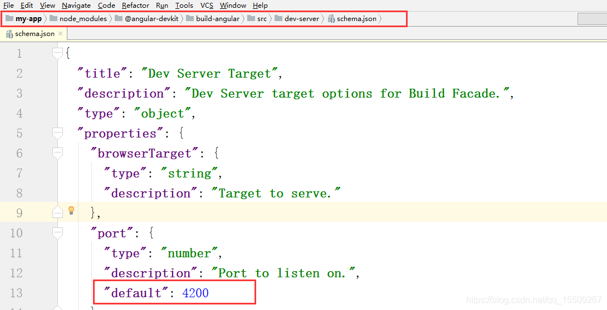

### 启动端口修改

# **一、修改package.json中改变start的配置**

```javascript
//使用代理服务器


"start": "ng serve -o --proxy-config proxy.conf.json --port 4444",
```

# **二、修改schema.json文件中的port**



# **三、启动时修改端口**

```javascript
ng serve --port 4444
```

 

