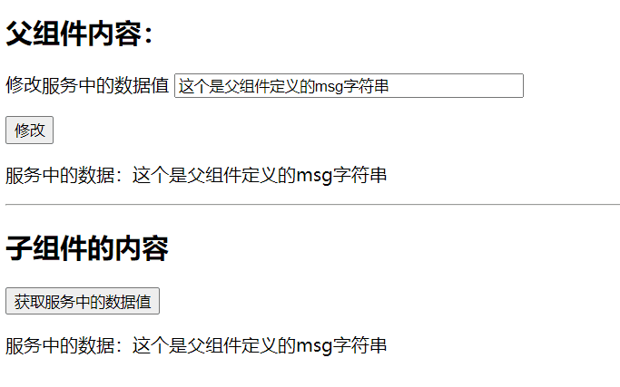

# 组件

# 一、组件的基本概念

创建新项目

```
ng new ngComponents01
```

创建组件

```shell
ng g c product-list
# 或者 将productlist组件放到src/app/components路径下
ng g c components/product-list
```


==组件包含四个部分==

- product-list.component.ts：组件类，用来处理数据和功能，为视图呈现提供支持
- product-list.component.html：组件对应的页面 HTML 模板，用来呈现组件的功能
- product-list.component.scss：只针对当前组件的样式
- product-list.component.spec.ts：当前组件的单元测试文件（非必须）

通过命令行创建一个新的组件之后，会==自动将新创建的组件注册到应用的根模块==（app.module.ts）中


在组件类中，通过使用 @Component 装饰器 [^1] 用来将类声明为组件类，并为这个组件类配置一些元数据 [^2]，以决定该组件在运行期间该如何处理、实例化和使用

装饰器中存在三个基础的配置参数，用来完成组件与视图之间的关联

- selector：选择器，当我们在页面上添加了这个选择器指定的标签（`<app-product-list></app-product-list>`）后，就会在当前使用位置上创建并插入这个组件的一个实例
- templateUrl：该组件所对应的 HTML 模板文件地址
- styleUrls：该组件视图所特有的 css 样式文件地址

```js
import { Component, OnInit } from '@angular/core';

@Component({
  selector: 'app-product-list',
  templateUrl: './product-list.component.html',
  styleUrls: ['./product-list.component.scss']
})
export class ProductListComponent implements OnInit {

  constructor() { }

  ngOnInit(): void {
  }
}
```

==当需要使用这个组件时，直接在页面上添加选择器对应的标签就可以了==


# 二、数据、事件绑定语法

## 1、插值表达式 {{}}

```js
import { Component } from '@angular/core';

@Component({
  selector: 'app-product-list',
  templateUrl: './product-list.component.html',
  styleUrls: ['./product-list.component.scss']
})
export class ProductListComponent {

public title = "我是productlist组件的成员变量title";

  constructor() { }

}
```

```html
<h1>这是product-list组件</h1>
<h2>title: {{ title }}</h2>
<p> 1+2 = {{ 1 + 2}}</p>
```


## 2、单向、双向数据绑定

| 分类                            | 语法                                                         |
| ------------------------------- | ------------------------------------------------------------ |
| 单向 从数据源到视图             | 1、插值表达式：{{expression}} <br />2、使用 [] 进行绑定：`<a [href]='expression'></a>` <br />3、使用 bind 进行绑定：`<a bind-href='expression'></a>` |
| 单向 从视图到数据源             | 1、使用 () 进行绑定：`<a (click)='statement'></a>`<br />2、使用 on 进行绑定：`<a on-click='statement'></a>` |
| 双向 视图到数据源；数据源到视图 | 1、使用 [()] 进行绑定：`<input type="text" [(ngModel)]="product.Name">` <br />2、使用 bindon 进行绑定：`<input type="text" bindon-ngModel="product.Name">` |

`product-list.compoent.ts`

```js
import { Component, OnInit } from '@angular/core';

@Component({
  selector: 'app-product-list',
  templateUrl: './product-list.component.html',
  styleUrls: ['./product-list.component.scss']
})
export class ProductListComponent implements OnInit {

  public title = "我是productlist组件的成员变量title";

  public styleProperty = '<b>我是包含 html 标签的属性</b>';

  public fontColor = 'red';

  public url = 'https://google.com';

  public name: string = '';

  constructor() { }

  ngOnInit(): void {
  }

  getUser() {
    alert('111111111');
  }

}
```

`product-list.component.html`

```html
<h1>这是product-list组件</h1>
<h3>1、插值表达式</h3>
<p>title: {{ title }}</p>
<p> 1+2 = {{ 1 + 2}}</p>
<h3>2.1、从数据源到视图</h3>

<p>
  <a href='{{url}}'>使用插值表达式进行绑定</a>
</p>
<p>
  <a [href]='url' [style.color]='fontColor'>使用 [] 进行绑定</a>
</p>
<p>
  <a bind-href='url'>使用 bind 进行绑定</a>
</p>
<p>
  <span [innerHtml]="styleProperty"></span>
</p>

<h3>2.2、从视图到数据源</h3>

<p>
  <button (click)="getUser()">使用 () 进行绑定</button>
</p>
<p>
  <button on-click="getUser()">使用 on 进行绑定</button>
</p>

<h3>2.3、数据双向绑定 --- 需要在 AppModule 中添加对于 FormsModule 的引用</h3>

<p>
  <input type="text" id="userName" [(ngModel)]="name">
</p>
<p>
  <input type="text" bindon-ngModel="name">
</p>
```

## 3、单向、双向数据绑定总结

- 单向数据绑定

  ```html
  <p>{{title}}</p>
  ```

- 双向数据绑定

  ```html
  <!--数据双向绑定 --- 需要在 AppModule 中添加对于 FormsModule 的引用-->
  <input type="text" id="userName" [(ngModel)]="name">
  
  <!-- 
    当没有 NgModel 时，双向数据绑定等同于下面的写法
   -->
  <input type="text" id="userName" [value]="name" (input)="name=$event.target.value">
  ```

## 4、属性、样式绑定

- dom 元素的 property 绑定

  ```html
  
  
  
  ```

- html 标签的 attribute 绑定，==这个我也不知道啥意思，感觉没什么用==

  attribute 绑定的语法类似于 property 绑定，由前缀 `attr`、点（ `.` ）和 attribute 名称组成

  attribute 绑定的主要用例之一是设置 ARIA attribute（给残障人士提供便利）

  ```html
  <button [attr.aria-label]="actionName">{{actionName}} with Aria</button>
  ```

- style 内联样式绑定

  | 语法                     | 输入类型                    | 组件属性示例                                          |
  | ------------------------ | --------------------------- | ----------------------------------------------------- |
  | [style.width]="width"    | string \| undefined \| null | public width = "100px";                               |
  | [style.width.px]="width" | number\| undefined \| null  | public width = "20";                                  |
  | [style]="styleExpr"      | string                      | public styleExpr = "width: 100px; color:red";         |
  | [style]="styleExpr"      | {key:value}                 | public styleExpr = {width: '100px', height: '100px'}; |
  | [style]="styleExpr"      | array                       | public styleExpr = ["width", "100px"];                |

- class 属性绑定

  | 语法                 | 输入类型                  | 组件属性示例                                           |
  | -------------------- | ------------------------- | ------------------------------------------------------ |
  | [class.foo]="hasFoo" | bool \| undefined \| null | public hasFoo = true;                                  |
  | [class]="classExpr"  | string                    | public classExpr = "my-class1 my-class2";              |
  | [class]="classExpr"  | {key:value}               | public classExpr= {my-class1:  true, my-class2: true}; |
  | [class]="classExpr"  | array                     | public classExpr= ["my-class1", "my-class2"];          |

## 5、事件绑定

#### 方式1

在事件绑定中，可以通过 $event 参数获取到 dom 事件对象的属性从而获取到模板信息

`product-list.component.html`

```html
<input type="text" (keyup)="getMsg($event)">
<p>输入的值：{{msg}}</p>
```

`product-list.component.ts`

```js
  public msg: string = "";
  
  getMsg(event: KeyboardEvent) {
    console.log(event);
    this.msg = (event.target as HTMLInputElement).value;
  }
```


#### 方式2：模板引用变量获取数据

通过使用 $event 作为方法的参数会将许多用不到的模板信息传递到组件中，导致我们在仅仅是为了获取数据的前提下，却需要对于页面元素十分了解，违背了模板（用户所能看到的）与组件（应用如何去处理用户数据）之间的关注点分类的原则。因此，这里==应该使用模板引用变量的方式获取数据信息==。

`product-list.component.html`

```html
<input type="text" #refMsgInput (keyup)="getRefMsg(refMsgInput.value)">
<p>通过模板引入变量的方式获取到输入的值：{{refMsg}}</p>
```

`product-list.component.ts`

```js
public refMsg: string =  "";

getRefMsg(msg: string) {
    this.refMsg = msg;
}
```

模板引用变量的作用域是整个模板，因此要==确保一个模板中的引用变量名称是唯一的==，同时，在声明引用变量时，也==可以使用 ref- 代替 #==

```html
<input type="text" ref-refMsgInput (keyup)="getRefMsg(refMsgInput.value)">
<p>通过模板引入变量的方式获取到输入的值：{{refMsg}}</p>
```

# 三、指令

## 属性型指令

属性型指令被应用在视图 dom 元素上，用来改变 dom 元素的外观或行为

### NgClass

NgClass：用来设置元素的多个 css 类属性，如果只设置一个 css 类，应该使用模板绑定语法中 class 类绑定

```html
<p [ngClass]="inlineStyle">NgClass 属性指令</p>
```

```typescript
import { Component, OnInit } from '@angular/core';

@Component({
  selector: 'app-product-list',
  templateUrl: './product-list.component.html',
  styleUrls: ['./product-list.component.scss']
})

export class ProductListComponent implements OnInit {

  public inlineStyle: {};

  constructor() { }

  ngOnInit(): void {
    this.setInlineStyle();
  }

  setInlineStyle() {
    this.inlineStyle = {
      'text-red': true,
      'bg-blue': false,
    };
  }
}
```

这里的 text-red、bg-blue 都是 css 类名，如果想要在指定的元素上添加该类，则 css 类名对应的值为 true，反之则为 false

### NgStyle

NgStyle：用来设置元素的多个内联样式，如果只设置一个内联样式，应该使用模板绑定语法中的样式绑定

```html
<p [ngStyle]="currentStyles">NgStyle 属性指令</p>
```

```typescript
import { Component, OnInit } from '@angular/core';

@Component({
  selector: 'app-product-list',
  templateUrl: './product-list.component.html',
  styleUrls: ['./product-list.component.scss']
})

export class ProductListComponent implements OnInit {

  public currentStyles: {};

  constructor() { }

  ngOnInit(): void {
    this.setCurrentStyles();
  }

  setCurrentStyles() {
    this.currentStyles = {
      'font-style': 'italic',
      'font-weight': 'bold',
      'font-size': '24px'
    };
  }
}
```

通过在组件的属性中设置多个内联样式对象的形式，完成对于页面元素样式的批量设置

### NgModel

```html
<input type="text" id="userName" [(ngModel)]="name">
```

## 结构型指令

结构型指令用来操作 dom 树，通过进行一些的逻辑判断，从而完成对于页面布局的修改

### NgIf

NgIf：根据表达式的值（true or false）来创建或者销毁 dom 元素

```html
<p *ngIf="expr">NgIf 结构型指令</p>
```

当 expr 属性为 true 时，这个元素则会显示在页面上，当属性值为 false 时，则不显示该元素

ngIf 指令并不是通过使用 css 样式来隐藏元素的，当值为 false 时，则这些元素会从 dom 中被销毁，并且所有监听该 dom 元素的事件会被取消，当重新显示该元素时，会重新执行初始化的过程

与销毁元素不同，对于隐藏的元素来说，所有的元素监听事件还会执行监听的，再次显示时不用重新进行初始化过程

### NgFor

NgFor：通过定义单条数据的显示格式，angular 以此为模板，循环渲染出所有的数据

==index==: NgFor 指令上下文中的 index 属性在每次迭代中，会获取到条数据的索引值

```html
<p *ngFor="let item of products; let i = index">
  {{i+1}} - {{item.name}} --- {{item.price}}
</p>
```

```typescript
import { Component, OnInit } from '@angular/core';

@Component({
  selector: 'app-product-list',
  templateUrl: './product-list.component.html',
  styleUrls: ['./product-list.component.scss']
})

export class ProductListComponent implements OnInit {

  public products = [{
    'name': 'lalala',
    'price': '$200'
  }, {
    'name': 'hehehe',
    'price': '$400'
  }, {
    'name': 'wuwuwu',
    'price': '$120'
  }, {
    'name': 'xixi',
    'price': '$570'
  }];

  constructor() { }

  ngOnInit(): void {
  }
}
```


 ==trackBy:== 当渲染的数据发生改变时，会导致 dom 元素的重新渲染，此时可以采用 trackBy 的方式，通过==在组件中添加一个方法==，指定循环需要跟踪的属性值，此时当渲染的数据发生改变时，==只会重新渲染变更了指定的属性值的数据==

```html
<p>不使用 trackBy 跟踪属性</p>
<div>
  <p *ngFor="let item of products; let i = index;">
    {{i+1}} - {{item.name}} --- {{item.price}}
  </p>
</div>
<p>使用 trackBy 跟踪属性</p>
<div>
  <p *ngFor="let item of products; let i = index; trackBy: trackByIndex">
    {{i+1}} - {{item.name}} --- {{item.price}}
  </p>
</div>
<button (click)="addProduct()">新增</button>
```

```typescript
import { Component, OnInit } from '@angular/core';

@Component({
  selector: 'app-product-list',
  templateUrl: './product-list.component.html',
  styleUrls: ['./product-list.component.scss']
})

export class ProductListComponent implements OnInit {

  public products = [{
    'name': 'lalala',
    'price': '$200'
  }, {
    'name': 'hehehe',
    'price': '$400'
  }, {
    'name': 'wuwuwu',
    'price': '$120'
  }, {
    'name': 'xixi',
    'price': '$570'
  }];

  constructor() { }

  ngOnInit(): void {
  }

  trackByIndex(index: number, item: any): string {
    return item.price;
  }

  addProduct() {
    this.products = [{
      'name': 'lalala',
      'price': '$200'
    }, {
      'name': 'hehehe',
      'price': '$400'
    }, {
      'name': 'wuwuwu',
      'price': '$120'
    }, {
      'name': 'xixi',
      'price': '$570'
    }, {
      'name': 'lululu',
      'price': '$' + (Math.random() * 100).toFixed()
    }];
  }
}
```

注意看下图紫色部分


### NgSwitch

NgSwitch：根据条件切换，从候选的几个元素中选择匹配的，放到 dom 元素中

```html
<p>
  请选择配置
  <select [(ngModel)]="config">
    <option value="">请选择</option>
    <option value="r7-3700x">AMD Ryzen 7 3700X</option>
    <option value="i5-9400f">Intel i5 9400F</option>
    <option value="i5-9600kf">Intel i5 9600KF</option>
  </select>
</p>
<p> 配置描述 </p>
<div [ngSwitch]="config">
  <p *ngSwitchCase="'r7-3700x'">
    一个能打得都木的~~~
  </p>
  <p *ngSwitchCase="'i5-9400f'">
    挤牙膏的。。。
  </p>
  <p *ngSwitchCase="'i5-9600kf'">
    别看了，我不是开封菜。。。
  </p>
  <p *ngSwitchDefault>
    你选一个啊~~~
  </p>
</div>
```

```typescript
import { Component, OnInit } from '@angular/core';

@Component({
  selector: 'app-product-list',
  templateUrl: './product-list.component.html',
  styleUrls: ['./product-list.component.scss']
})

export class ProductListComponent implements OnInit {

  public config = '';

  constructor() { }

  ngOnInit(): void {
  }
}
```


NgSwitch 本身是一个属性型指令，它不会直接操作 dom 元素，而是通过它所控制的两个结构型指令（NgSwitchCase、ngSwitchDefault）来操作 dom 元素

# 四、管道

[angular管道介绍](https://segmentfault.com/a/1190000040205274)

管道是一种特殊的函数，可以把运算符（|）左边的数据转换成期望呈现给视图的数据格式，例如，将时间进行格式化、将数据转换成 json 字符串的形式等等

可以针对一个数据使用多个管道进行串联，并且管道运算符的优先级比三元运算符（ ?: ）高

```html
<h3>5.1、管道运算符</h3>
<div>
  <p>信息 json 字符串</p>
  {{info | json}}
</div>
```

```js
public info:object = {
name:"ck",
email:"ck@123.com",
hobbies:"nothing",
}
```


## 内建管道

- `String` -> `String`
  - UpperCasePipe
  - LowerCasePipe
  - TitleCasePipe
- `Number` -> `String`
  - DecimalPipe
  - PercentPipe
  - CurrencyPipe
- `Object` -> `String`
  - JsonPipe
  - DatePipe
- `Tools`
  - SlicePipe
  - AsyncPipe
  - I18nPluralPipe
  - I18nSelectPipe

### 大写转换

```html
<div>
  <p ngNonBindable>{{ 'Angular' | uppercase }}</p>
  <p>{{ 'Angular' | uppercase }}</p> <!-- Output: ANGULAR -->
</div>
```


### 日期格式化

```html
<div>
  <p ngNonBindable>{{ today | date: 'shortTime' }}</p>
  <p>{{ today | date: 'yyyy-MM-dd HH:mm:ss' }}</p>
</div>
```

```js
public today:Date = new Date();
```


### 数值格式化

```html
<div>
  <p ngNonBindable>{{ 3.14159265 | number: '1.4-4' }}</p>
  <p>{{ 3.14159265 | number: '1.4-4' }}</p> <!-- Output: 3.1416 -->
</div>
```

```js
digitsInfo={minIntegerDigits}.{minFractionDigits}-{maxFractionDigits}。
minIntegerDigits：小数点前的最小整数位数。默认是1。
minFractionDigits：小数点后的最小位数。默认是0。
maxFractionDigits：小数点后的最大位数。默认是3。
```

## 自定义管道

下面以过往项目中使用的管道为示例，讲解自定义管道步骤：

- 使用 `@Pipe` 装饰器定义 `Pipe` 的 `metadata` 信息，如 `Pipe` 的名称 - 即 `name` 属性
- 实现 `PipeTransform` 接口中定义的 `transform` 方法

```
ng generate pipe FormatErrorPipe
```

### 定义

```typescript
import { Pipe, PipeTransform } from "@angular/core";

@Pipe({ name: "formatError" })
export class FormatErrorPipe implements PipeTransform {
    constructor() {}

    transform(value: any, module: string) {
        if (value.code) {
            return value.desc;
        } else {
            return value.message;
        }
    }
}
```

### 使用

```handlebars
<div *ngIf="errorMessage">
    <div class="message-box error mb-16" [@animate]="{value:'*',params:{opacity:'0',duration:'200ms'}}">
        {{errorMessage.error | formatError:"auth"}}
    </div>
</div>
```

# 五、安全导航运算符 ？

在视图中使用的属性值为 null or undefined 时，javascript 和 angular 会引发空指针异常并中断视图的渲染过程， 从而视图会渲染失败，而使用了安全导航运算符（?）后，视图依然会渲染，只是显示的值为空白

`product-list.component.ts`

```js
import { Component } from '@angular/core';

interface Product{
  name:string;
  price:string
}

@Component({
  selector: 'app-product-list',
  templateUrl: './product-list.component.html',
  styleUrls: ['./product-list.component.scss']
})
export class ProductListComponent  {
    
  public products:Array<Product> = new  Array(
    {
      name:"奔驰",
      price:"30w"
    },
    {
      name:"五菱",
      price:"6w"
    }
  );

  constructor() { }

}
```

`product-list.component.html`

```
<h3>5.2、安全导航运算符</h3>
<p>第五个专案的名称为：{{products[5].name}}</p>
```

会报下面的错误，也不会渲染


```
<h3>5.2、安全导航运算符</h3>
<p>第五个专案的名称为：{{products[5]?.name}}</p>
```


# 六、非空断言运算符 ！

非空断言运算符用来告诉编译器对特定的属性不做严格的空值校验，当属性值为 null or  undefined 时，不抛错误。在下面的代码中，在判断 obj 存在后，就不再针对 obj.name 进行校验

非空断言运算符不会防止出现 null 或 undefined，只是不提示


```js


import { Component, OnInit } from '@angular/core';

interface Person {
    name: string;
    age: number;
  }

  @Component({
    selector: 'app-product-list',
    templateUrl: './product-list.component.html',
    styleUrls: ['./product-list.component.scss']
  })

  export class ProductListComponent implements OnInit {

    public obj: Person;     
      
    constructor() {
    }
      
    ngOnInit(): void {
    }

  }
```

```html
<p *ngIf="obj">
  <span>{{obj!.name}}</span>
</p>
```

# 七、组件之间的通讯

```
ng g c parent
ng g c child
```

`parent.component.html`

```html
<p>parent works!</p>
<app-child></app-child>
```

`app.component.html`

```html
<app-parent></app-parent>
```


## 7.1 子组件获取父组件信息：成员变量和成员函数

首先是子组件

`child.component.html`

```html
<h2>子组件内容：</h2>
<p>父组件的title属性值：{{parentTitle}}</p>
<p>
  <button (click)="runParentFunc()">调用父组件的方法</button>
</p>
```

`chid.component.ts`

```js
// 一、导入Input
import { Component, Input } from '@angular/core';

@Component({
  selector: 'app-child',
  templateUrl: './child.component.html',
  styleUrls: ['./child.component.scss']
})
export class ChildComponent{

  // 二、获取父组件成员变量
  private _title:string = "";

  // 三、对父组件成员变量做预处理，不预处理的话就直接：@Input() parentTitle:string = ""
  @Input()
  set parentTitle(title:string){
    this._title = (title && title.trim()) || '父组件的title属性值为空'
  }

  get parentTitle():string{
    return this._title;
  }

  // 获取父组件成员函数
  @Input() parentGetMsg: any;

  runParentFunc(){
    this.parentGetMsg();
  }
  
  constructor() { }
}
```

父组件

`parent.component.html`

```html
<h2>父组件内容：</h2>
<p>
  <label for="title">标题：</label>
  <input type="text" id="title" [(ngModel)]="title">
</p>
<!-- parentTitle是属性绑定， parentGetMsg是方法绑定 -->
<app-child [parentTitle]="title" [parentGetMsg]="getMsg"></app-child>
```

`parent.component.ts`

```ts
import { Component} from '@angular/core';

@Component({
  selector: 'app-parent',
  templateUrl: './parent.component.html',
  styleUrls: ['./parent.component.scss']
})
export class ParentComponent {

  public title = 'parent title';

  constructor() { }

  getMsg(){
    alert("我是父组件的 getMsg 方法");
  }
}
```


## 7.2 父组件获取子组件上的成员变量、成员函数

### 7.2.1 使用ViewChild装饰器  模板引用变量

父组件

`parent.component.html`

```html
<h2>父组件内容：</h2>
<h3>使用@ViewChild装饰器获取子组件数据</h3>

<p>
  <button (click)="getChildInfo()">获取子组件的成员变量</button>
</p>

<p>
  <button (click)="runChildFunc()">调用子组件的成员函数</button>
</p>

<!--
  在子组件上定义一个模板引用变量
 -->
<app-child #childC></app-child>
```

`parent.component.ts`

```ts
// 引入ViewChild
import { Component, ViewChild} from '@angular/core';

@Component({
  selector: 'app-parent',
  templateUrl: './parent.component.html',
  styleUrls: ['./parent.component.scss']
})
export class ParentComponent {

  @ViewChild("childC") child:any;

  getChildInfo(){
    alert(this.child.info);
  }

  runChildFunc(){
    this.child.getInfo();
  }

  constructor() { }
}
```

子组件

`child.component.html`

```html
<h2>子组件的内容</h2>
<div>
  <label for="info">信息：</label>
  <input type="text" [(ngModel)]="info">
</div>
```

`child.component.ts`

```ts
// 一、导入Input
import { Component } from '@angular/core';

@Component({
  selector: 'app-child',
  templateUrl: './child.component.html',
  styleUrls: ['./child.component.scss']
})
export class ChildComponent{
    
  public info:string="我是子组件上的信息"

  getInfo(){
    alert("恭喜你，成功调用了子组件上的成员函数");
  }

  constructor() { }
}
```


### 7.2.2 使用 @Output 装饰器配合 EventEmitter 实现

`child.component.html`

```html
<h2>子组件的内容</h2>
<p>
  <label for="msg">信息：</label>
  <input type="text" id="msg" [(ngModel)]="msg">
</p>

<p>
  <button (click)="sendMsg()">通过 @Output 装饰器给父组件传递数据</button>
</p>
```

`child.component.ts`

```ts
// 一、导入Output,EventEmitter
import { Component, Output, EventEmitter } from '@angular/core';

@Component({
  selector: 'app-child',
  templateUrl: './child.component.html',
  styleUrls: ['./child.component.scss']
})
export class ChildComponent{

  public msg:string = "child title";

  @Output() childEmitter = new EventEmitter<string>();

  sendMsg(){
    this.childEmitter.emit(this.msg);
  }

  constructor() { }
}
```

`parent.component.heml`

```html
<h2>父组件内容：</h2>
<h3>使用 @Output 装饰器配合 EventEmitter 获取子组件数据</h3>

<p>{{ childMsg }}</p>
<hr>

<app-child (childEmitter)="childEmitMsg($event)"></app-child>
```

`parent.component.ts`

```js
import { Component } from '@angular/core';

@Component({
  selector: 'app-parent',
  templateUrl: './parent.component.html',
  styleUrls: ['./parent.component.scss']
})
export class ParentComponent {

  public childMsg:string = "";

  childEmitMsg( event:any ){
    this.childMsg = event;
  }

  constructor() { }
}
```


## 7.3 非父子组件之间的通讯

所有组件通讯都可以通过，一个共享的服务来进行通讯，也可以用浏览器的localstroage

创建服务

```
ng g service services/storage
```

`app.module.ts`引入服务

```js
import { NgModule } from '@angular/core';
import { BrowserModule } from '@angular/platform-browser';
import { FormsModule } from '@angular/forms';

import { AppRoutingModule } from './app-routing.module';
import { AppComponent } from './app.component';
import { ProductListComponent } from './product-list/product-list.component';
import { ParentComponent } from './parent/parent.component';
import { ChildComponent } from './child/child.component';

// 一、引入服务
import { StorageService } from './services/storage.service';

@NgModule({
  declarations: [
    AppComponent,
    ProductListComponent,
    ParentComponent,
    ChildComponent
  ],
  imports: [
    BrowserModule,
    AppRoutingModule,
    FormsModule
  ],
  providers: [StorageService], // 二、配置服务
  bootstrap: [AppComponent]
})
export class AppModule { }
```

`storage.service.ts`

```js
import { Injectable } from '@angular/core';

@Injectable({
  providedIn: 'root'
})
export class StorageService {

  private shareMsg:string = "";

  setShareMsg(msg:string){
    this.shareMsg = msg;
  }

  getShareMsg(): string{
    return this.shareMsg;
  }

  constructor() { }
}
```

`parent.component.html`

```html
<h2>父组件内容：</h2>
<p>
  修改服务中的数据值
  <input type="text" [(ngModel)]="msg" style="width:300px">
</p>
<button (click)="changeMsg()">修改</button>
<p>服务中的数据：{{ msg }}</p>
<hr>
<app-child></app-child>
```

`parent.component.ts`

```js
import { Component } from '@angular/core';

// 引入
import { StorageService } from '../services/storage.service';

@Component({
  selector: 'app-parent',
  templateUrl: './parent.component.html',
  styleUrls: ['./parent.component.scss']
})
export class ParentComponent {

  public msg: string = "这个是父组件定义的msg字符串";

  // 注入 service
  constructor(public store:StorageService) {
    store.setShareMsg(this.msg);
  }

  changeMsg(){
    this.store.setShareMsg(this.msg);
  }

}
```

`child.component.html`

```html
<h2>子组件的内容</h2>
<button (click)="getServiceMsg()">获取服务中的数据值</button>
<p>
  服务中的数据：{{ msg }}
</p>
```

`child.component.ts`

```js
import { Component } from '@angular/core';

import { StorageService } from '../services/storage.service';

@Component({
  selector: 'app-child',
  templateUrl: './child.component.html',
  styleUrls: ['./child.component.scss']
})
export class ChildComponent {

  public msg: string = "";

  constructor(public store: StorageService) {
    this.msg = store.getShareMsg();
  }

  getServiceMsg(){
    this.msg = this.store.getShareMsg();
  }

}
```



# 八、组件的生命周期

| 钩子函数              | 触发时机                                                     |
| --------------------- | ------------------------------------------------------------ |
| ngOnChanges           | 被绑定的输入属性值发生变化时触发，会调用多次；==如果没有使用到父子组件传值，则不会触发== |
| ngOnInit              | 初始化组件时会调用一次，一般是用来在构造函数之后执行组件复杂的初始化逻辑 |
| ngDoCheck             | ==只要数据发生改变就会被调用==                               |
| ngAfterContentInit    | 组件内容渲染完成后调用一次                                   |
| ngAfterContentChecked | 只要组件的内容发生改变就会被调用                             |
| ngAfterViewInit       | 视图加载完成后触发一次，一般用来对视图的 dom 元素进行操作    |
| ngAfterViewChecked    | 视图发生变化时调用，在组件的生命周期中会调用多次             |
| ngOnDestroy           | 只在销毁组件时调用一次，一般用来在组件销毁前执行某些操作     |

在组件加载过程中，会按照上面列出的钩子函数顺序，在组件的构造函数执行之后依次执行，在页面加载过程中会涉及绑定数据的操作，因此会再次出发 ==ngDoCheck、ngAfterContentChecked、ngAfterViewChecked== 这三个生命周期钩子函数。后续==只要页面数据有发生改变，都会触发这几个事件==。

创建两个组件

```
ng g c lifecycle
ng g c lifecycle-child
```

`lifecycle.component.html`

```html
<h2>父组件信息</h2>

<p>lifecycle works!</p>

<p>
  <label for="msg">信息：</label>
  <input type="text" name="" id="msg" [(ngModel)]="msg">
</p>

<p>
  <button (click)="toggle()">隐藏 & 显示子组件</button>
</p>

<hr>

<h2>子组件信息</h2>

<app-lifecycle-child [parentMsg]='msg' *ngIf="flag"></app-lifecycle-child>
```

`lifecycle.component.ts`

```js
import { Component, OnInit } from '@angular/core';

@Component({
  selector: 'app-lifecycle',
  templateUrl: './lifecycle.component.html',
  styleUrls: ['./lifecycle.component.scss']
})
export class LifecycleComponent implements OnInit {

  public flag = true;

  public msg = '我是父组件的 msg';

  constructor() { }

  ngOnInit(): void {
  }


  toggle() {
    this.flag = !this.flag;
  }
}
```

`lifecycle-child.component.html`

```
<p>lifecycle-child works!</p>

<p>
  <label for="title">标题：</label>
  <input type="text" name="" id="title" [(ngModel)]="title">
</p>

<p>
  父组件的 msg 属性值：{{parentMsg}}
</p>
```

`lifecycle-child.component.ts`

```
import { Component, Input, OnChanges, OnInit, DoCheck, AfterContentInit, AfterContentChecked, AfterViewInit, AfterViewChecked, OnDestroy, SimpleChanges } from '@angular/core';

@Component({
  selector: 'app-lifecycle-child',
  templateUrl: './lifecycle-child.component.html',
  styleUrls: ['./lifecycle-child.component.scss']
})
export class LifecycleChildComponent implements OnChanges, OnInit, DoCheck, AfterContentInit, AfterContentChecked, AfterViewInit, AfterViewChecked, OnDestroy {

  public title = '我是子组件的 title 属性';


  @Input() parentMsg: string;

  constructor() {
    console.log('01-构造函数初始化--constructor');
  }

  ngOnChanges(changes: SimpleChanges): void {
    //Called before any other lifecycle hook. Use it to inject dependencies, but avoid any serious work here.
    //Add '${implements OnChanges}' to the class.
    console.log(`输入属性数据发生变化时触发：${JSON.stringify(changes)}`);
  }

  ngOnInit(): void {
    console.log('02-初始化组件时触发--ngOnInit');
  }

  ngDoCheck(): void {
    //Called every time that the input properties of a component or a directive are checked. Use it to extend change detection by performing a custom check.
    //Add 'implements DoCheck' to the class.
    console.log('03-数据发生改变后触发--ngDoCheck');
  }

  ngAfterContentInit(): void {
    //Called after ngOnInit when the component's or directive's content has been initialized.
    //Add 'implements AfterContentInit' to the class.
    console.log('04-组件内容渲染完成后调用--ngAfterContentInit');
  }

  ngAfterContentChecked(): void {
    //Called after every check of the component's or directive's content.
    //Add 'implements AfterContentChecked' to the class.
    console.log('05-组件内容变化时调用--ngAfterContentChecked');
  }

  ngAfterViewInit(): void {
    //Called after ngAfterContentInit when the component's view has been initialized. Applies to components only.
    //Add 'implements AfterViewInit' to the class.
    console.log('06-视图加载完成后调用--ngAfterViewInit');
  }

  ngAfterViewChecked(): void {
    //Called after every check of the component's view. Applies to components only.
    //Add 'implements AfterViewChecked' to the class.
    console.log('07-视图发生变化时调用--ngAfterViewChecked');
  }

  ngOnDestroy(): void {
    //Called once, before the instance is destroyed.
    //Add 'implements OnDestroy' to the class.
    console.log('08-组件被销毁时触发--ngOnDestroy');
  }
}

```

