# 表单

|          | 模板驱动表单                 | 响应式表单                       |
| -------- | ---------------------------- | -------------------------------- |
| 建立表单 | 由组件隐式的创建表单控件实例 | 在组件类中进行显示的创建控件实例 |
| 表单验证 | 指令                         | 函数                             |

在表单数据发生变更时，模板驱动表单通过修改 ngModel 绑定的数据模型来完成数据更新，而响应式表单在表单数据发生变更时，FormControl 实例会返回一个新的数据模型，而不是直接修改原来的数据模型

## 一、模板驱动表单

[参考文章：表单控件概览](https://www.cnblogs.com/danvic712/p/angular-forms-overview.html)

### 一、模板驱动表单的双向数据绑定

创建项目、类、组件

```
ng new ngform02
ng g class classes/hero
ng g c template-driven-forms
```

`app.model.ts`

```js
//  导入 FormsModule
import { FormsModule} from '@angular/forms'; 

@NgModule({
  ...
  imports: [
    BrowserModule,
    AppRoutingModule,
    FormsModule // 使用
  ],
  ...
})
```

`app-routing.module.ts`

```js
const routes: Routes = [
  {
    path:'template-driven-forms',
    component:TemplateDrivenFormsComponent
  }
];
```

`app.component.html`

```html
<h1>APP Component</h1>
<a [routerLink]="['/template-driven-forms']">template-driven-forms</a>
<router-outlet></router-outlet>
```

`hero.ts`

```js
export class Hero {

  /**
   *
   * @param name 姓名
   * @param age 年龄
   * @param gender  性别
   * @param location 住址
   */
  constructor(public name:string, public age: number, public gender:string, public location:string){

  }
}
```

`template-driven-forms.component.html`

```html
<h2>template-driven-forms</h2>
<form>
  <div class="form-group">
    <label for="name">姓名：</label>
    <input type="text" name="name" id="name" [(ngModel)]="hero.name" class="form-control" autocomplete="off" required
      minlength="4">
  </div>
  <div class="form-group">
    <label for="gender">性别：</label>
    <div class="form-check" *ngFor="let gender of genders">
      <input type="radio" class="form-check-input" name="gender" id="{{gender.id}}" value="{{gender.value}}"
        [(ngModel)]="hero.gender">
      <label for="{{gender.id}}" class="form-check-label"> {{ gender.text }}</label>
    </div>
  </div>
  <div class="form-group">
    <label for="location">住址：</label>
    <select name="location" id="location" [(ngModel)]="hero.location" class="form-control" required="">
      <option value="{{location}}" *ngFor="let location of locations">{{ location }}</option>
    </select>
  </div>
</form>

<pre>
  表单的数据信息：{{hero | json}}
</pre>
```

`template-driven-forms.component.ts`

```js
import { Component, OnInit } from '@angular/core';
import { Hero } from '../classes/hero';

@Component({
  selector: 'app-template-driven-forms',
  templateUrl: './template-driven-forms.component.html',
  styleUrls: ['./template-driven-forms.component.scss']
})
export class TemplateDrivenFormsComponent implements OnInit {

  // 性别选项
  public genders = [
    {id: 'male', text: '男', value: true},
    {id: 'female', text: '女', value: false},
  ]

  // 住址选项
  public locations:Array<string> = ['beijing', 'shanghai', 'hangzhou', 'wuhan']

  hero = new Hero('', 18, 'true', 'beijing');

  constructor() { }

  ngOnInit(): void {
  }
}
```

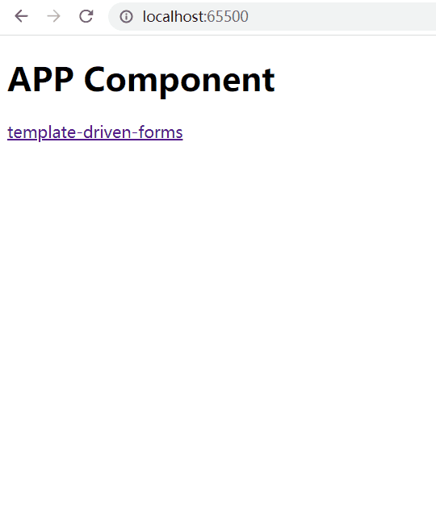

### 二、跟踪表单状态

在表单中使用 ngModel 之后，NgModel 指令通过更新控件的 css 类，达到反映控件状态的目的

| 状态             | 发生时的 css 类 | 没发生的 css 类 |
| ---------------- | --------------- | --------------- |
| 控件被访问       | ng-touched      | ng-untouched    |
| 控件的值发生变化 | ng-dirty        | ng-pristine     |
| 控件的值是否有效 | ng-valid        | ng-invalid      |

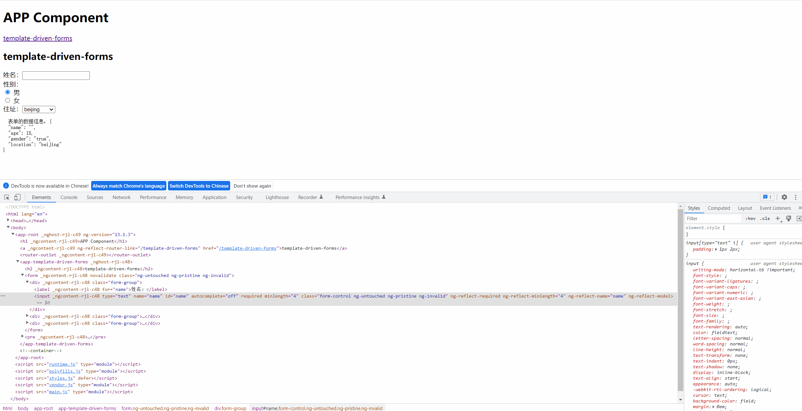

通过这些控件的 css 类样式，就可以通过添加自定义的 css 样式在用户输入内容不满足条件时进行提示

```css
.ng-valid[required], .ng-valid.required  {
  border-left: 5px solid #42A948; /* green */
}

.ng-invalid:not(form)  {
  border-left: 5px solid #a94442; /* red */
}
```

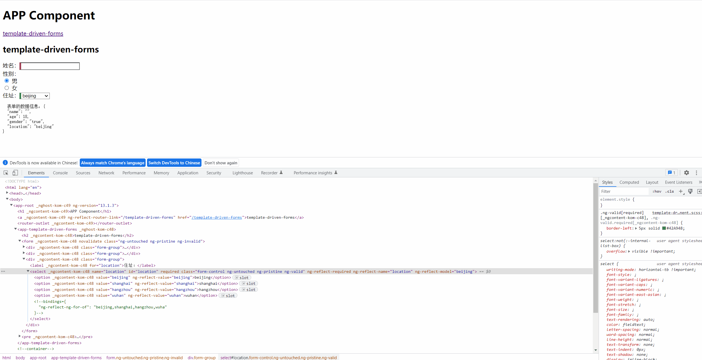

### 三、表单验证

1. 在控件上添加一个==模板引用变量暴露出 ngModel==，在模板中获取到指定控件的状态信息

2. 通过获取错误信息列表来进行反馈 

`template-driven-forms.component.html`

```html
<div class="form-group">
    <label for="name">姓名：</label>
    <!--
将 ngModel 指令通过模板引用变量的形式暴露出来，从而获取到控件的状态
-->
    <input type="text" name="name" id="name" [(ngModel)]="hero.name" class="form-control" autocomplete="off" required
           minlength="4" #name="ngModel">
    <!--
在用户有改动数据 or 访问控件之后才对数据的有效性进行验证
-->
    <div *ngIf="name.invalid && (name.dirty || name.touched) && name.errors != null" class="alert alert-danger">
        <div *ngIf="name.errors['required']">
            姓名不能为空
        </div>
        <div *ngIf="name.errors['minlength']">
            姓名信息不能少于 4 个字符长度
        </div>
    </div>
</div>
```

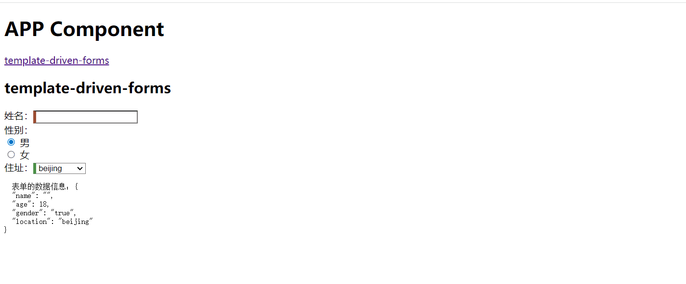

数据验证失败时，表单是不允许提交的；

因此可以将提交事件绑定到表单的 ngSubmit 事件属性上，通过模板引用变量的形式，在提交按钮处进行数据有效性判断，当无效时，禁用表单的提交按钮。

`template-driven-forms.component.html`

```html
<h2>template-driven-forms</h2>
<form #heroForm="ngForm">
  <div class="form-group">
    <label for="name">姓名：</label>
    <!--
      将 ngModel 指令通过模板引用变量的形式暴露出来，从而获取到控件的状态
     -->
    <input type="text" name="name" id="name" [(ngModel)]="hero.name" class="form-control" autocomplete="off" required
      minlength="4" #name="ngModel">
    <!--
      在用户有改动数据 or 访问控件之后才对数据的有效性进行验证
     -->
    <div *ngIf="name.invalid && (name.dirty || name.touched) && name.errors != null" class="alert alert-danger">
      <div *ngIf="name.errors['required']">
        姓名不能为空
      </div>
      <div *ngIf="name.errors['minlength']">
        姓名信息不能少于 4 个字符长度
      </div>
    </div>
  </div>
  <div class="form-group">
    <label for="gender">性别：</label>
    <div class="form-check" *ngFor="let gender of genders">
      <input type="radio" class="form-check-input" name="gender" id="{{gender.id}}" value="{{gender.value}}"
        [(ngModel)]="hero.gender">
      <label for="{{gender.id}}" class="form-check-label"> {{ gender.text }}</label>
    </div>
  </div>
  <div class="form-group">
    <label for="location">住址：</label>
    <select name="location" id="location" [(ngModel)]="hero.location" class="form-control" required="">
      <option value="{{location}}" *ngFor="let location of locations">{{ location }}</option>
    </select>
  </div>
  <button type="submit" [disabled]="!heroForm.form.valid" class="btn btn-primary">Submit</button>
</form>

<pre>
  表单的数据信息：{{hero | json}}
</pre>
```

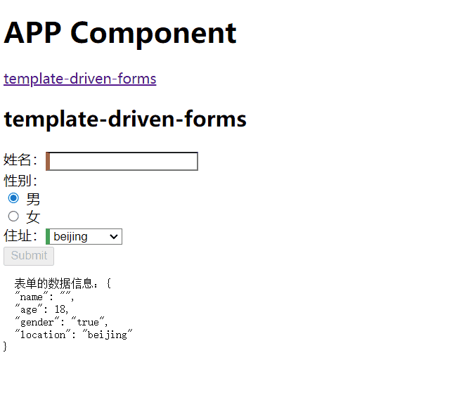

## 二、响应式表单

参考文章：

[angualr响应式表单](https://segmentfault.com/a/1190000017127570) 文章中有介绍动态表单的部分，我感觉我暂时用不到，先不看

### 一、FormControl：表示表单控件

创建项目、组件

```shell
ng new ngform01
ng g c components/nameEditor
```

`app.module.ts`

```js
import { ReactiveFormsModule } from '@angular/forms'; // 导入这个块

@NgModule({
  ...
  imports: [
    BrowserModule,
    AppRoutingModule,
    ReactiveFormsModule // 使用
  ],
  ...
})
```

`app.component.html`

```html
<h1>这是Home组件</h1>
<a [routerLink]="['/nameEditor']">nameEditor</a>
<router-outlet></router-outlet>
```

`app-routing.module.ts`

```js
const routes: Routes = [
  {
    path:'nameEditor',
    component:NameEditorComponent
  },
  {
    path:'home',
    component:AppComponent
  },
  {
    path:'**',
    component:AppComponent
  },
  {
    path:'',
    redirectTo:'home',
    pathMatch:'full'
  },
];
...
```

`name-editor.component.html`

```html
<h1>Name Editor</h1>
<label>
  Name:
  <input type="text" [formControl]="name">
</label>
<p>{{ name.value }}</p>
```

`name-editor.component.ts`

```js
import { Component, OnInit } from '@angular/core';
import { FormControl } from '@angular/forms'; // 导入FormControl

@Component({
  selector: 'app-name-editor',
  templateUrl: './name-editor.component.html',
  styleUrls: ['./name-editor.component.scss']
})
export class NameEditorComponent implements OnInit {

  name = new FormControl(); // 初始化

  constructor() { }

  ngOnInit(): void {
  }
}
```

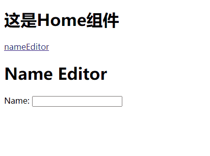

### 二、FromGroup：管理表单控件

修改`name-editor.component.ts`

```js
import { Component, OnInit } from '@angular/core';
import { FormControl, FormGroup } from '@angular/forms'; //引入FormGroup

@Component({
  selector: 'app-name-editor',
  templateUrl: './name-editor.component.html',
  styleUrls: ['./name-editor.component.scss']
})
export class NameEditorComponent implements OnInit {

  name = new FormControl();
    
  //定义表单数据
  teacher = new FormGroup({ 
    name: new FormControl(''),
    email: new FormControl('')
  });

  constructor() { }

  ngOnInit(): void {
  }

}
```

修改`name-editor.component.html`

```html
<!-- 增加表单  -->
<form [formGroup]="teacher">
  <label>
    TeacherName:
    <input type="text" formControlName="name">
  </label>
  <label>
    TeacherEmail:
    <input type="text" formControlName="email">
  </label>
</form>
<pre>{{ teacher.value | json}}</pre>
```

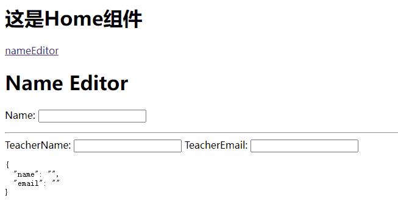

### 三、FormBuilder：简化生成控件

`name-editor.component.ts`

```js
import { Component, OnInit } from '@angular/core';
// 导入FormBuilder
import { FormControl, FormGroup, FormBuilder } from '@angular/forms';

@Component({
  selector: 'app-name-editor',
  templateUrl: './name-editor.component.html',
  styleUrls: ['./name-editor.component.scss']
})
export class NameEditorComponent implements OnInit {

  name = new FormControl();

  // FormBuilder快速创建FormControl实例
  builderName = this.fb.control('');

  teacher = new FormGroup({
    name: new FormControl(''),
    email: new FormControl('')
  });

  // FormBuilder快速创建FormGroup实例
  buildTeacher = this.fb.group(
    {
      name:[''],
      email:['']
    }
  )

  // DI注入
  constructor(private fb: FormBuilder) {

  }
    
  ngOnInit(): void {
  }
}
```

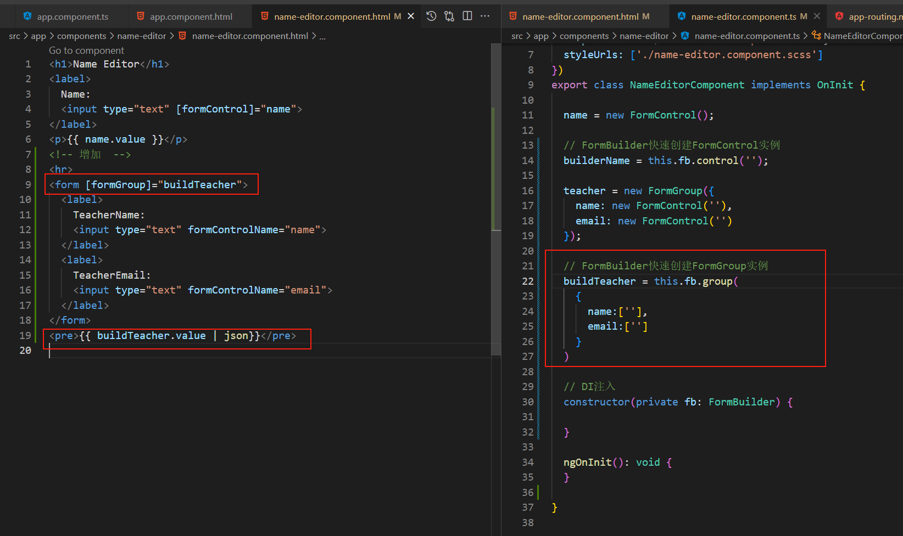

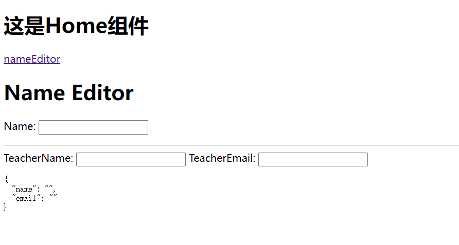

### 四、表单验证

`name-editor.component.ts`

```ts
import { Component, OnInit } from '@angular/core';
import { FormControl, FormGroup, FormBuilder } from '@angular/forms';
// 引入 Validators 验证器
import { Validators } from '@angular/forms';
@Component({
  selector: 'app-name-editor',
  templateUrl: './name-editor.component.html',
  styleUrls: ['./name-editor.component.scss']
})
export class NameEditorComponent implements OnInit {

  // name = new FormControl();

  // FormBuilder快速创建FormControl实例
  builderName = this.fb.control('');

  // teacher = new FormGroup({
  //   name: new FormControl(''),
  //   email: new FormControl('')
  // });

  // FormBuilder快速创建FormGroup实例
  buildTeacher = this.fb.group(
    {
      name: ['', [
        Validators.required,
        Validators.minLength(4)
      ]],
      email: ['']
    }
  )
  // DI注入
  constructor(private fb: FormBuilder) {

  }

   // 添加需要验证控件 getter 方法，用来在模板中获取状态值
   // 不添加这个html那里，取不到这个name变量
   get name() {
    return this.buildTeacher.get('name');
  }

  ngOnInit(): void {
  }

}
```

`name-editor.component.html`

```html
<h1>Name Editor</h1>
<!-- <label>
  Name:
  <input type="text" [formControl]="name">
</label>
<p>{{ name.value }}</p> -->
<!-- 增加  -->
<hr>
<form [formGroup]="buildTeacher">
  <label>
    TeacherName:
    <input type="text" formControlName="name" autocomplete="off">

    <div *ngIf="name != null && name.invalid && (name.dirty || name.touched) && name.errors != null">
      <div *ngIf="name.errors['required']">姓名不能为空</div>
      <div *ngIf="name.errors['minlength']"> 姓名信息不能少于 4 个字符长度</div>
    </div>

  </label>
  <br>

  <br>
  <label>
    TeacherEmail:
    <input type="text" formControlName="email">
  </label>
  <br>
  <button type="submit" class="btn btn-primary" [disabled]="!buildTeacher.valid">数据提交</button>
</form>
<pre>{{ buildTeacher.value | json}}</pre>
```

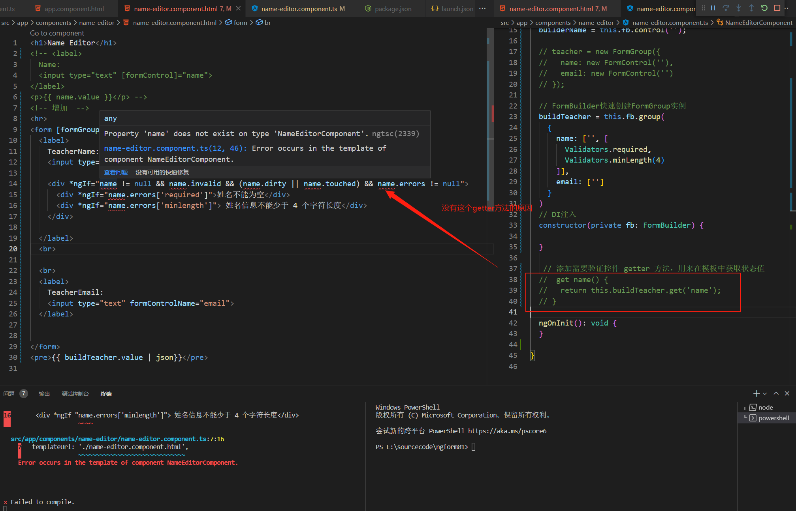

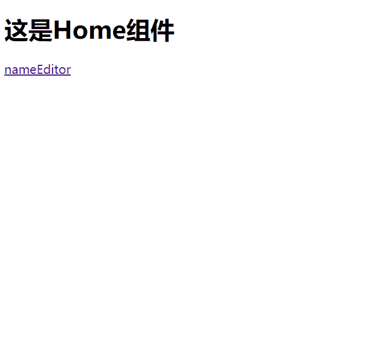

## 三、自定义表单验证

### 一、自定义验证器

在很多的情况下，原生的验证规则无法满足我们的需要，此时需要创建自定义的验证器来实现

#### 一、对于响应式表单

对于响应式表单，我们可以定义一个方法，对控件的数据进行校验，之后将方法作为参数添加到控件定义处即可

```typescript
import { Component, OnInit } from '@angular/core';

// 引入 FormBuilder 构建表单控件
import { FormBuilder } from '@angular/forms';

// 引入 Validators 验证器
import { Validators } from '@angular/forms';

/**
 * 自定义验证方法
 * @param name 控件信息
 */
function validatorName(name: FormControl) {
  return name.value === 'lala' ? { nameinvalid: true } : null;
}

@Component({
  selector: 'app-reactive-forms',
  templateUrl: './reactive-forms.component.html',
  styleUrls: ['./reactive-forms.component.scss']
})
export class ReactiveFormsComponent implements OnInit {

  /**
   * ctor
   * @param formBuilder 表单构造器
   */
  constructor(private formBuilder: FormBuilder) { }

  public profileForm = this.formBuilder.group({
    name: ['', [
      Validators.required,
      Validators.minLength(4),
      validatorName // 添加自定义验证方法
    ]],
    age: [12],
    address: this.formBuilder.group({
      province: ['北京市'],
      city: ['北京'],
      district: ['朝阳区'],
      street: ['三里屯街道']
    })
  });

  // 添加需要验证控件 getter 方法，用来在模板中获取状态值
  get name() {
    return this.profileForm.get('name');
  }

  ngOnInit(): void {
  }
}
```

在验证方法中，当数据有效时，返回 null，当数据无效时，则会返回一个对象信息，这里的 nameinvalid 就是我们在模板中获取到的错误信息的 key 值

```html
<div class="form-group">
    <label for="name">姓名：</label>
    <input type="text" id="name" formControlName='name' class="form-control" autocomplete="off" required minlength="4">

    <!--
      在用户有改动数据 or 访问控件之后才对数据的有效性进行验证
     -->
    <div *ngIf="name.invalid && (name.dirty || name.touched)" class="alert alert-danger">
      <div *ngIf="name.errors.required">
        姓名不能为空
      </div>
      <div *ngIf="name.errors.minlength">
        姓名信息不能少于 4 个字符长度
      </div>
      <div *ngIf="name.errors.nameinvalid">
        姓名无效
      </div>
    </div>
</div>
```


#### 二、模板驱动表单

在模板驱动表单中，因为不是直接使用的 FormControl 实例，因此这里应该在模板上添加一个自定义的指令来完成对于控件数据的校验

使用 angular cli 创建一个用来进行表单验证的指令

```bash
ng g directive direactives/hero-validate
```

在创建完成指令之后，我们需要将这个指令将该验证器添加到已经存在的验证器集合中，同时为了使这个指令可以与 angular 表单集成在一起，我们需要继承 Validator 接口

```typescript
import { Directive, Input } from '@angular/core';
import { AbstractControl, Validator, ValidationErrors, NG_VALIDATORS } from '@angular/forms';

@Directive({
  selector: '[appHeroValidate]',
  // 将指令注册到 NG_VALIDATORS 使用 multi: true 将该验证器添加到现存的验证器集合中
  providers: [{ provide: NG_VALIDATORS, useExisting: HeroValidateDirective, multi: true }]
})
export class HeroValidateDirective implements Validator {

  constructor() { }

  /**
   * 对指定的控件执行同步验证方法
   * @param control 控件
   */
  validate(control: AbstractControl): ValidationErrors | null {
    return control.value === 'lala' ? { 'nameInvalid': true } : null;
  }
}
```

当实现了继承的 validate 方法后，就可以在模板的控件上添加该指令

```html
<div class="form-group">
    <label for="name">姓名：</label>
    <!--
      将 ngModel 指令通过模板引用变量的形式暴露出来，从而获取到控件的状态
     -->
    <input type="text" name="name" id="name" [(ngModel)]="hero.name" class="form-control" autocomplete="off" required
      minlength="4" #name="ngModel" appHeroValidate>
    <!--
      在用户有改动数据 or 访问控件之后才对数据的有效性进行验证
     -->
    <div *ngIf="name.invalid && (name.dirty || name.touched)" class="alert alert-danger">
      <div *ngIf="name.errors.required">
        姓名不能为空
      </div>
      <div *ngIf="name.errors.minlength">
        姓名信息不能少于 4 个字符长度
      </div>
      <div *ngIf="name.errors.nameInvalid">
        姓名无效
      </div>
    </div>
</div>
```


### 二、跨字段的交叉验证

#### 一、对于响应式表单

有时候需要针对表单中的多个控件数据进行交叉验证，此时就需要针对整个 FormGroup 进行验证。因此这里的验证方法需要在定义控件组时作为 FormGroup 的参数传入

与单个字段的验证方式相似，通过实现 ValidatorFn 接口，当表单数据有效时，它返回一个 null，否则返回 ValidationErrors 对象

```typescript
import { Component, OnInit } from '@angular/core';

// 引入 FormControl 和 FormGroup 对象
import { FormControl, FormGroup, ValidatorFn, ValidationErrors } from '@angular/forms';

// 引入 FormBuilder 构建表单控件
import { FormBuilder } from '@angular/forms';

// 引入 Validators 验证器
import { Validators } from '@angular/forms';

/**
 * 跨字段验证
 * @param controlGroup 控件组
 */
const nameAgeCrossValidator: ValidatorFn = (controlGroup: FormGroup): ValidationErrors | null => {

  // 获取子控件的信息
  //
  const name = controlGroup.get('name');
  const age = controlGroup.get('age');

  return name && age && name.value === 'lala' && age.value === 12 ? { 'nameAgeInvalid': true } : null;
};

@Component({
  selector: 'app-reactive-forms',
  templateUrl: './reactive-forms.component.html',
  styleUrls: ['./reactive-forms.component.scss']
})
export class ReactiveFormsComponent implements OnInit {
  /**
   * ctor
   * @param formBuilder 表单构造器
   */
  constructor(private formBuilder: FormBuilder) { }

  public profileForm = this.formBuilder.group({
    name: ['', [
      Validators.required,
      Validators.minLength(4),
      validatorName
    ]],
    age: [12],
    address: this.formBuilder.group({
      province: ['北京市'],
      city: ['北京'],
      district: ['朝阳区'],
      street: ['三里屯街道']
    })
  }, { validators: [nameAgeCrossValidator] }); // 添加针对控件组的验证器
  
  ngOnInit(): void {
  }
}
```

在针对多个字段进行交叉验证时，在模板页面中，则需要通过获取整个表单的错误对象信息来获取到交叉验证的错误信息

```html
<div class="form-group">
    <label for="name">姓名：</label>
    <input type="text" id="name" formControlName='name' class="form-control" autocomplete="off" required minlength="4">

    <!--
      在用户有改动数据 or 访问控件之后才对数据的有效性进行验证
     -->
    <div *ngIf="name.invalid && (name.dirty || name.touched)" class="alert alert-danger">
      <div *ngIf="name.errors.required">
        姓名不能为空
      </div>
      <div *ngIf="name.errors.minlength">
        姓名信息不能少于 4 个字符长度
      </div>
      <div *ngIf="name.errors.nameinvalid">
        姓名无效
      </div>
    </div>
  </div>
  <div class="form-group">
    <label for="age">年龄：</label>
    <input type="number" id="age" formControlName='age' class="form-control" autocomplete="off" required step="1"
      max="100" min="1">
    <div *ngIf="profileForm.errors?.nameAgeInvalid && (profileForm.touched || profileForm.dirty)"
      class="alert alert-danger">
      lala 不能是 12 岁
    </div>
</div>
```

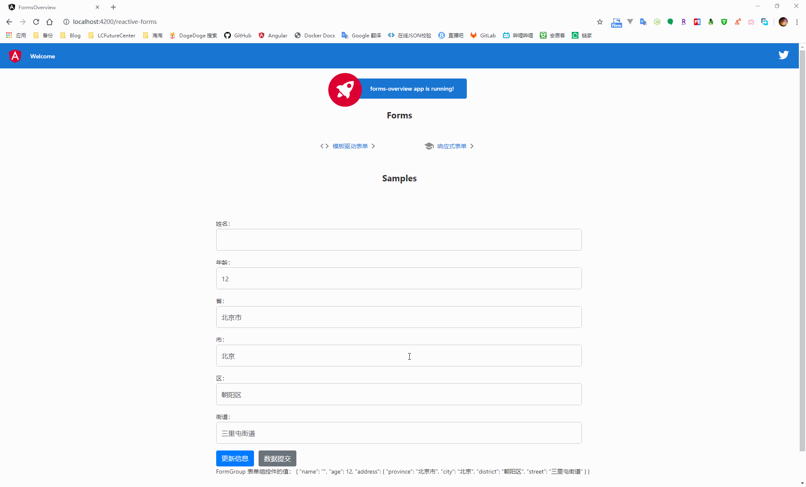

#### 二、模板驱动表单

对于模板驱动表单，同样是采用自定义指令的方式进行跨字段的交叉验证，与单个控件的验证不同，此时需要将指令添加到 form 标签上，然后使用模板引用变量来获取错误信息

```typescript
import { Directive } from '@angular/core';
import { Validator, AbstractControl, ValidationErrors, ValidatorFn, FormGroup, NG_VALIDATORS } from '@angular/forms';

/**
 * 跨字段验证
 * @param controlGroup 控件组
 */
const nameAgeCrossValidator: ValidatorFn = (controlGroup: FormGroup): ValidationErrors | null => {

  // 获取子控件的信息
  //
  const name = controlGroup.get('name');
  const age = controlGroup.get('age');

  return name && age && name.value === 'lala' && age.value === 12 ? { 'nameAgeInvalid': true } : null;
};

@Directive({
  selector: '[appCrossFieldValidate]',
  providers: [{ provide: NG_VALIDATORS, useExisting: CrossFieldValidateDirective, multi: true }]
})
export class CrossFieldValidateDirective implements Validator {

  constructor() { }

  validate(control: AbstractControl): ValidationErrors | null {
    return nameAgeCrossValidator(control);
  }
}
```

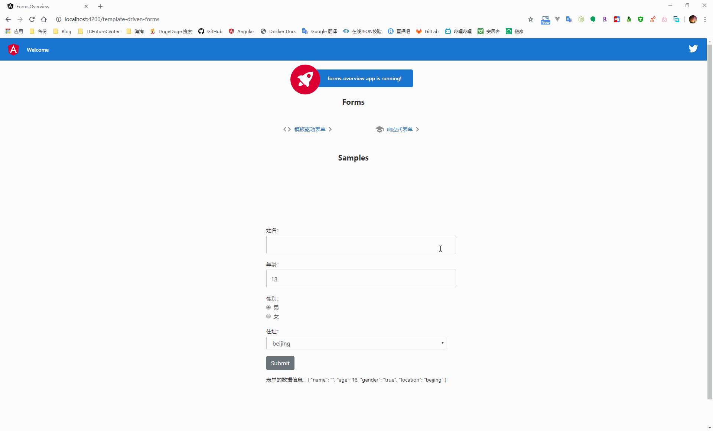

