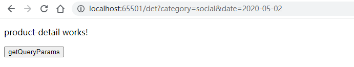

# 路由

[参考链接一](https://juejin.cn/post/6994832561964843016#heading-8)

主要注重如下几个部分：

1. 路由规则匹配
2. 路由传参
3. 路由参数获取
4. 路由跳转

# 一、在app-routing中统一配置 ==路由规则==

## 1、创建项目&一级模块

```shell
# 创建项目
ng new route01
# 创建一级模块
ng g c pages/login
ng g c pages/home
ng g c pages/mine
ng g c pages/notFound
```

## 2、app.component.html

用a标签做路由跳转

```html
<div>
  <a [routerLink]="['/login']">登陆</a>｜
  <a [routerLink]="['/home']">首页</a>｜
  <a [routerLink]="['/mine']">我的</a>
</div>
<!-- 配置路由出口 -->
<router-outlet></router-outlet>

```

## 3、app-routing.module.ts

配置路由

```js
import { NgModule } from '@angular/core';
import { RouterModule, Routes } from '@angular/router';
import { HomeComponent } from './pages/home/home.component';
import { LoginComponent } from './pages/login/login.component';
import { MineComponent } from './pages/mine/mine.component';
import { NotFoundComponent } from './pages/not-found/not-found.component';

// 只配置这个是没用的，一定要在html中配置 <router-outlet></router-outlet>
const routes: Routes = [
  {
    path: 'login',
    component: LoginComponent,
  },
  {
    path: 'home',
    component: HomeComponent,
  },
  {
    path: 'mine',
    component: MineComponent,
  },
  {
    path: '**',
    component: NotFoundComponent, //path支持一个特殊的通配符来支持“**”，当在路由表中没有成功匹配的情况下会最后指向通配符对应的组件
  },
  {
    path: '', // 设置默认路由
    redirectTo: '/home', 
    pathMatch: 'full'
  },
];

@NgModule({
  imports: [RouterModule.forRoot(routes)],
  exports: [RouterModule]
})
export class AppRoutingModule { }

```

# 二、配置子模块和子路由 ==路由规则==

## 1、为home组件增加==带路由的模块==

```shell
# ng cli创建模块命令详解： https://angular.cn/cli/generate#module-command
# --routing 代表创建一个带路由的
# --module
ng generate module pages/home/home --module app --flat --routing
或者
ng g m pages/home/home --module app --falt --routing

```


## 2、 修改app.module.ts中import导入模块的顺序

注：用cli创建的模块==会自动配置到根模块==，但我们手动的调整一下顺序==将AppRoutingModule移动到最后==，==满足先到先得的策略==。

```js
imports: [
BrowserModule,
AppRoutingModule,
HomeModule
]
```

## 3、 将home组件的路由转移到home模块中，home-routing

home-routing.module.ts中新增

```js
const routes: Routes = [
  {
    path: 'home',
    component: HomeComponent,
  }
];
```

app-routing.module.ts中删除：

```
{
path: 'home',
component: HomeComponent,
}
```


## 4、为home模块配置==子组件==并配置==子路由==

 创建子组件

==这里名字起得不好，uer-list这些，感觉应该用userList==

```
ng g c pages/home/children/user-list
ng g c pages/home/children/user-detail
ng g c pages/home/children/edit-user
```

从下面输出，可以看到创建了四个文件，然后更新了一个文件。


## 5、为Home路由器配置==增加`children`属性==来==配置子组件路由==

```js
const routes: Routes = [
  {
    path: 'home',
    component: HomeComponent,
    children: [
      {
        path: 'list',
        component: UserListComponent,
      },
      {
        path: 'detail',
        component: UserDetailComponent,
      },
      {
        path: 'edit',
        component: EditUserComponent,
      },
      {
        path: '',
        redirectTo: '/home/list',
        pathMatch: 'full'
      }
    ]

  }
];
```

## 6、修改home.component.html

```
<div>
  <a [routerLink]="['/home/list']">列表</a>｜
  <a [routerLink]="['/home/edit']">编辑</a>｜
  <a [routerLink]="['/home/detail']">详情</a>
</div>
<!-- 配置路由出口 -->
<router-outlet></router-outlet>
```


# 三、传参及获取：查询参数

查询参数就是这样的url：

```
http://localhost:65501/det?name=chenkang&id=1
```

新建工程，并增加两个组件product和productDetail

```shell
ng new route01
ng g c components/product
ng g c components/productDetail
```

配置package.json，默认端口号和编译完成打开浏览器

```js
  "scripts": {
    "start": "ng serve --port 65501 --open",
  },
```

`npm start`启动项目

app.component.html：

```html
<router-outlet></router-outlet>
```

app-routing.module.ts

```js
const routes: Routes = [
  {
    path:"product",
    component:ProductComponent
  },
  {
    path:"det",
    component:ProductDetailComponent
  },
  {
    path:"",
    redirectTo:"product",
    pathMatch:"full"
  }
];
```

product.component.html

==传参（查询参数）方式一：用a标签==

```
<h1>product works!</h1>
<a [routerLink]="['/det']" [queryParams]="{category:'social',date:'2020-05-02'}">1</a>
```


product-detail.component.html

```
<p>product-detail works!</p>
<button (click)="getQueryParams()">getQueryParams</button>
```



product-detail.component.ts

==获取查询参数的方法==

```js
import { Component, OnInit } from '@angular/core';
import { ActivatedRoute } from '@angular/router'; // 第一步：引入ActivatedRoute

@Component({
  selector: 'app-product-detail',
  templateUrl: './product-detail.component.html',
  styleUrls: ['./product-detail.component.scss']
})
export class ProductDetailComponent implements OnInit {

  constructor(private route: ActivatedRoute) { } // 第二步：注入引入ActivatedRoute

  ngOnInit(): void {

  }

  getQueryParams(){ 
    this.route.queryParamMap.subscribe((data: any) => { //获取查询方式
      console.log(data.params);
    });
  }

}
```

点击==getQueryParams==按钮后


==传参方式二：==

直接在浏览器地址栏输入：

```
http://localhost:65501/det?data=helloworld
```


==传参方式三：==

```
<a href="http://localhost:65501/det?data=helloworld">跳转</a>
```

==传参方式四：用JS方法传参==

product.component.html

```
<h1>product works!</h1>
<a [routerLink]="['/det']" [queryParams]="{category:'social',date:'2020-05-02'}">1</a>
<br>
<button (click)="queryNavigate()">用js传参</button>
```

product.component.ts

```js
import { Component, OnInit } from '@angular/core';
import { Router, NavigationExtras } from '@angular/router'; // 第一步：引入依赖
@Component({
  selector: 'app-product',
  templateUrl: './product.component.html',
  styleUrls: ['./product.component.scss']
})
export class ProductComponent implements OnInit {

  constructor(private router: Router) { } // 第二步：注入

  ngOnInit(): void {
  }

    /**
   * 使用 js 的方式通过 query 查询字符串的形式传递参数
   */
     queryNavigate() { // 第三步：传参函数

      // 查询参数
      let query: NavigationExtras = {
        queryParams: {
          category: 'social',
          date: '2020-05-04'
        }
      };
      this.router.navigate(['/det' ], query);
    }

}

```

# 四、传参及获取：动态路由参数

动态路由就是这种路由，最后的1，2是会动态变的

```
http://localhost:65501/det/1
http://localhost:65501/det/2
```

新建工程，并增加两个组件product和productDetail

```shell
ng new route01
ng g c components/product
ng g c components/productDetail
```

配置package.json，默认端口号和编译完成打开浏览器

```js
  "scripts": {
    "start": "ng serve --port 65501 --open",
  },
```

`npm start`启动项目

app.component.html：

```html
<router-outlet></router-outlet>
```

app-routing.module.ts

==这里要做路由配置==

```
const routes: Routes = [
  {
    path:"product",
    component:ProductComponent
  },
  {
    path:"det/:id",
    component:ProductDetailComponent
  },
  {
    path:"",
    redirectTo:"product",
    pathMatch:"full"
  }
];
```

product.component.html

==传参方式1==

```
<h1>product works!</h1>
<a [routerLink]="['/det', 1]" routerLinkActive="active" >1</a>
```

product-detail.component.html

```
<p>product-detail works!</p>
<button (click)="getQueryParams()">getQueryParams</button>
```

product-detail.component.ts

==获取参数：==

```
import { Component } from '@angular/core';
import { ActivatedRoute } from '@angular/router'; //第一步
@Component({
  selector: 'app-product-detail',
  templateUrl: './product-detail.component.html',
  styleUrls: ['./product-detail.component.scss']
})
export class ProductDetailComponent {

  constructor(private route: ActivatedRoute) { }

  getQueryParams() { //第二步
    this.route.params.subscribe(params => {
      console.log("params", params);
    });
    const key = this.route.snapshot.params['id'];
    console.log("id", key);
  }
}
```


==传参方式二：== ==this.router.navigate(['/det', 1]);==

product.component.ts

```
import { Component } from '@angular/core';
import { Router } from '@angular/router';
@Component({
  selector: 'app-product',
  templateUrl: './product.component.html',
  styleUrls: ['./product.component.scss']
})
export class ProductComponent  {
  newsList: any;

  constructor(private router:Router) {
  }

  sendPara(){
    this.router.navigate(['/det', 1]);
  }
}
```

product.component.html

```
<h1>product works!</h1>
<button (click)="sendPara()">sendPara</button>
```


# 五、传参及获取：通过路由配置传参

==这里是摘抄的，还不知道怎么用==

 **在路由配置中传参**（注意：可以用于自定义路由预加载）

路由路径配置：

```typescript
path: "news",  
component: NewsComponent,  
data: {key: "hero"}
```

获取参数方法：

```typescript
this.route.data.subscribe(params => {  
  console.log("params", params.key);  
});  
const key = this.route.snapshot.params['key'];  
console.log("key", key);
```

# 六、路由守卫

